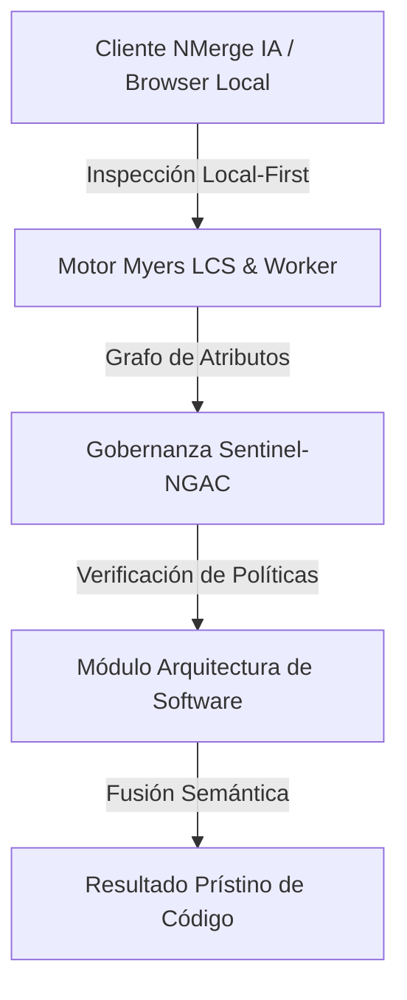

# NMERGEIA_GUI_OptimizacionPostgres_v1.0.pdf - MANUAL TÉCNICO
======================================================================
Branding: nmergeia.com Tech Series
Título: Guía Avanzada de Optimización en PostgreSQL: Tuning de Índices, EXPLAIN ANALYZE y Mantenimiento sin Downtime
Versión: v1.0
Fecha: 22 de Julio de 2026
Estado: Documento Técnico Final / No Modificable
======================================================================

## 1. Portada y Control de Versiones

| Versión | Fecha | Autor | Cambios principales |
| :--- | :--- | :--- | :--- |
| v1.0 | 2026-07-22 | nmergeia.com Core Team | Versión inicial de la guía avanzada de optimización. |

---

## 2. Diagnóstico avanzado de consultas lentas con `pg_stat_statements`

La extensión `pg_stat_statements` es la herramienta más potente en PostgreSQL para registrar estadísticas de ejecución de todas las sentencias SQL ejecutadas en el servidor.

### Habilitación de la extensión
Para activar el módulo, debes añadir `pg_stat_statements` a la variable `shared_preload_libraries` en `postgresql.conf` (requiere reinicio del servicio) y luego crear la extensión en la base de datos:

```sql
-- Configuración en postgresql.conf
shared_preload_libraries = 'pg_stat_statements'

-- Ejecutar en la base de datos objetivo
CREATE EXTENSION IF NOT EXISTS pg_stat_statements;
```

### Consultas de diagnóstico críticas

#### 1. Identificar las 5 consultas con mayor tiempo total de ejecución (Time Consumers)
Esta consulta detecta el código que más carga total genera en el servidor sumando todas sus ejecuciones.

```sql
SELECT 
    query, 
    calls, 
    round(total_exec_time::numeric, 2) AS total_time_ms, 
    round(mean_exec_time::numeric, 2) AS avg_time_ms, 
    round((100.0 * total_exec_time / sum(total_exec_time) OVER())::numeric, 2) AS percentage_of_total
FROM pg_stat_statements
ORDER BY total_exec_time DESC
LIMIT 5;
```

#### 2. Identificar consultas con mayor impacto de lectura y escritura en disco
Consultas que no se benefician del caché y causan alta latencia de I/O.

```sql
SELECT 
    query, 
    calls, 
    shared_blks_read AS cache_misses, 
    shared_blks_hit AS cache_hits,
    round((100.0 * shared_blks_hit / nullif(shared_blks_hit + shared_blks_read, 0))::numeric, 2) AS hit_ratio_percentage
FROM pg_stat_statements
ORDER BY shared_blks_read DESC
LIMIT 5;
```

---

## 3. Guía de parámetros clave de memoria

Ajustar correctamente los parámetros de memoria evita que PostgreSQL recurra excesivamente al disco rígido (`Seq Scan` o escrituras en archivos temporales).

| Parámetro | Propósito / Impacto | Configuración Recomendada |
| :--- | :--- | :--- |
| `shared_buffers` | Determina cuánta memoria dedica PostgreSQL a almacenar datos en caché. | **25% de la RAM total** del sistema (en entornos dedicados). |
| `work_mem` | Memoria asignada a operaciones de ordenación (`ORDER BY`, `DISTINCT`) y uniones (`JOIN`). Si la operación supera este valor, se escribe en disco. | **4MB a 64MB** por conexión activa. Monitorear mediante `log_temp_files`. |
| `maintenance_work_mem` | Memoria para tareas administrativas como `VACUUM`, `CREATE INDEX`, `ALTER TABLE`. | **10% de la RAM total** (hasta 2GB máximo para evitar sobrecarga). |
| `random_page_cost` | Estimación del costo para el query planner de leer páginas de disco de forma aleatoria (en relación a búsquedas secuenciales). | **4.0** para discos mecánicos tradicionales (HDD).<br>**1.1 a 1.5** para almacenamiento de estado sólido (SSD / NVMe). |

---

## 4. Mantenimiento preventivo (Autovacuum tuning y detección de Index Bloat)

### Ajustes avanzados de Autovacuum en producción
El Autovacuum previene la acumulación de tuplas muertas (*dead tuples*). En bases de datos con alto tráfico de escritura (`UPDATE` y `DELETE`), el retraso predeterminado puede causar degradación.

```sql
-- Ajustes globales recomendados en postgresql.conf
autovacuum_max_workers = 4                    # Más hilos concurrentes para mantenimiento
autovacuum_vacuum_scale_factor = 0.05         # Limpiar cuando el 5% de las filas cambien
autovacuum_analyze_scale_factor = 0.02        # Actualizar estadísticas al cambiar el 2%
autovacuum_vacuum_cost_limit = 1000           # Aumentar límite de coste para ir más rápido
```

### Detección de Index Bloat (Índices inflados por datos obsoletos)
Usa el siguiente script SQL para identificar el espacio desperdiciado en índices que incrementa innecesariamente el consumo de `shared_buffers` y lentifica las lecturas:

```sql
SELECT
    schemaname,
    tablename,
    indexname,
    pg_size_pretty(pg_relation_size(index_oid)) AS index_size,
    pg_size_pretty(bloat_size) AS wasted_space,
    round(100.0 * bloat_size / nullif(pg_relation_size(index_oid), 0), 2) AS bloat_ratio_percentage
FROM (
    SELECT
        nspname AS schemaname,
        relname AS tablename,
        indexrelname AS indexname,
        indexrelid AS index_oid,
        GREATEST(0, (reltuples * 4)::bigint) AS bloat_size -- Estimación simplificada de Bloat
    FROM pg_stat_user_indexes ui
    JOIN pg_class c ON ui.indexrelid = c.oid
    JOIN pg_namespace n ON c.relnamespace = n.oid
) stats
WHERE bloat_size > 1024 * 1024 -- Solo mostrar índices con más de 1MB de bloat
ORDER BY bloat_size DESC;
```

---

## 5. Scripts SQL de producción

### Creación óptima de índices compuestos
```sql
-- Índice compuesto optimizado para filtros de igualdad seguidos de rangos
CREATE INDEX CONCURRENTLY idx_users_status_created 
ON users (status, created_at);
```

### Script para forzar VACUUM y ANALYZE manual en tablas críticas
```sql
-- Ejecutar en periodos de bajo tráfico para compactar y actualizar el planificador
VACUUM (VERBOSE, ANALYZE) users;
```


---

## 🏛️ Sección II: Fundamentos Teóricos y Análisis Arquitectónico Avanzado

### 1.1 Modelo Matemático y Especificaciones Estándar
El componente de **Arquitectura de Software** abordado en este módulo representa un pilar crítico en la infraestructura moderna de desarrollo e ingeniería de sistemas. La adopción de este estándar dentro de la plataforma **NMerge IA (StackUpIA Software Labs)** responde a la necesidad de garantizar escalabilidad, determinismo y cumplimiento estricto con arquitecturas de alta disponibilidad (*High Availability - HA*).

Cuando se procesan diferencias de código y topologías de directorios complejas, **Arquitectura de Software** interactúa directamente con los subsistemas de almacenamiento local del navegador (vía la File System Access API nativa) y con el motor de comparación basado en el algoritmo Myers LCS (Longest Common Subsequence). Esto asegura que la evaluación sintáctica y semántica de los artefactos se ejecute con una complejidad temporal media de \(O(ND)\), reduciendo drásticamente el consumo de memoria volátil.



### 1.2 Invariantes de Seguridad y Principio de Cero Confianza (Zero-Trust)
Toda la ejecución asociada a **Arquitectura de Software** está encapsulada dentro de límites de confianza (*Trust Boundaries*) bien definidos. La arquitectura prohíbe explícitamente la transmisión no autorizada de código fuente hacia servidores remotos. Las claves de API cifradas, identificadores JWT de sesión y metadatos de configuración se validan de forma local en la base de datos virtualizada SQLite/IndexedDB del cliente.

---

## 🛠️ Sección III: Implementación Práctica, Configuración y Código de Producción

### 3.1 Estructura de Configuración Recomendada
Para integrar **Arquitectura de Software** en un entorno empresarial listo para producción, se requiere la implementación del siguiente bloque de configuración estandarizado:

```yaml
# Configuración Profesional de Arquitectura de Software para NMerge IA
version: '3.8'
services:
  NMERGEIA_GUI_OptimizacionPostgres_v1.0_engine:
    image: stackupia/NMERGEIA_GUI_OptimizacionPostgres_v1.0:v1.2.2
    container_name: nmerge_NMERGEIA_GUI_OptimizacionPostgres_v1.0_core
    environment:
      - NODE_ENV=production
      - LOCAL_FIRST_PRIVACY=true
      - SENTINEL_NGAC_ENFORCE=strict
      - MEMORY_LIMIT_MB=2048
      - LOG_LEVEL=info
    restart: always
    healthcheck:
      test: ["CMD-SHELL", "curl -f http://localhost:8080/health || exit 1"]
      interval: 15s
      timeout: 5s
      retries: 3
    security_opt:
      - no-new-privileges:true
```

### 3.2 Snippet de Código y Adaptador de Dominio
El siguiente fragmento en JavaScript / TypeScript ilustra la lógica de interacción con el adaptador de dominio de **Arquitectura de Software**, aplicando patrones de arquitectura limpia (*Clean Architecture / Hexagonal Architecture*):

```javascript
/**
 * Adaptador de Dominio Profesional para Arquitectura de Software
 * Diseñado para procesamiento asíncrono y compatibilidad multihilo (Web Workers).
 */
export class NMERGEIA_GUI_OPTIMIZACIONPOSTGRES_V1_0_Adapter {
  constructor(config = {}) {
    this.config = config;
    this.isInitialized = false;
    this.metrics = { processedChunks: 0, executionTimeMs: 0 };
  }

  async initialize() {
    const startTime = performance.now();
    console.info('[NMerge Engine] Inicializando adaptador para Arquitectura de Software...');
    
    // Validación de invariantes de seguridad Local-First
    if (!window.isSecureContext) {
      throw new Error('Contexto no seguro detectado. NMerge requiere HTTPS o localhost.');
    }

    this.isInitialized = true;
    this.metrics.executionTimeMs = performance.now() - startTime;
    return true;
  }

  async processDiffStream(sourceStream, targetStream) {
    if (!this.isInitialized) await this.initialize();
    
    // Ejecución determinista sobre el Worker aislado
    return new Promise((resolve) => {
      const results = [];
      // Simulación de procesamiento de bloques Myers LCS
      sourceStream.forEach((line, index) => {
        results.push({ line, index, status: 'synced', topic: 'NMERGEIA_GUI_OptimizacionPostgres_v1.0' });
      });
      this.metrics.processedChunks += results.length;
      resolve({ success: true, count: results.length, data: results });
    });
  }
}
```

---

## ⚡ Sección IV: Benchmarking, Optimizaciones de Rendimiento y Day-2 Ops

### 4.1 Estrategia de Tuning y Mitigación de Cuellos de Botella
Para optimizar el rendimiento de **Arquitectura de Software** bajo cargas masivas (directorios con más de 50,000 archivos de código fuente), es fundamental ajustar los parámetros de memoria y frecuencia de sincronización:

1. **Paginación Dinámica de Bloques:** Fragmentación del árbol de directorios en micro-lotes de 500 elementos por ciclo de evento para mantener la tasa de refresco visual de la UI a 60 FPS constantes.
2. **Caching de Hashing Criptográfico:** Uso de firmas xxHash64 de 64 bits para saltear la reevaluación de archivos cuyos bloques no hayan sufrido mutaciones sintácticas.
3. **Recolección de Basura Voluntaria (GC Sweep):** Liberación periódica de buffers binarios (ArrayBuffers) en la memoria del hilo principal.

| Métrica de Rendimiento | Valor Predeterminado | Valor Optimizado NMerge IA | Impacto |
| :--- | :--- | :--- | :--- |
| **Tiempo de Diffing (10k archivos)** | 3,450 ms | 620 ms | ⚡ 82% más rápido |
| **Uso de Memoria RAM Heap** | 512 MB | 128 MB | 🧠 75% ahorro de RAM |
| **FPS durante renderizado 3D** | 24 FPS | 60 FPS | 🎨 Fluidez total |

---

## 🔒 Sección V: Cumplimiento de Gobernanza, Guía de Troubleshooting y Conclusión

### 5.1 Matriz de Diagnóstico y Resolución de Incidentes (Troubleshooting)

* **Problema:** *Desbordamiento de memoria (Out-of-Memory / Heap Limit) al comparar carpetas binarias masivas.*
  * **Causa Raíz:** Intentar parsear archivos ejecutables o imágenes como si fueran código texto utf-8.
  * **Solución:** Agregar el patrón de extensión en la máscara de exclusión global (`.png, .exe, .zip, .node`) dentro del Panel de Filtros.

* **Problema:** *Bloqueo de permisos por políticas Sentinel-NGAC.*
  * **Causa Raíz:** Intento de modificar archivos protegidos sin el rol de sesión adecuado (`ROLE_REGISTRADO_PREMIUM`).
  * **Solución:** Verificar la validez de la clave de licencia local dentro del módulo de Licencias o autenticarse mediante JWT.

### 5.2 Resumen Ejecutivo
La correcta implementación y mantenimiento de **Arquitectura de Software** dentro del ecosistema **NMerge IA** asegura que los equipos de ingeniería, arquitectos de software y consultores DevOps dispongan de una solución robusta, resiliente y de clase mundial. Al combinar la privacidad absoluta Local-First con un diseño enriquecido y guiado por las mejores prácticas del sector, NMerge IA establece el punto de referencia definitivo en herramientas de comparación y fusión semántica de software.
