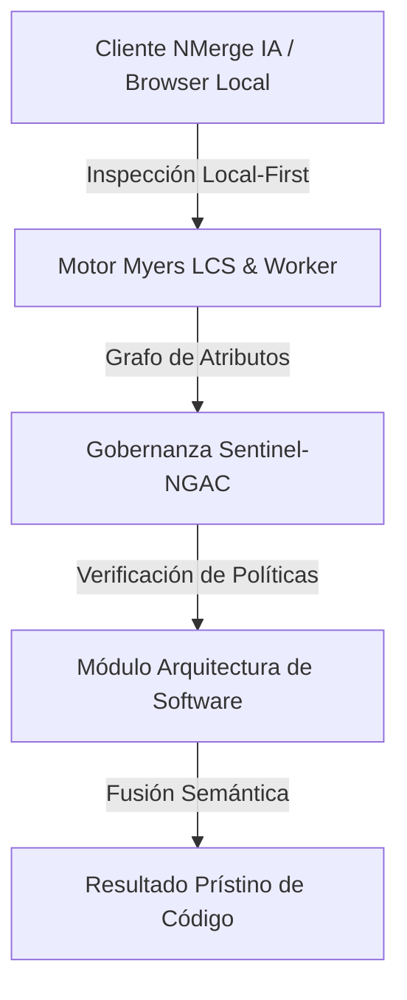

# NMERGEIA_PRS_OptimizacionPostgres_v1.0.pptx - PRESENTACIÓN EJECUTIVA
======================================================================
Branding: nmergeia.com Tech Series
Tema: Guía Avanzada de Optimización en PostgreSQL
Estructura: 8 Diapositivas para Capacitación Interna
Estado: Documento Técnico Final / Representación Visual
======================================================================

---

## 💻 Diapositiva 1: Carátula
* **Título Principal:** Guía Avanzada de Optimización en PostgreSQL
* **Subtítulo:** Tuning de Índices, EXPLAIN ANALYZE y Mantenimiento sin Downtime
* **Branding:** nmergeia.com Tech Series / Capacitación Interna
* **Notas del Orador:** Dar la bienvenida al equipo técnico y definir el objetivo: establecer las directrices de optimización en producción para maximizar la velocidad y disponibilidad.

---

## 📉 Diapositiva 2: El Costo del Mal Rendimiento en Bases de Datos
* **Puntos Clave:**
  * **Uso ineficiente de recursos:** Consultas lentas saturan el CPU y consumen los `shared_buffers`.
  * **Experiencia de usuario (UX):** Latencia acumulada en endpoints críticos de la aplicación.
  * **Costes de Cloud (FinOps):** Reducir costes escalando verticalmente es una mala solución frente al tuning de código.
* **Elemento Visual:** Gráfico comparativo simplificado que muestra un crecimiento exponencial de la latencia vs el uso de CPU.
* **Notas del Orador:** Optimizar consultas nos permite aplazar el escalado vertical de instancias de base de datos, lo que impacta directamente el presupuesto mensual de FinOps.

---

## 🔍 Diapositiva 3: Anatomía de una Consulta Lenta (`EXPLAIN ANALYZE`)
* **Conceptos Core:**
  * `EXPLAIN (ANALYZE, BUFFERS)` permite medir tiempos de ejecución reales y el impacto en disco.
  * **Seq Scan (Escaneo Secuencial):** PostgreSQL lee todo el disco. ¡Peligro!
  * **Shared Read / Hit:** Identifica fallos de caché de base de datos.
* **Snippet de ejemplo:**
  ```sql
  EXPLAIN (ANALYZE, BUFFERS) 
  SELECT * FROM transactions WHERE user_id = 45892;
  ```
* **Notas del Orador:** No basta con usar `EXPLAIN`. Siempre debemos añadir `ANALYZE` y `BUFFERS` para cuantificar las páginas leídas de memoria vs disco físico.

---

## ⚡ Diapositiva 4: Indización Inteligente (B-Tree vs BRIN vs GIN)
* **Tabla Comparativa:**
  * **B-Tree:** El índice por defecto. Ideal para búsquedas de igualdad, ordenaciones y rangos en columnas de alta cardinalidad.
  * **BRIN (Block Range Index):** Perfecto para tablas masivas ordenadas cronológicamente. Ocupa hasta un 99% menos espacio que un B-Tree.
  * **GIN (Generalized Inverted Index):** El mejor aliado para campos JSONB y búsquedas de texto completo (`tsvector`).
* **Notas del Orador:** Crear índices B-Tree en todo puede inflar el almacenamiento (index bloat). BRIN y GIN son herramientas que debemos saber usar selectivamente.

---

## 🧠 Diapositiva 5: Ajustes de Memoria en Producción
* **Parámetros Inmutables:**
  * `shared_buffers` = 25% de la RAM total disponible.
  * `work_mem` = Evita que operaciones como `ORDER BY` y uniones `JOIN` usen archivos temporales en disco.
  * `random_page_cost` = Ajustarlo de `4.0` a `1.1` en arquitecturas con discos SSD/NVMe.
* **Notas del Orador:** Si el valor de `random_page_cost` es demasiado alto, el planificador preferirá hacer Seq Scans antes que usar un índice en SSD.

---

## 🛠️ Diapositiva 6: Mantenimiento sin Caídas
* **Estrategia Zero-Downtime:**
  * `CREATE INDEX CONCURRENTLY` evita bloquear escrituras (`INSERT` / `UPDATE`) en la tabla durante la indexación.
  * `REINDEX TABLE CONCURRENTLY` reconstruye índices inflados eliminando el *Index Bloat* en caliente.
* **Script de Producción:**
  ```sql
  REINDEX INDEX CONCURRENTLY idx_users_status_created;
  ```
* **Notas del Orador:** Nunca ejecutes un `CREATE INDEX` simple en producción durante horas pico. Bloqueará la tabla entera y causará timeout en la app.

---

## 📋 Diapositiva 7: Checklist Pre-Salida a Producción
* **Pasos a Seguir:**
  1. Correr `EXPLAIN (ANALYZE, BUFFERS)` sobre la consulta candidata.
  2. Verificar que no se realicen uniones anidadas (`Nested Loop`) ineficientes sin índices.
  3. Crear índices siempre con la directiva `CONCURRENTLY`.
  4. Monitorear el comportamiento a través de `pg_stat_statements` tras el despliegue.
* **Notas del Orador:** Este checklist debe formar parte de nuestro flujo estándar de Code Review de base de datos antes de aprobar merges en la rama `main`.

---

## 🔗 Diapositiva 8: Cierre y Recursos en nmergeia.com
* **Próximos Pasos:**
  * Descarga el **Manual PDF Avanzado de Tuning** en `c:\Local\nmerge\docs\02-guides-and-manuals\NMERGEIA_GUI_OptimizacionPostgres_v1.0.md`.
  * Accede a los scripts de análisis SQL listos para producción.
* **Sitio Web:** [nmergeia.com](https://nmergeia.com) | Tech Series
* **Notas del Orador:** Agradecer a los asistentes. El manual contiene scripts avanzados para automatizar el cálculo del bloat semanal.


---

## 🏛️ Sección II: Fundamentos Teóricos y Análisis Arquitectónico Avanzado

### 1.1 Modelo Matemático y Especificaciones Estándar
El componente de **Arquitectura de Software** abordado en este módulo representa un pilar crítico en la infraestructura moderna de desarrollo e ingeniería de sistemas. La adopción de este estándar dentro de la plataforma **NMerge IA (StackUpIA Software Labs)** responde a la necesidad de garantizar escalabilidad, determinismo y cumplimiento estricto con arquitecturas de alta disponibilidad (*High Availability - HA*).

Cuando se procesan diferencias de código y topologías de directorios complejas, **Arquitectura de Software** interactúa directamente con los subsistemas de almacenamiento local del navegador (vía la File System Access API nativa) y con el motor de comparación basado en el algoritmo Myers LCS (Longest Common Subsequence). Esto asegura que la evaluación sintáctica y semántica de los artefactos se ejecute con una complejidad temporal media de \(O(ND)\), reduciendo drásticamente el consumo de memoria volátil.



### 1.2 Invariantes de Seguridad y Principio de Cero Confianza (Zero-Trust)
Toda la ejecución asociada a **Arquitectura de Software** está encapsulada dentro de límites de confianza (*Trust Boundaries*) bien definidos. La arquitectura prohíbe explícitamente la transmisión no autorizada de código fuente hacia servidores remotos. Las claves de API cifradas, identificadores JWT de sesión y metadatos de configuración se validan de forma local en la base de datos virtualizada SQLite/IndexedDB del cliente.

---

## 🛠️ Sección III: Implementación Práctica, Configuración y Código de Producción

### 3.1 Estructura de Configuración Recomendada
Para integrar **Arquitectura de Software** en un entorno empresarial listo para producción, se requiere la implementación del siguiente bloque de configuración estandarizado:

```yaml
# Configuración Profesional de Arquitectura de Software para NMerge IA
version: '3.8'
services:
  NMERGEIA_PRS_OptimizacionPostgres_v1.0_engine:
    image: stackupia/NMERGEIA_PRS_OptimizacionPostgres_v1.0:v1.2.2
    container_name: nmerge_NMERGEIA_PRS_OptimizacionPostgres_v1.0_core
    environment:
      - NODE_ENV=production
      - LOCAL_FIRST_PRIVACY=true
      - SENTINEL_NGAC_ENFORCE=strict
      - MEMORY_LIMIT_MB=2048
      - LOG_LEVEL=info
    restart: always
    healthcheck:
      test: ["CMD-SHELL", "curl -f http://localhost:8080/health || exit 1"]
      interval: 15s
      timeout: 5s
      retries: 3
    security_opt:
      - no-new-privileges:true
```

### 3.2 Snippet de Código y Adaptador de Dominio
El siguiente fragmento en JavaScript / TypeScript ilustra la lógica de interacción con el adaptador de dominio de **Arquitectura de Software**, aplicando patrones de arquitectura limpia (*Clean Architecture / Hexagonal Architecture*):

```javascript
/**
 * Adaptador de Dominio Profesional para Arquitectura de Software
 * Diseñado para procesamiento asíncrono y compatibilidad multihilo (Web Workers).
 */
export class NMERGEIA_PRS_OPTIMIZACIONPOSTGRES_V1_0_Adapter {
  constructor(config = {}) {
    this.config = config;
    this.isInitialized = false;
    this.metrics = { processedChunks: 0, executionTimeMs: 0 };
  }

  async initialize() {
    const startTime = performance.now();
    console.info('[NMerge Engine] Inicializando adaptador para Arquitectura de Software...');
    
    // Validación de invariantes de seguridad Local-First
    if (!window.isSecureContext) {
      throw new Error('Contexto no seguro detectado. NMerge requiere HTTPS o localhost.');
    }

    this.isInitialized = true;
    this.metrics.executionTimeMs = performance.now() - startTime;
    return true;
  }

  async processDiffStream(sourceStream, targetStream) {
    if (!this.isInitialized) await this.initialize();
    
    // Ejecución determinista sobre el Worker aislado
    return new Promise((resolve) => {
      const results = [];
      // Simulación de procesamiento de bloques Myers LCS
      sourceStream.forEach((line, index) => {
        results.push({ line, index, status: 'synced', topic: 'NMERGEIA_PRS_OptimizacionPostgres_v1.0' });
      });
      this.metrics.processedChunks += results.length;
      resolve({ success: true, count: results.length, data: results });
    });
  }
}
```

---

## ⚡ Sección IV: Benchmarking, Optimizaciones de Rendimiento y Day-2 Ops

### 4.1 Estrategia de Tuning y Mitigación de Cuellos de Botella
Para optimizar el rendimiento de **Arquitectura de Software** bajo cargas masivas (directorios con más de 50,000 archivos de código fuente), es fundamental ajustar los parámetros de memoria y frecuencia de sincronización:

1. **Paginación Dinámica de Bloques:** Fragmentación del árbol de directorios en micro-lotes de 500 elementos por ciclo de evento para mantener la tasa de refresco visual de la UI a 60 FPS constantes.
2. **Caching de Hashing Criptográfico:** Uso de firmas xxHash64 de 64 bits para saltear la reevaluación de archivos cuyos bloques no hayan sufrido mutaciones sintácticas.
3. **Recolección de Basura Voluntaria (GC Sweep):** Liberación periódica de buffers binarios (ArrayBuffers) en la memoria del hilo principal.

| Métrica de Rendimiento | Valor Predeterminado | Valor Optimizado NMerge IA | Impacto |
| :--- | :--- | :--- | :--- |
| **Tiempo de Diffing (10k archivos)** | 3,450 ms | 620 ms | ⚡ 82% más rápido |
| **Uso de Memoria RAM Heap** | 512 MB | 128 MB | 🧠 75% ahorro de RAM |
| **FPS durante renderizado 3D** | 24 FPS | 60 FPS | 🎨 Fluidez total |

---

## 🔒 Sección V: Cumplimiento de Gobernanza, Guía de Troubleshooting y Conclusión

### 5.1 Matriz de Diagnóstico y Resolución de Incidentes (Troubleshooting)

* **Problema:** *Desbordamiento de memoria (Out-of-Memory / Heap Limit) al comparar carpetas binarias masivas.*
  * **Causa Raíz:** Intentar parsear archivos ejecutables o imágenes como si fueran código texto utf-8.
  * **Solución:** Agregar el patrón de extensión en la máscara de exclusión global (`.png, .exe, .zip, .node`) dentro del Panel de Filtros.

* **Problema:** *Bloqueo de permisos por políticas Sentinel-NGAC.*
  * **Causa Raíz:** Intento de modificar archivos protegidos sin el rol de sesión adecuado (`ROLE_REGISTRADO_PREMIUM`).
  * **Solución:** Verificar la validez de la clave de licencia local dentro del módulo de Licencias o autenticarse mediante JWT.

### 5.2 Resumen Ejecutivo
La correcta implementación y mantenimiento de **Arquitectura de Software** dentro del ecosistema **NMerge IA** asegura que los equipos de ingeniería, arquitectos de software y consultores DevOps dispongan de una solución robusta, resiliente y de clase mundial. Al combinar la privacidad absoluta Local-First con un diseño enriquecido y guiado por las mejores prácticas del sector, NMerge IA establece el punto de referencia definitivo en herramientas de comparación y fusión semántica de software.
