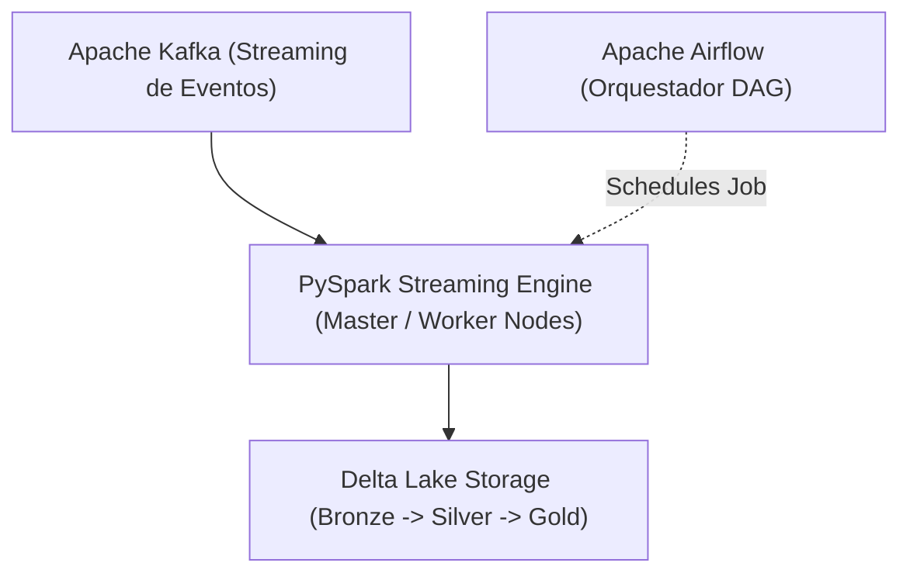

# Big Data Engineering: PySpark, Delta Lake, Apache Kafka y Airflow

Cuando el volumen de los datos supera la memoria RAM de un solo servidor (Terabytes o Petabytes), las herramientas tradicionales como Pandas fallan por Out-of-Memory (OOM). La **Ingeniería de Big Data** utiliza sistemas de cómputo distribuido en clústeres masivos donde las cargas de trabajo se dividen horizontalmente entre decenas o cientos de nodos.



## 1. PySpark: Cómputo Distribuido en memoria RAM

PySpark es la API en Python para Apache Spark. Transforma operaciones imperativas en grafos acíclicos dirigidos (DAGs) de ejecución perezosa (Lazy Evaluation) optimizados por el motor Catalyst.

```python
from pyspark.sql import SparkSession
from pyspark.sql.functions import col, avg, count

# Inicialización de la Sesión distribuida de Spark
spark = SparkSession.builder     .appName("NMerge Big Data Pipeline")     .config("spark.driver.memory", "4g")     .config("spark.executor.memory", "8g")     .getOrCreate()

# Carga de dataset masivo Parquet desde HDFS o S3
df_spark = spark.read.parquet("s3a://nmerge-data-bucket/transacciones/*.parquet")

# Operaciones transformacionales con ejecución diferida (Lazy)
df_agrupado = df_spark.filter(col("monto") > 100)     .groupBy("categoria", "pais")     .agg(
        avg("monto").alias("monto_promedio"),
        count("transaccion_id").alias("total_operaciones")
    )     .orderBy(col("total_operaciones").desc())

# Evaluación de la acción (Acción física en los nodos workers)
df_agrupado.show(10)
```

## 2. Delta Lake: Arquitectura Lakehouse y Transacciones ACID

Delta Lake añade una capa de almacenamiento de código abierto sobre almacenamiento de objetos (AWS S3, Azure Blob, GCS) que aporta transacciones ACID, registro de transacciones ACID (`_delta_log`) y Time Travel (viaje en el tiempo de versiones).

```python
# Escritura en formato Delta Lake con soporte ACID
df_spark.write.format("delta")     .mode("overwrite")     .partitionBy("fecha")     .save("s3a://nmerge-data-bucket/lakehouse/silver/transacciones")

# Consulta de Viaje en el Tiempo (Time Travel) a una versión anterior
df_version_anterior = spark.read.format("delta")     .option("versionAsOf", 2)     .load("s3a://nmerge-data-bucket/lakehouse/silver/transacciones")
```

## 3. Orquestación de Data Pipelines con Apache Airflow

Airflow define pipelines de datos como código Python estructurado en DAGs (Directed Acyclic Graphs).

```python
from datetime import datetime, timedelta
from airflow import DAG
from airflow.providers.apache.spark.operators.spark_submit import SparkSubmitOperator

default_args = {
    'owner': 'Data Engineering Team',
    'depends_on_past': False,
    'start_date': datetime(2026, 1, 1),
    'retries': 2,
    'retry_delay': timedelta(minutes=5),
}

with DAG(
    'etl_big_data_nmerge',
    default_args=default_args,
    schedule_interval='@daily',
    catchup=False
) as dag:

    spark_job = SparkSubmitOperator(
        task_id='procesamiento_spark_diario',
        application='/opt/airflow/dags/scripts/spark_etl.py',
        conn_id='spark_default',
        executor_memory='4g',
        total_executor_cores=8
    )
```
