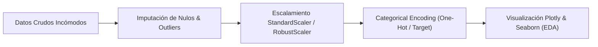

# Exploración de Datos (EDA), Data Cleaning y Visualización Científica

El **Análisis Exploratorio de Datos (EDA - Exploratory Data Analysis)** es la fase crítica de la ciencia de datos donde el investigador analiza cuantitativamente y visualmente las estructuras del conjunto de datos para descubrir anomalías, probar hipótesis preliminares, identificar datos faltantes y comprender la distribución subyacente antes de construir cualquier modelo predictivo de Machine Learning.



## 1. Tratamiento Profesional de Datos Faltantes (Data Imputation)

Los valores nulos (`NaN` / `None`) pueden distorsionar los algoritmos estadísticos. Eliminar filas a ciegas (`dropna`) produce sesgo de selección. Las técnicas avanzadas incluyen la imputación por mediana condicional o la imputación por vecinos más cercanos (KNN Imputer).

```python
import pandas as pd
import numpy as np
from sklearn.impute import KNNImputer

# Creación de DataFrame con datos faltantes sintéticos
np.random.seed(42)
df = pd.DataFrame({
    'edad': [25, 30, np.nan, 45, 50, 22, np.nan, 60],
    'ingresos': [50000, 60000, 52000, np.nan, 110000, 48000, 95000, np.nan],
    'score_credito': [650, 700, 680, 750, np.nan, 610, 790, 800]
})

# Imputacion avanzada basada en k-Vecinos Mas Cercanos (KNN)
imputer = KNNImputer(n_neighbors=3)
datos_imputados = imputer.fit_transform(df)
df_limpio = pd.DataFrame(datos_imputados, columns=df.columns)

print("DataFrame Imputado con KNN:")
print(df_limpio)
```

## 2. Escalamiento de Características (Feature Scaling)

Muchos algoritmos de Machine Learning (KNN, SVM, Regresión Ridge/Lasso, Redes Neuronales) se basan en la distancia euclidiana entre puntos. Si una variable está en el rango [0, 1] y otra en [1000, 1000000], la segunda dominará injustamente el cálculo de los gradientes.

- **StandardScaler:** Z-score normalization ($z = \frac{x - \mu}{\sigma}$). Ideal para distribuciones gaussianas.
- **RobustScaler:** Utiliza la mediana y el rango intercuartílico (IQR). Resistente a valores atípicos (outliers).

```python
from sklearn.preprocessing import StandardScaler, RobustScaler

scaler_standard = StandardScaler()
scaler_robust = RobustScaler()

df_limpio['ingresos_std'] = scaler_standard.fit_transform(df_limpio[['ingresos']])
df_limpio['ingresos_robust'] = scaler_robust.fit_transform(df_limpio[['ingresos']])

print("Comparación de Escalamiento:")
print(df_limpio[['ingresos', 'ingresos_std', 'ingresos_robust']])
```

## 3. Visualización Científica e Interactiva con Plotly y Seaborn

La visualización de datos permite detectar correlaciones no lineales y distribuciones bimodales que los resúmenes estadísticos simples ocultan.

```python
import plotly.express as px

# Creacion de gráfico de dispersión interactivamente con linea de tendencia
fig = px.scatter(
    df_limpio, 
    x='edad', 
    y='ingresos', 
    color='score_credito',
    size='ingresos',
    trendline='ols',
    title='Relación Interactiva entre Edad, Ingresos y Score Crediticios'
)

# Renderizado interactivo compatible con Jupyter / Web Application
fig.update_layout(template='plotly_dark')
# fig.show()
```
