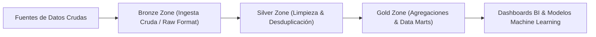

# Delta Lake & Arquitectura Lakehouse (Medallion Architecture)

La **Arquitectura Lakehouse** combina la confiabilidad, las transacciones ACID y la gobernanza de los Data Warehouses tradicionales con la escalabilidad y bajo costo de los Data Lakes sobre almacenamiento de objetos de la nube (AWS S3, Azure Data Lake, Google Cloud Storage). **Delta Lake** es la capa de almacenamiento ACID de código abierto que hace posible esta arquitectura.



## 1. La Arquitectura Medallón (Bronze, Silver, Gold)

- **Capa Bronze (Raw Data):** Almacena los eventos y archivos crudos tal como llegan de las fuentes de origen (JSON, CSV, Kafka), conservando la historia inmutable completa.
- **Capa Silver (Cleansed & Conformed Data):** Filtra, valida, limpia y desduplica los datos de la capa Bronze. Representa una vista estructurada confiable a nivel de empresa.
- **Capa Gold (Business Aggregates):** Datos agregados organizados en esquemas en estrella (Star Schema) o Data Marts preparados para consumo directo de inteligencia de negocios (BI) y modelos analíticos.

## 2. Transacciones ACID, Merge (UPSERT) y Time Travel en Delta Lake

Delta Lake implementa un registro de transacciones ACID (`_delta_log`) compuesto por archivos JSON secuenciales que garantizan aislamiento de lectura/escritura concurrente.

```sql
-- Operación MERGE (UPSERT) nativa en Delta Lake para actualización incremental
MERGE INTO delta.`s3a://nmerge-data/lakehouse/silver/clientes` AS target
USING datos_nuevos_stage AS source
ON target.cliente_id = source.cliente_id
WHEN MATCHED THEN
  UPDATE SET 
    target.email = source.email,
    target.fecha_actualizacion = CURRENT_TIMESTAMP()
WHEN NOT MATCHED THEN
  INSERT (cliente_id, nombre, email, fecha_registro)
  VALUES (source.cliente_id, source.nombre, source.email, CURRENT_TIMESTAMP());
```

```python
# Consulta de Viaje en el Tiempo (Time Travel)
from delta.tables import DeltaTable

# Carga de la tabla Delta
deltaTable = DeltaTable.forPath(spark, "s3a://nmerge-data/lakehouse/silver/clientes")

# Restauración de la tabla a una versión histórica previa antes de una falla
deltaTable.restoreToVersion(5)
```
