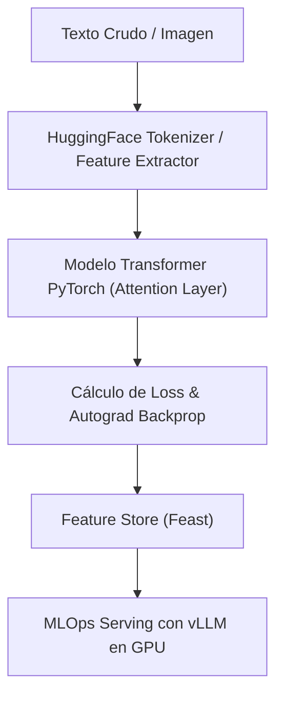

# Deep Learning con PyTorch, Arquitecturas Transformers y MLOps

El **Deep Learning (Aprendizaje Profundo)** utiliza redes neuronales artificiales profundas compuestas por múltiples capas ocultas no lineales para aprender representaciones jerárquicas complejas directamente a partir de datos no estructurados como imágenes, texto libre, audio y video. En la producción moderna de IA, la arquitectura **Transformer** (basada en el mecanismo de auto-atención) domina el estado del arte (SOTA).



## 1. PyTorch: Tensores, Autograd y Redes Neuronales Profundas

PyTorch es la librería preferida en investigación y producción para Deep Learning gracias a sus grafos de computación dinámicos y aceleración en unidades de procesamiento gráfico (GPU CUDA).

```python
import torch
import torch.nn as nn
import torch.optim as optim

# Selección dinámica de dispositivo de cómputo (CUDA GPU vs CPU)
device = torch.device("cuda" if torch.cuda.is_available() else "cpu")
print(f"Ejecutando Deep Learning en Dispositivo: {device}")

# Definición de una Red Neuronal Profunda Multi-Capa (MLP)
class RedNeuronalProfunda(nn.Module):
    def __init__(self, input_dim, hidden_dim, output_dim):
        super(RedNeuronalProfunda, self).__init__()
        self.fc1 = nn.Linear(input_dim, hidden_dim)
        self.relu = nn.ReLU()
        self.dropout = nn.Dropout(0.3)
        self.fc2 = nn.Linear(hidden_dim, output_dim)
        
    def forward(self, x):
        out = self.fc1(x)
        out = self.relu(out)
        out = self.dropout(out)
        out = self.fc2(out)
        return out

# Instanciación y transferencia del modelo a memoria GPU
model = RedNeuronalProfunda(input_dim=100, hidden_dim=64, output_dim=2).to(device)
criterion = nn.CrossEntropyLoss()
optimizer = optim.AdamW(model.parameters(), lr=1e-3, weight_decay=0.01)
```

## 2. Arquitectura Transformer con HuggingFace Transformers

Los Transformers procesan secuencias de texto enteras en paralelo mediante la fórmula de auto-atención escalada (Scaled Dot-Product Attention):

$$\text{Attention}(Q, K, V) = \text{softmax}\left(\frac{QK^T}{\sqrt{d_k}}\right)V$$

```python
from transformers import AutoTokenizer, AutoModelForSequenceClassification

model_name = "bert-base-uncased"
tokenizer = AutoTokenizer.from_pretrained(model_name)
model_transformer = AutoModelForSequenceClassification.from_pretrained(model_name, num_labels=2)

# Tokenización eficiente en tensores PyTorch
inputs = tokenizer("NMerge IA ofrece procesamiento local-first de alto rendimiento.", return_tensors="pt")
outputs = model_transformer(**inputs)
logits = outputs.logits
print(f"Logits de Clasificación Transformer: {logits}")
```

## 3. MLOps: Inferencia de Alta Velocidad en GPU con vLLM y MLflow

El ciclo de vida MLOps requiere rastrear experimentos y empaquetar modelos para inferencia masiva con baja latencia.

```bash
# Ejemplo de servidor de inferencia vLLM para LLMs en GPU con soporte PagedAttention
python3 -m vllm.entrypoints.openai.api_server \
    --model mistralai/Mistral-7B-Instruct-v0.2 \
    --tensor-parallel-size 1 \
    --port 8000
```
