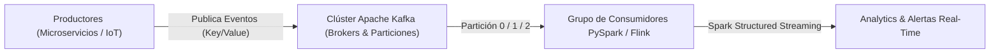

# Apache Kafka & Real-Time Event Streaming

En la arquitectura de datos moderna, la capacidad de procesar flujos de datos continuos en tiempo real (**Event Streaming**) ha superado los procesos tradicionales por lotes (Batch). **Apache Kafka** es la plataforma distribuida de transmisión de eventos de mayor rendimiento en el mundo, capaz de procesar billones de eventos al día con latencias inferiores a 10 milisegundos.



## 1. Conceptos Fundamentales de Apache Kafka

Kafka opera como un registro de confirmación de solo incorporación (Append-Only Commit Log) distribuido en un clúster de brokers.

- **Topics:** Categorías o nombres de flujo a los que se envían los mensajes.
- **Particiones:** Sub-registros distribuidos dentro de un Topic que permiten escalabilidad horizontal y procesamiento en paralelo.
- **Producers:** Aplicaciones que publican eventos en uno o más Topics de Kafka.
- **Consumers & Consumer Groups:** Clientes que se suscriben a los Topics. Un Grupo de Consumidores divide automáticamente las particiones entre sus miembros para garantizar un procesamiento ordenado y equilibrado.

## 2. Ingesta de Eventos en Tiempo Real con PySpark Structured Streaming

PySpark Structured Streaming permite tratar flujos en tiempo real procedentes de Kafka como si fueran DataFrames continuos en memoria.

```python
from pyspark.sql import SparkSession
from pyspark.sql.functions import from_json, col, expr
from pyspark.sql.types import StructType, StructField, StringType, DoubleType, TimestampType

spark = SparkSession.builder \
    .appName("Kafka Real-Time Streaming NMerge") \
    .config("spark.jars.packages", "org.apache.spark:spark-sql-kafka-0-10_2.12:3.5.0") \
    .getOrCreate()

# Definicion del esquema del payload de eventos JSON
esquema_evento = StructType([
    StructField("transaccion_id", StringType(), True),
    StructField("cliente_id", StringType(), True),
    StructField("monto", DoubleType(), True),
    StructField("timestamp", TimestampType(), True)
])

# Conexión en streaming al cluster de Kafka
df_kafka_stream = spark.readStream \
    .format("kafka") \
    .option("kafka.bootstrap.servers", "kafka-broker-1:9092,kafka-broker-2:9092") \
    .option("subscribe", "transacciones_bancarias") \
    .option("startingOffsets", "latest") \
    .load()

# Deserializacion del valor de la clave/payload JSON
df_eventos = df_kafka_stream.selectExpr("CAST(value AS STRING) as json_payload") \
    .select(from_json(col("json_payload"), esquema_evento).alias("data")) \
    .select("data.*")

# Procesamiento de Ventanas de Tiempo (Watermarking & Windowing)
df_alertas_fraude = df_eventos \
    .withWatermark("timestamp", "10 minutes") \
    .groupBy(
        expr("window(timestamp, '5 minutes', '1 minute')"),
        col("cliente_id")
    ) \
    .agg({"monto": "sum"}) \
    .filter(col("sum(monto)") > 5000)

# Escritura continua de alertas en streaming hacia Delta Lake
query = df_alertas_fraude.writeStream \
    .format("delta") \
    .outputMode("append") \
    .option("checkpointLocation", "s3a://nmerge-data/checkpoints/alertas") \
    .start("s3a://nmerge-data/lakehouse/silver/alertas_fraude")

# query.awaitTermination()
```
