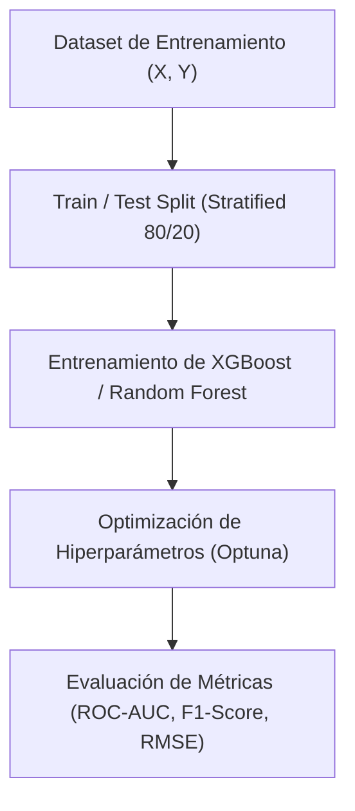

# Machine Learning Tradicional: Algoritmos Supervisados y No Supervisados

El **Machine Learning (Aprendizaje Automático)** es la rama de la Inteligencia Artificial dedicada a la construcción de sistemas capaces de aprender patrones automáticamente a partir de datos históricos sin ser programados explícitamente mediante reglas fijas. Se divide en **Aprendizaje Supervisado** (donde existen etiquetas de variable objetivo $Y$) y **Aprendizaje No Supervisado** (donde el algoritmo busca agrupamientos de patrones $X$ por sí solo).



## 1. Algoritmos Supervisados: Clasificación y Regresión

### Clasificación con XGBoost (Extreme Gradient Boosting)
XGBoost es el algoritmo basado en árboles de decisión (Ensemble Learning) más premiado en competencias de ciencia de datos debido a su velocidad de cómputo y manejo de regularización L1/L2 interna.

```python
import numpy as np
import pandas as pd
from sklearn.model_selection import train_test_split
from sklearn.metrics import classification_report, roc_auc_score
from xgboost import XGBClassifier

# Generacion de dataset sintético de detección de fraude
np.random.seed(42)
X = np.random.randn(1000, 10)
y = (X[:, 0] + X[:, 1] * 2 > 1).astype(int)

# División Estratificada de Entrenamiento y Prueba
X_train, X_test, y_train, y_test = train_test_split(X, y, test_size=0.2, random_state=42, stratify=y)

# Entrenamiento del Modelo XGBoost
model = XGBClassifier(
    n_estimators=100,
    learning_rate=0.05,
    max_depth=4,
    eval_metric='logloss',
    random_state=42
)
model.fit(X_train, y_train)

# Prediccion de probabilidades y etiquetas
y_pred = model.predict(X_test)
y_proba = model.predict_proba(X_test)[:, 1]

print("Reporte de Clasificación:")
print(classification_report(y_test, y_pred))
print(f"Métrica ROC-AUC Score: {roc_auc_score(y_test, y_proba):.4f}")
```

## 2. Optimización de Hiperparámetros con Optuna

En lugar de utilizar búsquedas exhaustivas lentas (GridSearch), **Optuna** emplea la optimización bayesiana mediante muestreadores Tree-structured Parzen Estimator (TPE) para encontrar los mejores parámetros en una fracción del tiempo.

```python
import optuna

def objective(trial):
    params = {
        'n_estimators': trial.suggest_int('n_estimators', 50, 300),
        'max_depth': trial.suggest_int('max_depth', 3, 9),
        'learning_rate': trial.suggest_float('learning_rate', 0.01, 0.2, log=True),
        'subsample': trial.suggest_float('subsample', 0.6, 1.0)
    }
    
    clf = XGBClassifier(**params, random_state=42, eval_metric='logloss')
    clf.fit(X_train, y_train)
    preds = clf.predict_proba(X_test)[:, 1]
    return roc_auc_score(y_test, preds)

# Búsqueda bayesiana de hyperparámetros
study = optuna.create_study(direction='maximize')
study.optimize(objective, n_trials=20)

print(f"Mejores Hiperparámetros Encontrados: {study.best_params}")
print(f"Mejor ROC-AUC: {study.best_value:.4f}")
```

## 3. Algoritmos No Supervisados: K-Means y DBSCAN

El aprendizaje no supervisado descubre agrupamientos naturales (clusters) sin intervención humana.

```python
from sklearn.cluster import KMeans, DBSCAN
from sklearn.preprocessing import StandardScaler

# Normalizacion previa obligatoria para algoritmos de distancia
scaler = StandardScaler()
X_scaled = scaler.fit_transform(X)

# Agrupamiento K-Means
kmeans = KMeans(n_clusters=3, random_state=42, n_init=10)
clusters_kmeans = kmeans.fit_predict(X_scaled)

# Agrupamiento DBSCAN (Deteccion de ruido y forma arbitraria)
dbscan = DBSCAN(eps=0.5, min_samples=5)
clusters_dbscan = dbscan.fit_predict(X_scaled)

print(f"Clusters K-Means Asignados: {np.bincount(clusters_kmeans)}")
```
