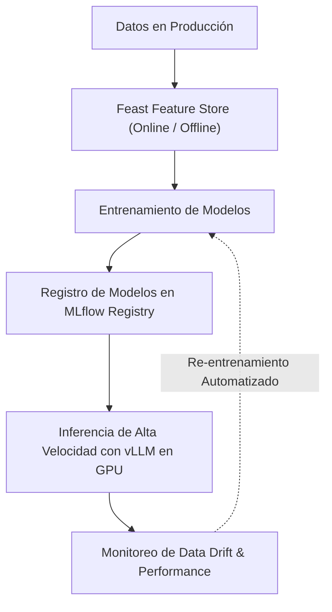

# MLOps, Model Serving & Feature Stores

**MLOps (Machine Learning Operations)** es la extensión de la disciplina DevOps dedicada a la automatización del ciclo de vida completo de los modelos de inteligencia artificial: desde la ingesta de características hasta el entrenamiento continuo, el registro de modelos, el despliegue con baja latencia y el monitoreo de **Data Drift** (desviación de distribución de datos).



## 1. Feature Stores: Registro Centralizado de Características con Feast

Un **Feature Store** resuelve el problema de la discrepancia entre las características utilizadas en el entrenamiento por lotes (Offline Feature Store en S3/BigQuery) y la inferencia en tiempo real (Online Feature Store en Redis/DynamoDB).

```python
# Definición de entidad y características en Feast (feature_definition.py)
from datetime import timedelta
from feast import Entity, FeatureView, Field, FileSource, ValueType
from feast.types import Float32, Int64

# Fuente de datos Offline
driver_stats_source = FileSource(
    name="driver_stats_source",
    path="s3a://nmerge-mlops/features/driver_stats.parquet",
    timestamp_field="event_timestamp",
)

# Definición de la entidad
driver = Entity(name="driver_id", value_type=ValueType.INT64)

# Feature View
driver_stats_fv = FeatureView(
    name="driver_hourly_stats",
    entities=[driver],
    ttl=timedelta(days=7),
    schema=[
        Field(name="conv_rate", dtype=Float32),
        Field(name="acc_rate", dtype=Float32),
        Field(name="avg_daily_trips", dtype=Int64),
    ],
    online=True,
    source=driver_stats_source,
)
```

## 2. Inferencia en GPU con vLLM y PagedAttention para LLMs

Para servir modelos de lenguaje masivos (LLMs), los servidores tradicionales sufren por la fragmentación de la memoria RAM de la GPU. **vLLM** introduce **PagedAttention**, una arquitectura de memoria virtual inspirada en los sistemas operativos que permite un rendimiento hasta 24x mayor.

```python
from vllm import LLM, SamplingParams

# Carga optimizada del modelo LLM en GPU con PagedAttention
llm = LLM(
    model="mistralai/Mistral-7B-Instruct-v0.2",
    tensor_parallel_size=1,
    gpu_memory_utilization=0.90
)

# Parámetros de generación de texto
sampling_params = SamplingParams(temperature=0.7, top_p=0.95, max_tokens=256)

prompts = [
    "Explica los principios del algoritmo Myers LCS en Data Science:",
    "¿Cuáles son los beneficios de la arquitectura Medallón en Delta Lake?"
]

# Generación masiva paralela en GPU
outputs = llm.generate(prompts, sampling_params)

for output in outputs:
    print(f"Prompt: {output.prompt}")
    print(f"Respuesta IA: {output.outputs[0].text}\n---")
```
