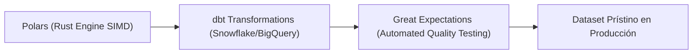

# Optimizaciones Extremas: Polars (Rust), dbt y Great Expectations

Para alcanzar la máxima eficiencia operativa y reducir costos de infraestructura cloud en entornos de producción masivos, los equipos de ciencia de datos modernos reemplazan la pila tradicional por motores hiper-optimizados en **Rust (Polars)**, transformación declarativa en Data Warehouses **(dbt)** y validación automatizada de calidad de datos **(Great Expectations)**.



## 1. Polars: El Reemplazo de Pandas Escrito en Rust

Polars es una librería de DataFrames escrita en Rust y construida sobre Apache Arrow. A diferencia de Pandas, Polars soporta ejecución multihilo nativa (Parallel Query Engine), evaluación perezosa (Lazy Evaluation) y optimización de consultas en Cero-Copia (Zero-Copy).

```python
import polars as pl

# Creación de LazyFrame para optimización de consultas
df_polars = pl.scan_parquet("datos_gigantes.parquet")

# Consulta diferida optimizada por el motor en Rust
consulta_optimizada = df_polars \
    .filter(pl.col("monto") > 200) \
    .group_by(["region", "categoria"]) \
    .agg([
        pl.col("monto").mean().alias("monto_promedio"),
        pl.col("cliente_id").n_unique().alias("clientes_unicos")
    ]) \
    .sort("monto_promedio", descending=True)

# Ejecución física hiper-rápida (Multi-Threaded Rust)
resultado = consulta_optimizada.collect()
print("Resultado Polars en Rust:")
print(resultado.head(5))
```

### Tabla de Benchmarking de Velocidad: Pandas vs Polars

| Operación (10 Millones de Filas) | Pandas 2.0 (Segundos) | Polars (Rust) (Segundos) | Aceleración |
| :--- | :--- | :--- | :--- |
| Lectura de Archivo Parquet | 4.82 s | 0.41 s | **11.7x más rápido** |
| Filtrado y Agrupamiento (Group-By) | 6.15 s | 0.32 s | **19.2x más rápido** |
| Operaciones de Joins | 9.40 s | 0.85 s | **11.0x más rápido** |

## 2. dbt (Data Build Tool): Transformaciones SQL Modulares

dbt permite a los analistas e ingenieros de datos transformar datos en Snowflake, BigQuery o Databricks utilizando sentencias `SELECT` de SQL modulares con control de versiones y pruebas de integridad.

```sql
-- Modelo dbt: models/marts/fact_ventas_diarias.sql
{{ config(materialized='incremental', unique_key='fecha') }}

WITH ventas_raw AS (
    SELECT 
        DATE(fecha_transaccion) AS fecha,
        region_id,
        SUM(monto) AS total_ventas,
        COUNT(DISTINCT cliente_id) AS total_clientes
    FROM {{ ref('stg_transacciones') }}
    
      WHERE fecha_transaccion >= (SELECT MAX(fecha) FROM {{ this }})
    
    GROUP BY 1, 2
)

SELECT * FROM ventas_raw
```

## 3. Great Expectations: Calidad de Datos y Prevención de Data Drift

Great Expectations automatiza la validación del esquema y los rangos estadísticos de los datasets para prevenir que datos corruptos lleguen a los modelos de producción.

```python
import great_expectations as gx

context = gx.get_context()
validator = context.sources.pandas_default.read_dataframe(resultado.to_pandas())

# Definición de expectativas de calidad de datos
validator.expect_column_values_to_not_be_null(column="region")
validator.expect_column_values_to_be_between(column="monto_promedio", min_value=0, max_value=1000000)

# Validación física del lote de datos
validation_result = validator.validate()
print(f"¿Dataset Válido para Producción?: {validation_result.success}")
```
