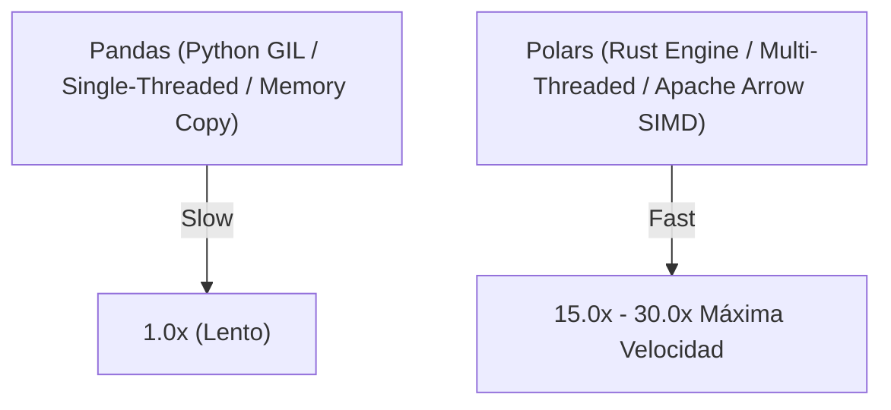

# Polars Framework: Motor SIMD en Rust vs Pandas

**Polars** es la librería de manipulación de DataFrames de próxima generación diseñada desde cero en lenguaje **Rust** sobre la especificación en memoria **Apache Arrow**. A diferencia de Pandas, que ejecuta cómputos monohilo (Single-threaded) con copias continuas de memoria, Polars implementa procesamiento multihilo automático por hardware, optimizador de consultas en Cero-Copia (Zero-Copy) e instrucciones **SIMD (Single Instruction Multiple Data)** de la CPU.



## 1. Comparativa Arquitectónica: Polars vs Pandas 2.0

| Característica | Pandas 2.0 (PyArrow) | Polars (Rust Engine) |
| :--- | :--- | :--- |
| **Lenguaje del Engine** | Python / C | **Rust Puro** |
| **Ejecución de Hilos** | Monohilo (Global Interpreter Lock - GIL) | **Multihilo Paralelo Automático** |
| **Forma de Evaluación** | Solo Imperativa (Eager Evaluation) | **Lazy Evaluation & Eager Mode** |
| **Optimizador de Consultas** | Ninguno | **Catalyst-like Rust Optimizer** |
| **Uso de Memoria RAM** | Copias Frecuentes en Memoria | **Zero-Copy & Memory Mapping (mmap)** |

## 2. Modo Lazy y Optimización de Consultas en Polars

El modo `LazyFrame` compila la consulta en un grafo lógico y aplica optimizaciones automáticas de predicados y columnas antes de procesar un solo byte.

```python
import polars as pl

# Ingesta perezosa desde Parquet usando LazyFrame
lazy_df = pl.scan_parquet("datos_gigantes.parquet")

# Construcción de la consulta diferida (Lazy Pipeline)
query = lazy_df \
    .filter(pl.col("monto") > 100) \
    .group_by(["pais", "categoria"]) \
    .agg([
        pl.col("monto").mean().alias("monto_promedio"),
        pl.col("monto").sum().alias("monto_total"),
        pl.col("cliente_id").n_unique().alias("clientes_unicos")
    ]) \
    .sort("monto_total", descending=True)

# Imprimir el plan físico optimizado por el motor en Rust
print("Plan Físico Optimizado de Polars:")
print(query.explain())

# Ejecución física hiper-rápida utilizando todos los núcleos de la CPU
result = query.collect()
print(result.head(10))
```
