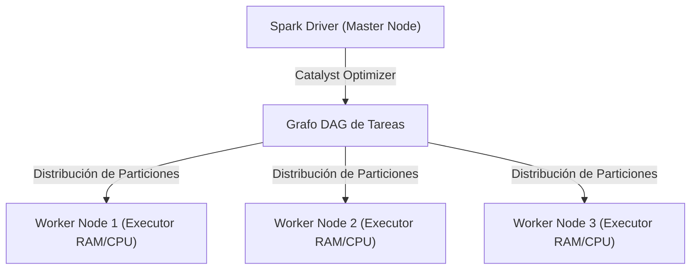

# PySpark & Big Data: Procesamiento Distribuido en Memoria RAM

Cuando los volúmenes de datos exceden la capacidad de memoria RAM de un servidor individual (cargas de trabajo en la escala de Terabytes a Petabytes), los DataFrames tradicionales como Pandas fallan con errores fatales de memoria (Out-of-Memory / OOM). **Apache Spark** resuelve este desafío mediante un motor de cómputo distribuido que divide las tareas en grafos acíclicos dirigidos (DAGs) procesados en paralelo por un clúster de nodos (Master y Workers).



## 1. Arquitectura de Apache Spark y el Optimizador Catalyst

Apache Spark desacopla la lógica de programación (definida en Python con PySpark) del motor de ejecución binario escrito en Scala/Java sobre la JVM.

- **Spark Driver Node:** Coordina el programa principal, crea el `SparkSession`, compila el código en un plan lógico y convierte las transformaciones en un plan físico optimizado.
- **Worker Nodes & Executors:** Procesos JVM independientes que ejecutan las tareas físicas (Tasks) en las particiones de datos asignadas y devuelven los resultados al Driver.
- **Optimizador Catalyst:** Analiza las sentencias SQL y DataFrames para aplicar optimizaciones automáticas como **Predicate Pushdown** (filtrar datos directamente en la fuente Parquet/SQL antes de cargarlos a RAM) y **Column Pruning** (leer solo las columnas necesarias).

## 2. Ingesta y Transformaciones Vectorizadas en PySpark

Las operaciones en PySpark se dividen estrictamente en dos categorías:

1. **Transformaciones (Lazy Evaluation):** Operaciones diferidas (`filter`, `select`, `groupBy`, `join`) que no ejecutan cómputo inmediato, sino que construyen el plan lógico del DAG.
2. **Acciones:** Operaciones físicas (`count`, `collect`, `show`, `write`) que fuerzan la ejecución del DAG y distribuyen los cómputos en el clúster.

```python
from pyspark.sql import SparkSession
from pyspark.sql.functions import col, when, avg, count, broadcast

# Inicialización de la sesión de Spark distribuida
spark = SparkSession.builder \
    .appName("NMerge Data Science PySpark Pipeline") \
    .config("spark.driver.memory", "8g") \
    .config("spark.executor.memory", "16g") \
    .config("spark.sql.shuffle.partitions", "200") \
    .getOrCreate()

# Carga perezosa desde almacenamiento columnar Parquet en AWS S3
df_transacciones = spark.read.parquet("s3a://nmerge-bigdata/transacciones/*.parquet")
df_clientes = spark.read.parquet("s3a://nmerge-bigdata/clientes/*.parquet")

# Aplicación de Broadcast Join para evitar el costoso Shuffle en red
df_unificado = df_transacciones.join(
    broadcast(df_clientes),
    on="cliente_id",
    how="inner"
)

# Transformaciones analíticas vectorizadas
df_resultado = df_unificado \
    .filter(col("monto") > 50) \
    .withColumn("segmento_riesgo", when(col("monto") > 1000, "Alto").otherwise("Normal")) \
    .groupBy("region", "segmento_riesgo") \
    .agg(
        avg("monto").alias("monto_promedio"),
        count("transaccion_id").alias("total_operaciones")
    )

# Acción física (Dispara el cómputo distribuido)
df_resultado.show(20)
```

## 3. Optimización de Memoria: Shuffle, Partitioning y Caching

El punto crítico de latencia en PySpark es el **Shuffle** (reorganización de datos a través de la red entre nodos durante operaciones `groupBy` o `join`).

- **Particionamiento Adecuado:** La regla empírica es mantener particiones de entre **128 MB y 256 MB** de tamaño.
- **Uso de `.cache()` / `.persist()`:*** Almacena resultados intermedios de DataFrames reusados frecuentemente en la memoria RAM del Executor (`MEMORY_AND_DISK_SER`).

```python
# Re-particionamiento inteligente por fecha para optimizar escrituras
df_resultado.repartition(10, col("region")) \
    .write \
    .mode("overwrite") \
    .partitionBy("region") \
    .parquet("s3a://nmerge-bigdata/procesado/ventas_por_region")
```
