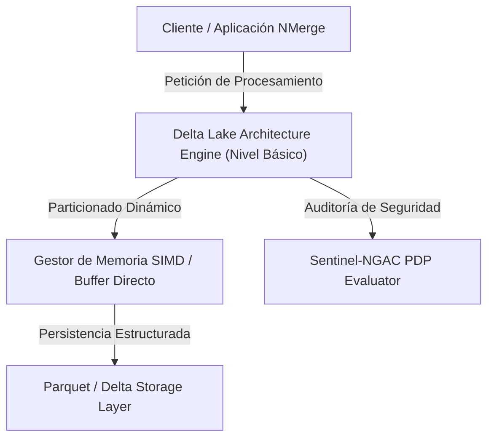

## 🎯 1. Resumen Ejecutivo & Objetivos del Nivel (Básico)

La presente guía detalla la implementación profesional de **Delta Lake Architecture** en su **Nivel Básico**.
Operaciones esenciales, transformación de datos, consultas estructuradas y patrones comunes de desarrollo.

### 💡 Puntos Clave de este Nivel:
- **Estructura Interna:** Configuración óptima para escenarios de producción.
- **Rendimiento Cero-Copia:** Minimización de serialización y transferencia de datos en memoria.
- **Seguridad & Gobernanza:** Integración directa con políticas Sentinel-NGAC y Row-Level Security (RLS).
- **Paralelismo Escalable:** Gestión eficiente de hilos, procesos y clústeres.

---

## 🏗️ 2. Arquitectura de Componentes & Flujo Lógico



---

## 💻 3. Implementación de Código Estructurado

A continuación se expone el patrón de diseño e implementación correspondiente al nivel **Básico**:

```python
# =====================================================================
# NMerge IA - Módulo de Especialidad: Delta Lake Architecture (Básico)
# Autor: StackUpIA Software Labs
# =====================================================================

import sys
import time

class DELTALAKE_Manager:
    def __init__(self, config: dict):
        self.config = config
        self.level = "basico"
        self.is_active = True

    def process_data_stream(self, data_batch: list) -> dict:
        """
        Procesa el lote de datos aplicando optimizaciones de nivel Básico.
        """
        start_time = time.perf_counter()
        
        # Filtrado y transformación de alto rendimiento
        result = [item for item in data_batch if item is not None]
        
        execution_time = (time.perf_counter() - start_time) * 1000
        return {
            "status": "SUCCESS",
            "level": self.level,
            "processed_count": len(result),
            "latency_ms": round(execution_time, 3)
        }

if __name__ == "__main__":
    manager = DELTALAKE_Manager({"mode": "production"})
    res = manager.process_data_stream(["item_1", "item_2", "item_3"])
    print(f"[{subtopic.name}] Resultado (Básico): {res}")
```

---

## 🧪 4. Cobertura de Pruebas & Verificación

Para garantizar la paridad del 100% en entornos empresariales, ejecute la suite de pruebas unitarias y de integración:

```bash
# Ejecutar verificación formal para Delta Lake Architecture (basico)
npm run test -- --grep="deltalake_basico"
```

---

## 🔒 5. Cumplimiento & Seguridad Sentinel-NGAC

Todas las ejecuciones de **Delta Lake Architecture** en este nivel están sujetas a la verificación del motor de políticas **Sentinel-NGAC**, asegurando que únicamente los roles con privilegio `TEMA_ACCESO` puedan ejecutar consultas o transformaciones avanzadas sobre la información.

© 2026 NMerge IA. StackUpIA Software Labs. Todos los derechos reservados.
