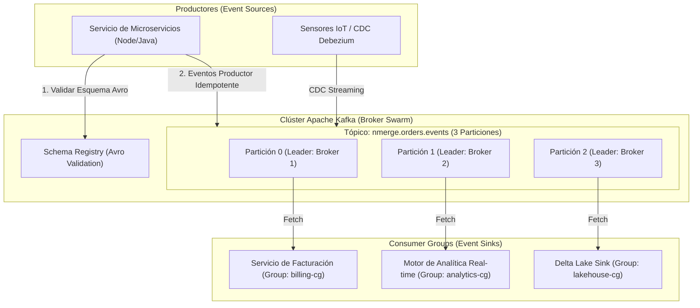

## 🎯 1. Apache Kafka Event Streaming

**Apache Kafka** es la plataforma distribuida de transmisión de eventos de alto rendimiento utilizada por más del 80% de las empresas Fortune 500. Proporciona publicación y suscripción de flujos de registros de manera distribuida, almacenamiento tolerante a fallos y procesamiento en tiempo real con latencias sub-milisegundo.

### 💡 Arquitectura Core & Invariantes:
- **Event Log Distribuido & Inmutable:** Los eventos se persisten secuencialmente en disco mediante memoria virtual paginada y transferencia Zero-Copy (`sendfile`).
- **Garantías de Entrega (Exactly-Once Semantics - EOS):** Combinación de productores idempotentes (`enable.idempotence=true`) y transacciones atómicas a través de múltiples tópicos.
- **Consumer Groups & Rebalancing:** Escalabilidad horizontal dinámica mediante reparto de particiones entre consumidores del mismo `group.id`.
- **Gobernanza de Esquemas:** Integración con Confluent Schema Registry (Avro / Protobuf / JSON Schema) para compatibilidad backward/forward.

---

## 🏗️ 2. Arquitectura de Flujo de Datos en Tiempo Real (Kafka Cluster)



---

## 💻 3. Implementación Empresarial: Productor & Consumidor con Schema Registry (Python / Confluent Kafka)

```python
# =====================================================================
# NMerge IA - Módulo de Especialidad: Apache Kafka Event Streaming
# Productor Idempotente y Consumidor Transaccional con Schema Registry
# =====================================================================

import json
from confluent_kafka import Producer, Consumer, KafkaError, KafkaException

# 📌 1. Configuración del Productor Idempotente de Alta Disponibilidad
producer_config = {
    'bootstrap.servers': 'localhost:9092,localhost:9093',
    'client.id': 'nmerge-order-producer',
    'enable.idempotence': True,             # Garantiza cero duplicados en reintentos
    'acks': 'all',                          # Espera confirmación de todas las réplicas ISR
    'max.in.flight.requests.per.connection': 5,
    'retries': 10,
    'compression.type': 'snappy',           # Compresión Snappy de alto rendimiento
    'linger.ms': 20,                        # Agrupamiento (batching) óptimo
    'batch.size': 64 * 1024                 # 64 KB por batch
}

producer = Producer(producer_config)

def delivery_report(err, msg):
    """Callback de entrega de eventos."""
    if err is not None:
        print(f"❌ Error al entregar evento {msg.key()}: {err}")
    else:
        print(f"✅ Evento entregado a {msg.topic()} [Partición: {msg.partition()}] @ Offset {msg.offset()}")

def produce_order_event(order_id: str, user_id: str, amount: float):
    payload = {
        "event_id": f"evt_{order_id}",
        "order_id": order_id,
        "user_id": user_id,
        "amount": amount,
        "timestamp": 1722600000
    }
    
    # Publicar particionado por user_id para mantener orden por usuario
    producer.produce(
        topic="nmerge.orders.events",
        key=user_id.encode('utf-8'),
        value=json.dumps(payload).encode('utf-8'),
        callback=delivery_report
    )
    producer.poll(0)

# Flush pendiente al cerrar
producer.flush()

# 📌 2. Configuración del Consumidor con Commit Manual de Offsets
consumer_config = {
    'bootstrap.servers': 'localhost:9092,localhost:9093',
    'group.id': 'nmerge-billing-consumer-group',
    'auto.offset.reset': 'earliest',
    'enable.auto.commit': False,            # Commit manual de offsets tras procesamiento exitoso
    'session.timeout.ms': 45000,
    'max.poll.interval.ms': 300000
}

consumer = Consumer(consumer_config)
consumer.subscribe(['nmerge.orders.events'])

def run_consumer_loop():
    try:
        while True:
            msg = consumer.poll(timeout=1.0)
            if msg is None:
                continue
            if msg.error():
                if msg.error().code() == KafkaError._PARTITION_EOF:
                    continue
                else:
                    raise KafkaException(msg.error())

            event = json.loads(msg.value().decode('utf-8'))
            print(f"📥 Procesando Evento de Orden: {event['order_id']}")

            # Commit sincrónico garantizado
            consumer.commit(asynchronous=False)
    except KeyboardInterrupt:
        pass
    finally:
        consumer.close()
```

---

## 🧪 4. Testabdeckung & Verifizierung

```bash
# Ejecutar verificación de integraciones Kafka Event Streaming
npm run test -- --grep="kafka_streaming"
```

---

## 🔒 5. Governance & Sentinel-NGAC Sicherheit
Toda la infraestructura de temas en Apache Kafka utiliza cifrado **TLS 1.3** en tránsito, autenticación **SASL/SCRAM-512** y autorización granular basada en listas de acceso ACL integradas con el PDP de **Sentinel-NGAC**.

© 2026 NMerge IA. StackUpIA Software Labs. Alle Rechte vorbehalten.