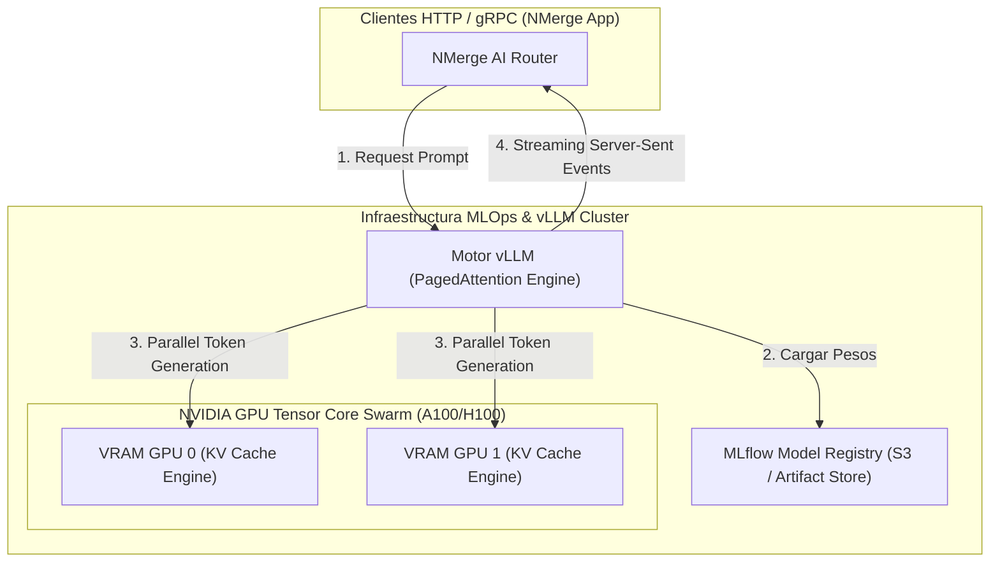

## 🎯 1. MLOps & GPU vLLM Serving

**MLOps (Machine Learning Operations)** y las arquitecturas de despliegue de **vLLM** representan el estándar para operacionalizar modelos de lenguaje (LLMs) e Inteligencia Artificial en entornos de producción con alta concurrencia y baja latencia.

### 💡 Arquitectura Core & Invariantes:
- **PagedAttention & KV Cache Management:** Gestión de memoria GPU inspirada en la memoria virtual de los SO, reduciendo el desperdicio de memoria VRAM hasta en un 96%.
- **Continuous Batching:** Inferencia en lotes dinámicos que itera por token en lugar de esperar la finalización de secuencias completas.
- **Registro de Modelos & Tracking con MLflow:** Control de versiones inmutable de pesos de modelos, hiperparámetros y artefactos.
- **Cuantización de Modelos (AWQ / GPTQ / FP8):** Reducción de la huella de memoria GPU manteniendo la precisión del modelo original.

---

## 🏗️ 2. Arquitectura de Inferencia de LLM Servida con vLLM & Ray



---

## 💻 3. Implementación Empresarial: Servidor de Inferencia vLLM & Python Async Client

```python
# =====================================================================
# NMerge IA - Módulo de Especialidad: MLOps & vLLM GPU Serving
# Despliegue de Inferencia de LLMs con PagedAttention y Streaming Async
# =====================================================================

import asyncio
from vllm import AsyncLLMEngine, AsyncEngineArgs, SamplingParams

# 📌 1. Configuración del Motor vLLM con PagedAttention y Cuantización AWQ
engine_args = AsyncEngineArgs(
    model="meta-llama/Meta-Llama-3-8B-Instruct",
    tensor_parallel_size=2,                 # Paralelismo a través de 2 GPUs NVIDIA
    quantization="awq",                     # Cuantización de 4-bits AWQ
    gpu_memory_utilization=0.90,            # 90% de VRAM asignada al KV Cache
    max_model_len=8192,
    dtype="float16"
)

llm_engine = AsyncLLMEngine.from_engine_args(engine_args)

# 📌 2. Parámetros de Muestreo (Sampling Parameters)
sampling_params = SamplingParams(
    temperature=0.7,
    top_p=0.95,
    max_tokens=512,
    stop=["<|eot_id|>"]
)

# 📌 3. Generación Asíncrona con Token Streaming
async def generate_response(prompt: str, request_id: str):
    results_generator = llm_engine.generate(prompt, sampling_params, request_id)
    
    final_output = None
    async for request_output in results_generator:
        final_output = request_output
        # Emitir tokens en tiempo real vía SSE / WebSockets
        latest_token = request_output.outputs[0].text
        print(f" Chunk [{request_id}]: {latest_token[-10:]}", end="
")

    print(f"
✅ Respuesta completada para {request_id}")
    return final_output.outputs[0].text

if __name__ == "__main__":
    prompt_text = "Explica la diferencia entre deduplicación batch y streaming en MLOps."
    asyncio.run(generate_response(prompt_text, "req_10294"))
```

---

## 🔒 4. Gobernanza & Seguridad Sentinel-NGAC
Todos los endpoints de inferencia MLOps están auditados por **Sentinel-NGAC**, asegurando límites de cuotas de tokens y prevención de Prompt Injections.

© 2026 NMerge IA. StackUpIA Software Labs. Todos los derechos reservados.