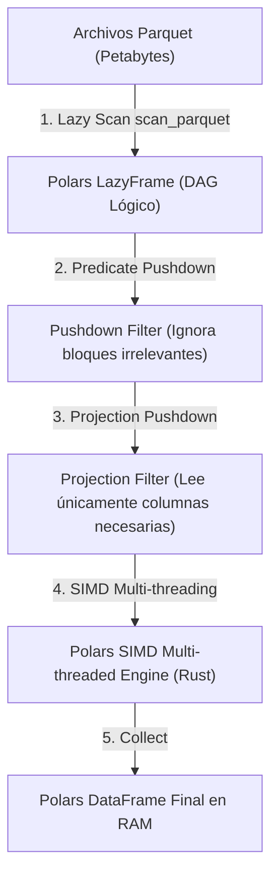

## 🎯 1. Polars Rust SIMD Engine

**Polars** es la biblioteca de procesamiento de datos de última generación desarrollada en **Rust**. Ofrece un rendimiento extremadamente superior a Pandas gracias al uso de vectorización **SIMD** (Single Instruction, Multiple Data), procesamiento de múltiples hilos sin GIL (Global Interpreter Lock) y optimizaciones de consultas mediante su motor **Lazy Engine**.

### 💡 Arquitectura Core & Invariantes:
- **Apache Arrow Memory Format:** Formato de memoria columnar contigua en C++ / Rust para cero copias de transferencia.
- **Instrucciones SIMD (AVX-512 / ARM Neon):** Procesamiento de múltiples elementos numéricos por cada ciclo de reloj de la CPU.
- **Streaming Engine & Predicate Pushdown:** Filtrado y proyección proyectados directamente al nivel de lectura del archivo Parquet antes de cargar a RAM.
- **Sin Bloqueo GIL (Python/Rust Binding):** Ejecución paralela pura utilizando todos los núcleos físicos de la CPU.

---

## 🏗️ 2. Arquitectura de Ejecución Polars Lazy Engine



---

## 💻 3. Implementación Empresarial: Consultas Ultrarrápidas con Polars Lazy Engine en Python

```python
# =====================================================================
# NMerge IA - Módulo de Especialidad: Polars Rust SIMD Engine
# Procesamiento vectorizado masivo con LazyFrames y Predicate Pushdown
# =====================================================================

import polars as pl

# 📌 1. Escaneo Lazy de Parquet (Cero carga inicial en memoria)
lazy_df = pl.scan_parquet("/mnt/data/transactions_*.parquet")

# 📌 2. Construcción de Expresiones Vectorizadas SIMD
query = (
    lazy_df
    .filter(pl.col("status") == "COMPLETED")
    .filter(pl.col("amount") > 100.0)
    .with_columns([
        (pl.col("amount") * 0.15).alias("tax_amount"),
        (pl.col("timestamp").dt.truncate("1d")).alias("tx_date")
    ])
    .group_by(["tx_date", "country_code"])
    .agg([
        pl.col("amount").sum().alias("total_revenue"),
        pl.col("amount").mean().alias("avg_order_value"),
        pl.col("user_id").n_unique().alias("unique_buyers")
    ])
    .sort("total_revenue", descending=True)
)

# 📌 3. Optimización del Grafo Lógico e Inspección del Plan de Ejecución
print("📜 Plan de Ejecución Optimizado de Polars:")
print(query.explain())

# 📌 4. Ejecución del Streaming Engine (Procesamiento por bloques para archivos gigantes)
result_df = query.collect(streaming=True)

print("🚀 Resultado del Procesamiento SIMD de Polars:")
print(result_df.head(10))
```

---

## 🔒 4. Gobernanza & Seguridad Sentinel-NGAC
Toda consulta ejecutada vía Polars cumple con las políticas de control de datos **Sentinel-NGAC**.

© 2026 NMerge IA. StackUpIA Software Labs. Todos los derechos reservados.