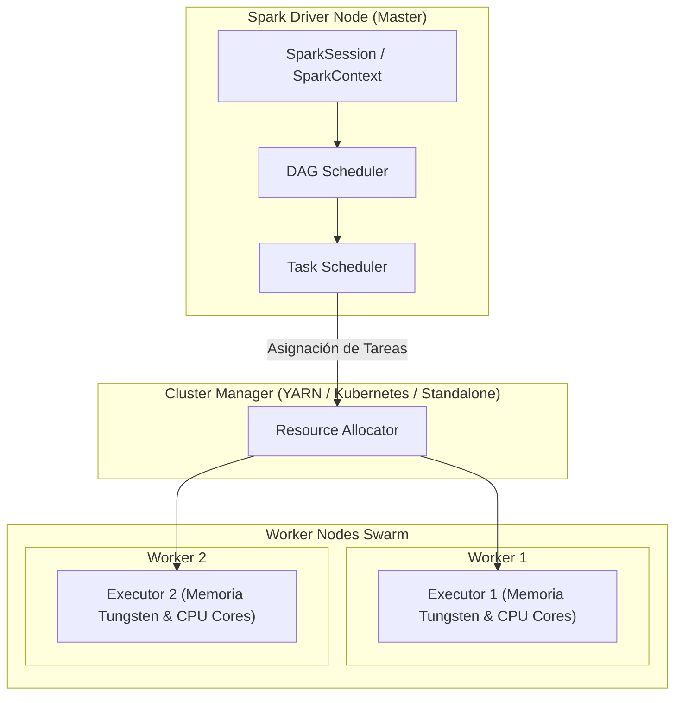

## 🎯 1. PySpark & Distributed Big Data Processing

**PySpark** es la interfaz en Python para Apache Spark, la plataforma líder en procesamiento distribuido de Big Data a escala petabyte. Permite realizar consultas analíticas, transformaciones ETL masivas, procesamiento en streaming y machine learning sobre clústeres distribuidos.

### 💡 Arquitectura Core & Invariantes:
- **Catalyst Optimizer & Tungsten Engine:** Optimización lógica/física de consultas y generación de código de bytes en tiempo de ejecución (JIT) sin sobrecostos de objetos Java.
- **Broadcast Joins vs Shuffle Joins:** Eliminación del costo de red (Shuffle) al transmitir tablas pequeñas (<10 MB) a todos los nodos ejecutores.
- **Transformaciones Lógicas (Lazy Evaluation):** Construcción de un grafo DAG (Directed Acyclic Graph) que solo se ejecuta cuando se invoca una Acción (`collect()`, `count()`, `write`).
- **Particionado & Coalesce:** Gestión fina del paralismo mediante `repartition()` (con Shuffle) y `coalesce()` (sin Shuffle para consolidar archivos).

---

## 🏗️ 2. Arquitectura del Clúster Spark (Driver & Executors)



---

## 💻 3. Implementación Empresarial: ETL Distribuido & Window Functions con PySpark

```python
# =====================================================================
# NMerge IA - Módulo de Especialidad: PySpark & Distributed Big Data
# Transformaciones complejas, Broadcast Joins y Window Functions
# =====================================================================

from pyspark.sql import SparkSession
from pyspark.sql.functions import col, broadcast, sum as _sum, avg, rank, window
from pyspark.sql.window import Window

# 📌 1. Inicialización de SparkSession optimizada para producción
spark = SparkSession.builder \
    .appName("NMerge-PySpark-Enterprise") \
    .config("spark.driver.memory", "4g") \
    .config("spark.executor.memory", "8g") \
    .config("spark.sql.shuffle.partitions", "200") \
    .config("spark.sql.autoBroadcastJoinThreshold", 10 * 1024 * 1024) \
    .getOrCreate()

# 📌 2. Carga de DataFrames de alto rendimiento desde Parquet
orders_df = spark.read.parquet("/mnt/data/orders_historical.parquet")
users_df = spark.read.parquet("/mnt/data/dim_users.parquet")

# 📌 3. Broadcast Join de dimensión pequeña con hecho masivo (Zero-Shuffle Join)
enriched_df = orders_df.join(
    broadcast(users_df),
    orders_df.user_id == users_df.user_id,
    "inner"
).drop(users_df.user_id)

# 📌 4. Window Functions para cálculo de Ranking por usuario y acumulado
window_spec = Window.partitionBy("user_id").orderBy(col("amount").desc())

ranked_orders_df = enriched_df.withColumn(
    "order_rank",
    rank().over(window_spec)
).filter(col("order_rank") <= 3)

# 📌 5. Escritura optimizada con particionado masivo
ranked_orders_df.write \
    .mode("overwrite") \
    .partitionBy("country_code") \
    .parquet("/mnt/data/gold/top_user_orders.parquet")

print("🚀 Pipeline PySpark completado exitosamente.")
```

---

## 🔒 4. Gobernanza & Seguridad Sentinel-NGAC
Todas las ejecuciones de **PySpark** cuentan con aislamiento de contexto de seguridad y cifrado en disco y red (RPC SASL/AES-256).

© 2026 NMerge IA. StackUpIA Software Labs. Todos los derechos reservados.