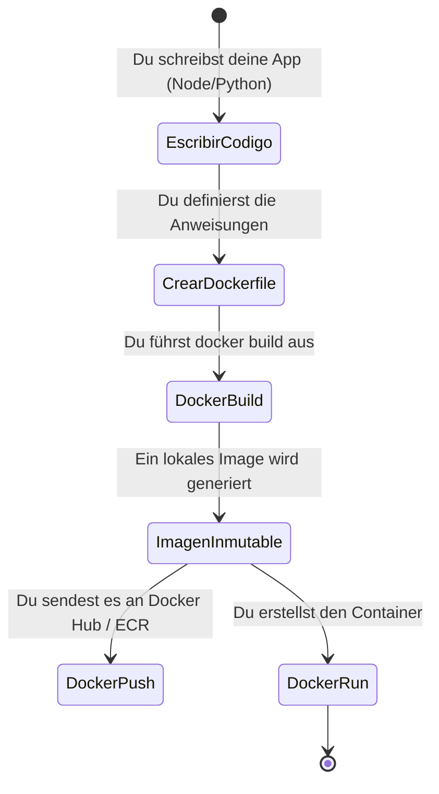

# Erstellen deiner eigenen Images (Dockerfile)

Sobald du weißt, wie man von anderen erstellte Container (wie NGINX oder Postgres) ausführt, ist es an der Zeit, deinen eigenen Code zu verpacken. Die wahre Magie von Docker liegt in der **Unveränderlichkeit (Immutability)**: Wenn du deine App heute verpackst, wird sie auf dem Computer deines Kollegen oder auf den AWS-Servern in 5 Jahren genau gleich laufen.

## 1. Das Manifest: Was ist eine Dockerfile?

Eine `Dockerfile` ist eine reine Textdatei (ohne Dateiendung), die eine Reihe logischer Anweisungen enthält, die Docker von oben nach unten liest, um ein Image zusammenzustellen.

### Der Lebenszyklus der Paketierung



## 2. Erstellen einer Web-App (Node.js)

Angenommen, wir haben eine sehr einfache Node.js-API. Unser Projekt hat die folgende Struktur:

```text
/mi-proyecto
├── package.json
├── package-lock.json
├── server.js
└── Dockerfile
```

### Die Standard-Dockerfile

Erstelle die Datei `Dockerfile` und füge die folgenden Ebenen (Layer) hinzu:

```dockerfile
# 1. Basis-Ebene: Verwende in der Produktion niemals das Tag 'latest'. Verwende feste Versionen.
FROM node:18-alpine

# 2. Arbeitsverzeichnis: Alles Folgende wird in diesem Ordner im Container ausgeführt
WORKDIR /usr/src/app

# 3. Abhängigkeits-Cache: Wir kopieren ZUERST NUR die Abhängigkeitsdateien.
# Dies ist entscheidend, um den Ebenen-Cache (Layer Cache) von Docker zu nutzen.
COPY package*.json ./

# 4. Installation: Wir führen den Paketmanager aus. Wird nur wiederholt, wenn sich die JSON-Dateien ändern.
RUN npm install --production

# 5. Quellcode: Jetzt kopieren wir den Rest der Anwendung.
COPY . .

# 6. Variablen und Ports: Wir deklarieren den Port, auf dem die App lauscht (nur zur Dokumentation).
EXPOSE 3000
ENV NODE_ENV=production

# 7. Ausführung: Der Standardbefehl beim Starten des Containers.
CMD ["node", "server.js"]
```

## 3. Die Macht des Ebenen-Caches (Layer Caching)

Warum trennen wir `COPY package*.json` von `COPY . .`? 
Docker speichert das Ergebnis jeder Zeile im Cache. Wenn du die Farbe eines Buttons in deinem Code (`server.js`) änderst, verwendet Docker den Cache der Abhängigkeiten (`npm install`) wieder, da sich die Datei `package.json` nicht geändert hat. Hättest du alles zusammen kopiert (`COPY . .` gefolgt von `RUN npm install`), würde eine einfache Textänderung Docker zwingen, alle Abhängigkeiten neu zu installieren, was dein Deployment extrem verlangsamen würde.

## 4. Bauen und Ausführen

Mit unserer fertigen `Dockerfile` weisen wir Docker an, das Image zu erstellen (der Punkt `.` gibt an, dass die Dockerfile im aktuellen Verzeichnis gesucht werden soll):

```bash
docker build -t mi-api-node:v1 .
```

Sobald der Build abgeschlossen ist, starten wir den Container:

```bash
docker run -d --name backend-api -p 3000:3000 mi-api-node:v1
```

## 5. Der Schutzschild: .dockerignore

Wenn du den Befehl `docker build` in einem Node.js-Projekt ausführst, läufst du Gefahr, den riesigen Ordner `node_modules` von deinem lokalen Computer in den Container zu kopieren und die native Installation des Containers (die möglicherweise eine andere CPU-Architektur verwendet) zu überschreiben.

Um dies zu vermeiden, erstelle IMMER eine `.dockerignore`-Datei:

```text
node_modules
npm-debug.log
.git
.env
```

Mit diesen Grundlagen bist du bereit, mehr als nur isolierte Container auszuführen. Auf der **mittleren Stufe (Nivel Medio)** werden wir lernen, wie man mehrere Dienste (wie deine Node.js-API und eine PostgreSQL-Datenbank) in einem orchestrierten Netzwerk mit **Docker Compose** verbindet.
