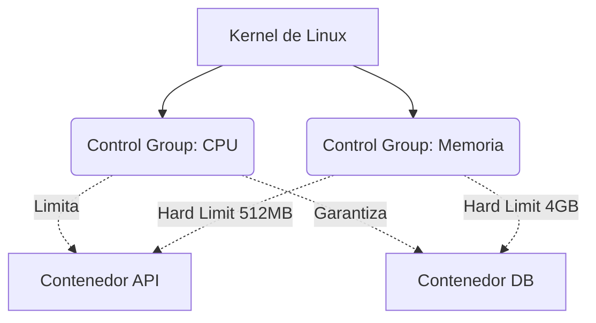

# Límites del Kernel, CGroups y Seguridad

Has aprendido a construir y orquestar imágenes hiper-optimizadas. Pero ejecutar contenedores en producción sin gobernar sus recursos es una receta para el desastre sistémico. En este nivel experto, bajaremos a las entrañas del Kernel de Linux.

¿Cómo evita Docker que un contenedor con una fuga de memoria (Memory Leak) consuma el 100% de la RAM del servidor físico y haga crashear al resto de las aplicaciones? La respuesta es **Cgroups (Control Groups)** y **Namespaces**.

## 1. Aislamiento Físico vs Aislamiento Lógico

- **Namespaces:** Le mienten al contenedor. Le hacen creer que tiene su propio disco duro, su propio sistema de red y su propio árbol de procesos (PID 1). Es el aislamiento *Lógico*.
- **Cgroups:** Le ponen esposas al contenedor. Limitan físicamente la cantidad de CPU, RAM e I/O que el contenedor puede solicitarle al hardware subyacente. Es el aislamiento *Físico*.

### Arquitectura de Control de Recursos



## 2. Implementando Límites Duros (Hard Limits)

Si un contenedor sobrepasa su límite de memoria asignado, el kernel de Linux invoca al infame **OOM Killer (Out Of Memory Killer)** y asesina el proceso del contenedor inmediatamente para salvar el sistema operativo host.

Aplica siempre políticas restrictivas en tu `docker-compose.yml` (especialmente usando la especificación *Deploy* de la versión V3/Compose Spec):

```yaml
services:
  data-processor:
    image: python-worker:latest
    deploy:
      resources:
        limits:
          cpus: '0.50'     # Máximo medio núcleo físico de CPU
          memory: 512M     # El OOM Killer actuará si llega a 513MB
        reservations:
          cpus: '0.10'     # CPU mínimo garantizado por el scheduler
          memory: 128M     # Memoria mínima reservada
```

Con esta configuración, un bucle infinito `while(True)` mal programado en el worker de Python solo afectará el 50% de un núcleo, manteniendo el servidor principal 100% estable.

## 3. Seguridad Experta: Drop Capabilities y Non-Root

Por defecto, el proceso principal dentro de un contenedor Docker se ejecuta como el usuario **root**. Esto es un riesgo masivo. Si hay un escape del contenedor (Container Breakout), el atacante tendrá privilegios de superusuario en el servidor host.

### Regla 1: Usuario No Privilegiado
Modifica el final de tu Dockerfile para degradar los permisos antes de ejecutar la aplicación.

```dockerfile
# ... (configuraciones previas) ...

# Crear un usuario de sistema sin shell ni privilegios
RUN addgroup -S appgroup && adduser -S appuser -G appgroup

# Asignar la propiedad de los archivos a ese usuario
RUN chown -R appuser:appgroup /usr/src/app

# Cambiar el contexto al usuario seguro
USER appuser

# Solo ahora ejecutamos el servidor
CMD ["node", "server.js"]
```

### Regla 2: Eliminación de Capacidades del Kernel (Capabilities)
Incluso como `root`, Linux divide los privilegios de superusuario en bloques llamados "Capabilities". Un contenedor por defecto retiene demasiadas (como `CAP_NET_RAW` que permite hacer Ping y Spoofing de red).

En producción, deberías eliminar (drop) todas las capacidades y solo devolver las matemáticas estrictamente necesarias.

```yaml
services:
  web:
    image: nginx:alpine
    cap_drop:
      - ALL # Destruye todos los privilegios del kernel
    cap_add:
      - NET_BIND_SERVICE # Solo permite asociarse a puertos bajos (<1024)
    security_opt:
      - no-new-privileges:true # Impide escalada de privilegios interna
```

## Resumen Experto
Un arquitecto de contenedores experto asume que el contenedor será vulnerado e inyectado con código malicioso. Aplicando límites de Cgroups estrictos, corriendo procesos como `USER no-privilegiado` y quitando las `Capabilities` del Kernel, garantizas que el radio de explosión (Blast Radius) de un ataque sea nulo. En el nivel **Maestro**, escalaremos esto a orquestación global.
