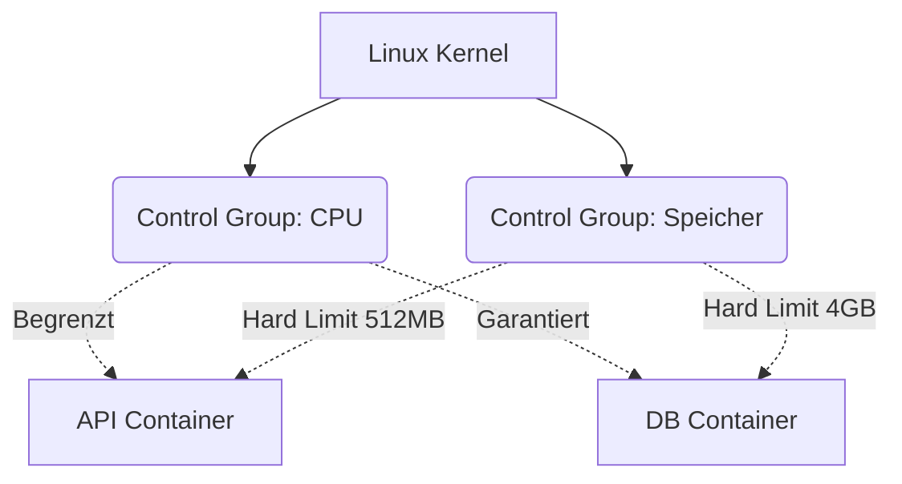

# Kernel-Limits, CGroups und Sicherheit

Du hast gelernt, hyper-optimierte Images zu erstellen und zu orchestrieren. Aber Container in der Produktion ohne Ressourcensteuerung auszuführen, ist ein Rezept für ein systemisches Desaster. Auf dieser Expertenstufe tauchen wir in die Eingeweide des Linux-Kernels ein.

Wie verhindert Docker, dass ein Container mit einem Speicherleck (Memory Leak) 100% des physischen Server-RAMs verbraucht und den Rest der Anwendungen zum Absturz bringt? Die Antwort lautet **Cgroups (Control Groups)** und **Namespaces**.

## 1. Physische vs. logische Isolierung

- **Namespaces:** Sie belügen den Container. Sie lassen ihn glauben, er hätte seine eigene Festplatte, sein eigenes Netzwerksystem und seinen eigenen Prozessbaum (PID 1). Das ist die *logische* Isolierung.
- **Cgroups:** Sie legen dem Container Handschellen an. Sie begrenzen physisch die Menge an CPU, RAM und I/O, die der Container von der zugrunde liegenden Hardware anfordern kann. Das ist die *physische* Isolierung.

### Architektur der Ressourcenkontrolle



## 2. Implementierung harter Limits (Hard Limits)

Wenn ein Container sein zugewiesenes Speicherlimit überschreitet, ruft der Linux-Kernel den berüchtigten **OOM Killer (Out Of Memory Killer)** auf und tötet den Containerprozess sofort, um das Host-Betriebssystem zu retten.

Wende in deiner `docker-compose.yml` immer restriktive Richtlinien an (insbesondere unter Verwendung der *Deploy*-Spezifikation von Version V3/Compose Spec):

```yaml
services:
  data-processor:
    image: python-worker:latest
    deploy:
      resources:
        limits:
          cpus: '0.50'     # Maximal ein halber physischer CPU-Kern
          memory: 512M     # Der OOM Killer greift ein, wenn 513MB erreicht werden
        reservations:
          cpus: '0.10'     # Vom Scheduler garantierte Mindest-CPU
          memory: 128M     # Reservierter Mindestspeicher
```

Mit dieser Konfiguration betrifft eine schlecht programmierte Endlosschleife `while(True)` im Python-Worker nur 50% eines Kerns, sodass der Hauptserver zu 100% stabil bleibt.

## 3. Experten-Sicherheit: Drop Capabilities und Non-Root

Standardmäßig wird der Hauptprozess in einem Docker-Container als **root**-Benutzer ausgeführt. Dies ist ein massives Risiko. Wenn es zu einem Ausbruch aus dem Container kommt (Container Breakout), hat der Angreifer Superuser-Rechte auf dem Host-Server.

### Regel 1: Nicht privilegierter Benutzer
Ändere das Ende deiner Dockerfile, um die Berechtigungen vor dem Ausführen der Anwendung herabzustufen.

```dockerfile
# ... (vorherige Konfigurationen) ...

# Erstelle einen Systembenutzer ohne Shell und Privilegien
RUN addgroup -S appgroup && adduser -S appuser -G appgroup

# Weise diesem Benutzer das Eigentum an den Dateien zu
RUN chown -R appuser:appgroup /usr/src/app

# Wechsle den Kontext zum sicheren Benutzer
USER appuser

# Erst jetzt führen wir den Server aus
CMD ["node", "server.js"]
```

### Regel 2: Entfernen von Kernel-Fähigkeiten (Capabilities)
Selbst als `root` unterteilt Linux die Superuser-Rechte in Blöcke, die "Capabilities" genannt werden. Ein Standard-Container behält zu viele davon (wie `CAP_NET_RAW`, was Ping und Netzwerk-Spoofing ermöglicht).

In der Produktion solltest du alle Capabilities entfernen (drop) und nur die strikt notwendigen Berechtigungen zurückgeben.

```yaml
services:
  web:
    image: nginx:alpine
    cap_drop:
      - ALL # Zerstört alle Kernel-Privilegien
    cap_add:
      - NET_BIND_SERVICE # Erlaubt nur die Bindung an niedrige Ports (<1024)
    security_opt:
      - no-new-privileges:true # Verhindert interne Rechteausweitung
```

## Experten-Zusammenfassung
Ein erfahrener Container-Architekt geht davon aus, dass der Container kompromittiert und mit bösartigem Code injiziert wird. Durch die Anwendung strenger Cgroups-Limits, die Ausführung von Prozessen als `USER ohne Privilegien` und das Entfernen von Kernel-`Capabilities` stellst du sicher, dass der Explosionsradius (Blast Radius) eines Angriffs null ist. Auf der **Meisterstufe (Maestro)** werden wir dies auf die globale Orchestrierung skalieren.
