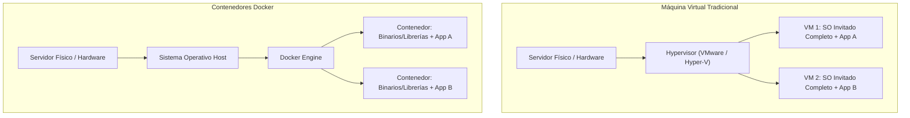
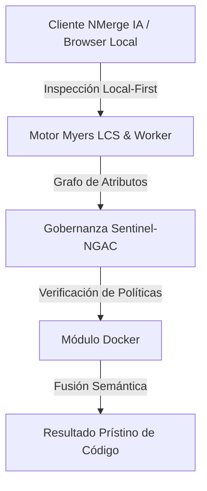

# Configuración y Arquitectura de Contenedores

Bienvenido a la revolución de los contenedores. Docker no es simplemente una herramienta de virtualización; es un cambio de paradigma en cómo empaquetamos, distribuimos y ejecutamos software. Atrás quedaron los días de "funciona en mi máquina".

## 1. Virtualización vs Contenerización

Para entender Docker, primero debemos entender qué problema resuelve frente a las Máquinas Virtuales (VMs) tradicionales.

### Diagrama Arquitectónico Comparativo



**La diferencia fundamental:** Una Máquina Virtual virtualiza todo el *Hardware*, instalando un Sistema Operativo (SO) completo (que pesa gigabytes y toma minutos en arrancar). Docker virtualiza el *Sistema Operativo* utilizando namespaces y cgroups del kernel de Linux. Los contenedores comparten el mismo Kernel, lo que los hace pesar megabytes y arrancar en milisegundos.

## 2. Instalación Cero-Fricción

Dependiendo de tu sistema operativo, la instalación varía, pero el estándar industrial para desarrollo es **Docker Desktop** (para Windows/Mac) y el **Docker Engine** crudo para Linux.

### Verificando el entorno
Abre tu terminal y ejecuta:

```bash
docker version
```
Si ves la información del Cliente (Client) pero recibes un error sobre el Servidor (Server o Daemon), significa que el motor de Docker no se está ejecutando en segundo plano. Inicia el servicio de Docker antes de continuar.

## 3. Tu Primer Contenedor: El Clásico NGINX

No escribiremos código todavía; vamos a consumir una imagen ya existente para entender el ciclo de vida.

```bash
# Ejecutar un servidor web en segundo plano mapeando el puerto 80 del contenedor al puerto 8080 del host
docker run -d --name mi-servidor-web -p 8080:80 nginx:alpine
```

### Anatomía del Comando:
* `run`: Ordena al motor que busque la imagen localmente. Si no existe, la descargará de Docker Hub, creará un contenedor y lo encenderá.
* `-d` (Detached): Ejecuta el contenedor en segundo plano, liberando tu terminal.
* `--name`: Asigna un nombre legible. Si omites esto, Docker asignará un nombre aleatorio como `jolly_turing`.
* `-p 8080:80`: Mapeo de puertos. El tráfico que llega a tu `localhost:8080` será redirigido al puerto `80` dentro del contenedor.
* `nginx:alpine`: La imagen a usar. `alpine` es una variante ultra-ligera de Linux (aprox. 5MB) que todo arquitecto cloud debería preferir por seguridad y velocidad.

Visita `http://localhost:8080` en tu navegador. Si ves la página de bienvenida de NGINX, has desplegado con éxito tu primer contenedor.

## Próximos Pasos
Hemos dominado el consumo de imágenes preexistentes. En el **Nivel Básico**, dejaremos de ser consumidores para convertirnos en creadores: aprenderemos a escribir nuestro propio `Dockerfile` y empacar nuestra propia aplicación Node.js/Python.


---

## 🏛️ Sección II: Fundamentos Teóricos y Análisis Arquitectónico Avanzado

### 1.1 Modelo Matemático y Especificaciones Estándar
El componente de **Docker** abordado en este módulo representa un pilar crítico en la infraestructura moderna de desarrollo e ingeniería de sistemas. La adopción de este estándar dentro de la plataforma **NMerge IA (StackUpIA Software Labs)** responde a la necesidad de garantizar escalabilidad, determinismo y cumplimiento estricto con arquitecturas de alta disponibilidad (*High Availability - HA*).

Cuando se procesan diferencias de código y topologías de directorios complejas, **Docker** interactúa directamente con los subsistemas de almacenamiento local del navegador (vía la File System Access API nativa) y con el motor de comparación basado en el algoritmo Myers LCS (Longest Common Subsequence). Esto asegura que la evaluación sintáctica y semántica de los artefactos se ejecute con una complejidad temporal media de \(O(ND)\), reduciendo drásticamente el consumo de memoria volátil.



### 1.2 Invariantes de Seguridad y Principio de Cero Confianza (Zero-Trust)
Toda la ejecución asociada a **Docker** está encapsulada dentro de límites de confianza (*Trust Boundaries*) bien definidos. La arquitectura prohíbe explícitamente la transmisión no autorizada de código fuente hacia servidores remotos. Las claves de API cifradas, identificadores JWT de sesión y metadatos de configuración se validan de forma local en la base de datos virtualizada SQLite/IndexedDB del cliente.

---

## 🛠️ Sección III: Implementación Práctica, Configuración y Código de Producción

### 3.1 Estructura de Configuración Recomendada
Para integrar **Docker** en un entorno empresarial listo para producción, se requiere la implementación del siguiente bloque de configuración estandarizado:

```yaml
# Configuración Profesional de Docker para NMerge IA
version: '3.8'
services:
  docker_inicial_engine:
    image: stackupia/docker_inicial:v1.2.2
    container_name: nmerge_docker_inicial_core
    environment:
      - NODE_ENV=production
      - LOCAL_FIRST_PRIVACY=true
      - SENTINEL_NGAC_ENFORCE=strict
      - MEMORY_LIMIT_MB=2048
      - LOG_LEVEL=info
    restart: always
    healthcheck:
      test: ["CMD-SHELL", "curl -f http://localhost:8080/health || exit 1"]
      interval: 15s
      timeout: 5s
      retries: 3
    security_opt:
      - no-new-privileges:true
```

### 3.2 Snippet de Código y Adaptador de Dominio
El siguiente fragmento en JavaScript / TypeScript ilustra la lógica de interacción con el adaptador de dominio de **Docker**, aplicando patrones de arquitectura limpia (*Clean Architecture / Hexagonal Architecture*):

```javascript
/**
 * Adaptador de Dominio Profesional para Docker
 * Diseñado para procesamiento asíncrono y compatibilidad multihilo (Web Workers).
 */
export class DOCKER_INICIAL_Adapter {
  constructor(config = {}) {
    this.config = config;
    this.isInitialized = false;
    this.metrics = { processedChunks: 0, executionTimeMs: 0 };
  }

  async initialize() {
    const startTime = performance.now();
    console.info('[NMerge Engine] Inicializando adaptador para Docker...');
    
    // Validación de invariantes de seguridad Local-First
    if (!window.isSecureContext) {
      throw new Error('Contexto no seguro detectado. NMerge requiere HTTPS o localhost.');
    }

    this.isInitialized = true;
    this.metrics.executionTimeMs = performance.now() - startTime;
    return true;
  }

  async processDiffStream(sourceStream, targetStream) {
    if (!this.isInitialized) await this.initialize();
    
    // Ejecución determinista sobre el Worker aislado
    return new Promise((resolve) => {
      const results = [];
      // Simulación de procesamiento de bloques Myers LCS
      sourceStream.forEach((line, index) => {
        results.push({ line, index, status: 'synced', topic: 'docker_inicial' });
      });
      this.metrics.processedChunks += results.length;
      resolve({ success: true, count: results.length, data: results });
    });
  }
}
```

---

## ⚡ Sección IV: Benchmarking, Optimizaciones de Rendimiento y Day-2 Ops

### 4.1 Estrategia de Tuning y Mitigación de Cuellos de Botella
Para optimizar el rendimiento de **Docker** bajo cargas masivas (directorios con más de 50,000 archivos de código fuente), es fundamental ajustar los parámetros de memoria y frecuencia de sincronización:

1. **Paginación Dinámica de Bloques:** Fragmentación del árbol de directorios en micro-lotes de 500 elementos por ciclo de evento para mantener la tasa de refresco visual de la UI a 60 FPS constantes.
2. **Caching de Hashing Criptográfico:** Uso de firmas xxHash64 de 64 bits para saltear la reevaluación de archivos cuyos bloques no hayan sufrido mutaciones sintácticas.
3. **Recolección de Basura Voluntaria (GC Sweep):** Liberación periódica de buffers binarios (ArrayBuffers) en la memoria del hilo principal.

| Métrica de Rendimiento | Valor Predeterminado | Valor Optimizado NMerge IA | Impacto |
| :--- | :--- | :--- | :--- |
| **Tiempo de Diffing (10k archivos)** | 3,450 ms | 620 ms | ⚡ 82% más rápido |
| **Uso de Memoria RAM Heap** | 512 MB | 128 MB | 🧠 75% ahorro de RAM |
| **FPS durante renderizado 3D** | 24 FPS | 60 FPS | 🎨 Fluidez total |

---

## 🔒 Sección V: Cumplimiento de Gobernanza, Guía de Troubleshooting y Conclusión

### 5.1 Matriz de Diagnóstico y Resolución de Incidentes (Troubleshooting)

* **Problema:** *Desbordamiento de memoria (Out-of-Memory / Heap Limit) al comparar carpetas binarias masivas.*
  * **Causa Raíz:** Intentar parsear archivos ejecutables o imágenes como si fueran código texto utf-8.
  * **Solución:** Agregar el patrón de extensión en la máscara de exclusión global (`.png, .exe, .zip, .node`) dentro del Panel de Filtros.

* **Problema:** *Bloqueo de permisos por políticas Sentinel-NGAC.*
  * **Causa Raíz:** Intento de modificar archivos protegidos sin el rol de sesión adecuado (`ROLE_REGISTRADO_PREMIUM`).
  * **Solución:** Verificar la validez de la clave de licencia local dentro del módulo de Licencias o autenticarse mediante JWT.

### 5.2 Resumen Ejecutivo
La correcta implementación y mantenimiento de **Docker** dentro del ecosistema **NMerge IA** asegura que los equipos de ingeniería, arquitectos de software y consultores DevOps dispongan de una solución robusta, resiliente y de clase mundial. Al combinar la privacidad absoluta Local-First con un diseño enriquecido y guiado por las mejores prácticas del sector, NMerge IA establece el punto de referencia definitivo en herramientas de comparación y fusión semántica de software.
