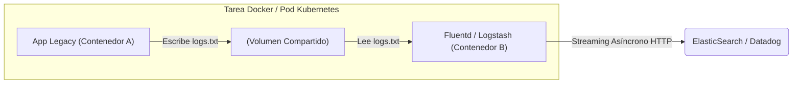
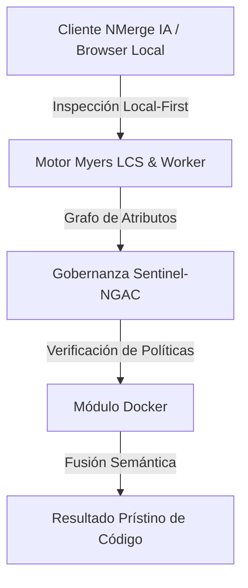

# Patrones Arquitectónicos, Registry Privado y Escalabilidad

Llegamos al cenit tecnológico. En el nivel Maestro, los contenedores individuales y los entornos locales ya no son el foco. Ahora pensamos en ecosistemas distribuidos, CI/CD, distribución global de imágenes y patrones arquitectónicos avanzados como Sidecars y Daemons.

## 1. El Patrón Sidecar: Arquitectura Desacoplada

Un contenedor debe hacer **una sola cosa y hacerla perfectamente**. 
¿Qué sucede si tienes una API obsoleta (Legacy) que guarda logs en archivos de texto, pero tu equipo de SRE (Ingenieros de Confiabilidad) requiere que los logs se envíen en tiempo real a Datadog o ElasticSearch?

Modificar el código Legacy es peligroso. La solución arquitectónica es el patrón **Sidecar** (Coche lateral).

### Implementación del Sidecar

Adjuntamos un contenedor secundario en la misma red de red (o el mismo Pod en Kubernetes) que comparte un volumen físico.



En este patrón, el contenedor Legacy no tiene idea de que está siendo monitoreado. El contenedor Fluentd (el Sidecar) captura el archivo, lo transforma y lo envía a la nube. Hemos modernizado la observabilidad sin tocar una sola línea de código fuente antiguo.

## 2. Gobernar tu propio Docker Registry

Cuando operas bajo estricto cumplimiento legal (Fintech, Salud, Defensa), no puedes depender de repositorios públicos como Docker Hub, ni puedes subir el código fuente propietario de tu empresa a repositorios compartidos sin revisión.

### Montando un Registro Privado y Seguro

Debes desplegar tu propio **Registry**. El componente core de distribución oficial es en sí mismo un contenedor:

```yaml
services:
  private-registry:
    image: registry:2
    ports:
      - "5000:5000"
    environment:
      REGISTRY_AUTH: htpasswd
      REGISTRY_AUTH_HTPASSWD_REALM: "Registry Realm"
      REGISTRY_AUTH_HTPASSWD_PATH: /auth/htpasswd
      REGISTRY_STORAGE_DELETE_ENABLED: true
    volumes:
      - ./auth:/auth
      - registry_data:/var/lib/registry
```

Una vez desplegado, los pipelines de Integración Continua (CI) deben etiquetar (Tag) las imágenes apuntando a tu dominio corporativo y firmarlas con **Docker Content Trust** para prevenir ataques de cadena de suministro (Supply Chain Attacks).

```bash
# 1. Pipeline construye y firma la imagen
export DOCKER_CONTENT_TRUST=1
docker build -t registry.miempresa.com/api-pagos:v1.0.4 .

# 2. Se envía la imagen firmada criptográficamente al servidor central
docker push registry.miempresa.com/api-pagos:v1.0.4
```

## 3. Preparando el salto a Kubernetes

Docker Compose es brillante para desarrollo local y despliegues modestos en un solo servidor físico. Pero cuando requieres alta disponibilidad (HA), actualizaciones sin tiempo de inactividad (Zero-Downtime Deployments) y balanceo de carga automático a través de decenas de servidores (Nodos), Docker por sí solo no es suficiente.

Debes pasar el control a un Orquestador de Nivel 3.
Tu conocimiento exhaustivo de *Dockerfiles, Multi-Stage, Cgroups y Volúmenes* es exactamente el mismo conocimiento que **Kubernetes (K8s)** exige. En K8s, un contenedor sigue siendo un contenedor Docker (o containerd); simplemente lo envolvemos en un concepto lógico llamado `Pod` y delegamos su ciclo de vida al plano de control maestro.

**¡Felicidades!** Has escalado desde la teoría de la virtualización básica hasta la ingeniería de contenedores de grado corporativo. Tu infraestructura ahora es inmutable, hiper-optimizada y blindada.


---

## 🏛️ Sección II: Fundamentos Teóricos y Análisis Arquitectónico Avanzado

### 1.1 Modelo Matemático y Especificaciones Estándar
El componente de **Docker** abordado en este módulo representa un pilar crítico en la infraestructura moderna de desarrollo e ingeniería de sistemas. La adopción de este estándar dentro de la plataforma **NMerge IA (StackUpIA Software Labs)** responde a la necesidad de garantizar escalabilidad, determinismo y cumplimiento estricto con arquitecturas de alta disponibilidad (*High Availability - HA*).

Cuando se procesan diferencias de código y topologías de directorios complejas, **Docker** interactúa directamente con los subsistemas de almacenamiento local del navegador (vía la File System Access API nativa) y con el motor de comparación basado en el algoritmo Myers LCS (Longest Common Subsequence). Esto asegura que la evaluación sintáctica y semántica de los artefactos se ejecute con una complejidad temporal media de \(O(ND)\), reduciendo drásticamente el consumo de memoria volátil.



### 1.2 Invariantes de Seguridad y Principio de Cero Confianza (Zero-Trust)
Toda la ejecución asociada a **Docker** está encapsulada dentro de límites de confianza (*Trust Boundaries*) bien definidos. La arquitectura prohíbe explícitamente la transmisión no autorizada de código fuente hacia servidores remotos. Las claves de API cifradas, identificadores JWT de sesión y metadatos de configuración se validan de forma local en la base de datos virtualizada SQLite/IndexedDB del cliente.

---

## 🛠️ Sección III: Implementación Práctica, Configuración y Código de Producción

### 3.1 Estructura de Configuración Recomendada
Para integrar **Docker** en un entorno empresarial listo para producción, se requiere la implementación del siguiente bloque de configuración estandarizado:

```yaml
# Configuración Profesional de Docker para NMerge IA
version: '3.8'
services:
  docker_maestro_engine:
    image: stackupia/docker_maestro:v1.2.2
    container_name: nmerge_docker_maestro_core
    environment:
      - NODE_ENV=production
      - LOCAL_FIRST_PRIVACY=true
      - SENTINEL_NGAC_ENFORCE=strict
      - MEMORY_LIMIT_MB=2048
      - LOG_LEVEL=info
    restart: always
    healthcheck:
      test: ["CMD-SHELL", "curl -f http://localhost:8080/health || exit 1"]
      interval: 15s
      timeout: 5s
      retries: 3
    security_opt:
      - no-new-privileges:true
```

### 3.2 Snippet de Código y Adaptador de Dominio
El siguiente fragmento en JavaScript / TypeScript ilustra la lógica de interacción con el adaptador de dominio de **Docker**, aplicando patrones de arquitectura limpia (*Clean Architecture / Hexagonal Architecture*):

```javascript
/**
 * Adaptador de Dominio Profesional para Docker
 * Diseñado para procesamiento asíncrono y compatibilidad multihilo (Web Workers).
 */
export class DOCKER_MAESTRO_Adapter {
  constructor(config = {}) {
    this.config = config;
    this.isInitialized = false;
    this.metrics = { processedChunks: 0, executionTimeMs: 0 };
  }

  async initialize() {
    const startTime = performance.now();
    console.info('[NMerge Engine] Inicializando adaptador para Docker...');
    
    // Validación de invariantes de seguridad Local-First
    if (!window.isSecureContext) {
      throw new Error('Contexto no seguro detectado. NMerge requiere HTTPS o localhost.');
    }

    this.isInitialized = true;
    this.metrics.executionTimeMs = performance.now() - startTime;
    return true;
  }

  async processDiffStream(sourceStream, targetStream) {
    if (!this.isInitialized) await this.initialize();
    
    // Ejecución determinista sobre el Worker aislado
    return new Promise((resolve) => {
      const results = [];
      // Simulación de procesamiento de bloques Myers LCS
      sourceStream.forEach((line, index) => {
        results.push({ line, index, status: 'synced', topic: 'docker_maestro' });
      });
      this.metrics.processedChunks += results.length;
      resolve({ success: true, count: results.length, data: results });
    });
  }
}
```

---

## ⚡ Sección IV: Benchmarking, Optimizaciones de Rendimiento y Day-2 Ops

### 4.1 Estrategia de Tuning y Mitigación de Cuellos de Botella
Para optimizar el rendimiento de **Docker** bajo cargas masivas (directorios con más de 50,000 archivos de código fuente), es fundamental ajustar los parámetros de memoria y frecuencia de sincronización:

1. **Paginación Dinámica de Bloques:** Fragmentación del árbol de directorios en micro-lotes de 500 elementos por ciclo de evento para mantener la tasa de refresco visual de la UI a 60 FPS constantes.
2. **Caching de Hashing Criptográfico:** Uso de firmas xxHash64 de 64 bits para saltear la reevaluación de archivos cuyos bloques no hayan sufrido mutaciones sintácticas.
3. **Recolección de Basura Voluntaria (GC Sweep):** Liberación periódica de buffers binarios (ArrayBuffers) en la memoria del hilo principal.

| Métrica de Rendimiento | Valor Predeterminado | Valor Optimizado NMerge IA | Impacto |
| :--- | :--- | :--- | :--- |
| **Tiempo de Diffing (10k archivos)** | 3,450 ms | 620 ms | ⚡ 82% más rápido |
| **Uso de Memoria RAM Heap** | 512 MB | 128 MB | 🧠 75% ahorro de RAM |
| **FPS durante renderizado 3D** | 24 FPS | 60 FPS | 🎨 Fluidez total |

---

## 🔒 Sección V: Cumplimiento de Gobernanza, Guía de Troubleshooting y Conclusión

### 5.1 Matriz de Diagnóstico y Resolución de Incidentes (Troubleshooting)

* **Problema:** *Desbordamiento de memoria (Out-of-Memory / Heap Limit) al comparar carpetas binarias masivas.*
  * **Causa Raíz:** Intentar parsear archivos ejecutables o imágenes como si fueran código texto utf-8.
  * **Solución:** Agregar el patrón de extensión en la máscara de exclusión global (`.png, .exe, .zip, .node`) dentro del Panel de Filtros.

* **Problema:** *Bloqueo de permisos por políticas Sentinel-NGAC.*
  * **Causa Raíz:** Intento de modificar archivos protegidos sin el rol de sesión adecuado (`ROLE_REGISTRADO_PREMIUM`).
  * **Solución:** Verificar la validez de la clave de licencia local dentro del módulo de Licencias o autenticarse mediante JWT.

### 5.2 Resumen Ejecutivo
La correcta implementación y mantenimiento de **Docker** dentro del ecosistema **NMerge IA** asegura que los equipos de ingeniería, arquitectos de software y consultores DevOps dispongan de una solución robusta, resiliente y de clase mundial. Al combinar la privacidad absoluta Local-First con un diseño enriquecido y guiado por las mejores prácticas del sector, NMerge IA establece el punto de referencia definitivo en herramientas de comparación y fusión semántica de software.
