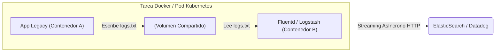

# Patrones Arquitectónicos, Registry Privado y Escalabilidad

Llegamos al cenit tecnológico. En el nivel Maestro, los contenedores individuales y los entornos locales ya no son el foco. Ahora pensamos en ecosistemas distribuidos, CI/CD, distribución global de imágenes y patrones arquitectónicos avanzados como Sidecars y Daemons.

## 1. El Patrón Sidecar: Arquitectura Desacoplada

Un contenedor debe hacer **una sola cosa y hacerla perfectamente**. 
¿Qué sucede si tienes una API obsoleta (Legacy) que guarda logs en archivos de texto, pero tu equipo de SRE (Ingenieros de Confiabilidad) requiere que los logs se envíen en tiempo real a Datadog o ElasticSearch?

Modificar el código Legacy es peligroso. La solución arquitectónica es el patrón **Sidecar** (Coche lateral).

### Implementación del Sidecar

Adjuntamos un contenedor secundario en la misma red de red (o el mismo Pod en Kubernetes) que comparte un volumen físico.



En este patrón, el contenedor Legacy no tiene idea de que está siendo monitoreado. El contenedor Fluentd (el Sidecar) captura el archivo, lo transforma y lo envía a la nube. Hemos modernizado la observabilidad sin tocar una sola línea de código fuente antiguo.

## 2. Gobernar tu propio Docker Registry

Cuando operas bajo estricto cumplimiento legal (Fintech, Salud, Defensa), no puedes depender de repositorios públicos como Docker Hub, ni puedes subir el código fuente propietario de tu empresa a repositorios compartidos sin revisión.

### Montando un Registro Privado y Seguro

Debes desplegar tu propio **Registry**. El componente core de distribución oficial es en sí mismo un contenedor:

```yaml
services:
  private-registry:
    image: registry:2
    ports:
      - "5000:5000"
    environment:
      REGISTRY_AUTH: htpasswd
      REGISTRY_AUTH_HTPASSWD_REALM: "Registry Realm"
      REGISTRY_AUTH_HTPASSWD_PATH: /auth/htpasswd
      REGISTRY_STORAGE_DELETE_ENABLED: true
    volumes:
      - ./auth:/auth
      - registry_data:/var/lib/registry
```

Una vez desplegado, los pipelines de Integración Continua (CI) deben etiquetar (Tag) las imágenes apuntando a tu dominio corporativo y firmarlas con **Docker Content Trust** para prevenir ataques de cadena de suministro (Supply Chain Attacks).

```bash
# 1. Pipeline construye y firma la imagen
export DOCKER_CONTENT_TRUST=1
docker build -t registry.miempresa.com/api-pagos:v1.0.4 .

# 2. Se envía la imagen firmada criptográficamente al servidor central
docker push registry.miempresa.com/api-pagos:v1.0.4
```

## 3. Preparando el salto a Kubernetes

Docker Compose es brillante para desarrollo local y despliegues modestos en un solo servidor físico. Pero cuando requieres alta disponibilidad (HA), actualizaciones sin tiempo de inactividad (Zero-Downtime Deployments) y balanceo de carga automático a través de decenas de servidores (Nodos), Docker por sí solo no es suficiente.

Debes pasar el control a un Orquestador de Nivel 3.
Tu conocimiento exhaustivo de *Dockerfiles, Multi-Stage, Cgroups y Volúmenes* es exactamente el mismo conocimiento que **Kubernetes (K8s)** exige. En K8s, un contenedor sigue siendo un contenedor Docker (o containerd); simplemente lo envolvemos en un concepto lógico llamado `Pod` y delegamos su ciclo de vida al plano de control maestro.

**¡Felicidades!** Has escalado desde la teoría de la virtualización básica hasta la ingeniería de contenedores de grado corporativo. Tu infraestructura ahora es inmutable, hiper-optimizada y blindada.
