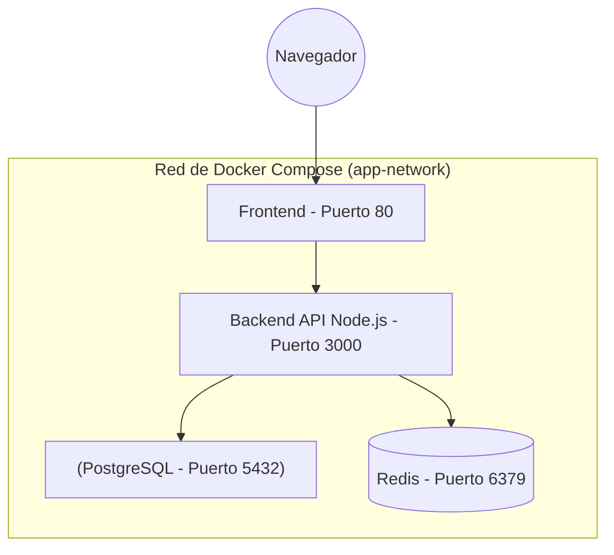

# Orquestación Local con Docker Compose y Redes

Tener una API corriendo en un contenedor es excelente, pero el software del mundo real requiere múltiples componentes: un Backend, una Base de Datos, un caché de Redis y un Frontend. Encenderlos todos manualmente usando decenas de comandos `docker run` con parámetros infinitos es insostenible y propenso a errores. 

La respuesta es **Docker Compose**: un orquestador declarativo para entornos locales.

## 1. El Archivo Declarativo: docker-compose.yml

En lugar de teclear comandos imperativos, definimos el estado final deseado de nuestra infraestructura en un archivo YAML. Docker se encargará de encender, conectar y apagar todo en el orden correcto.



**Atención a la regla de Redes:** Dentro de una red de Docker Compose, los contenedores no se comunican usando `localhost`. Se comunican usando **el nombre del servicio** como dominio de DNS.

## 2. Construyendo el Cluster de Desarrollo

Crea un archivo llamado `docker-compose.yml` en la raíz de tu proyecto:

```yaml
version: '3.8'

services:
  # Servicio 1: Nuestra Base de Datos
  db:
    image: postgres:15-alpine
    restart: always # Si la DB crashea, Docker la reinicia
    environment:
      POSTGRES_USER: admin
      POSTGRES_PASSWORD: mysecretpassword
      POSTGRES_DB: main_db
    volumes:
      - pg_data:/var/lib/postgresql/data # Persistencia
    ports:
      - "5432:5432" # Solo necesario para acceder desde DBeaver/DataGrip localmente

  # Servicio 2: Nuestro Backend Personalizado
  api:
    build: 
      context: ./backend # Ubicación del Dockerfile del backend
    ports:
      - "3000:3000"
    environment:
      - DB_HOST=db # Mágico: DNS automático gracias a Docker Compose
      - DB_USER=admin
      - DB_PASS=mysecretpassword
    depends_on:
      - db # Obliga a que la base de datos arranque antes que la API

  # Servicio 3: Caché Ultra-rápido
  redis-cache:
    image: redis:7-alpine
    ports:
      - "6379:6379"

volumes:
  pg_data: # Define el volumen nombrado para la persistencia de datos
```

## 3. El Poder del DNS Interno

Fíjate en la variable de entorno `DB_HOST=db` del servicio de la API. Como ambos servicios (`api` y `db`) están definidos en el mismo archivo compose, Docker crea automáticamente una red puente (bridge network) y un servidor DNS interno.

Cuando tu código en Node.js intente conectarse a `postgresql://admin:mysecretpassword@db:5432/main_db`, Docker resolverá la palabra `db` a la dirección IP interna del contenedor de PostgreSQL. No necesitas (ni debes) usar IPs crudas.

## 4. Ciclo de Vida del Comando Compose

El flujo de trabajo diario de un desarrollador moderno es ridículamente simple con Compose:

1. **Encender todo el cluster en segundo plano:**
   ```bash
   docker-compose up -d
   ```
2. **Ver los logs centralizados de todos los contenedores:**
   ```bash
   docker-compose logs -f
   ```
3. **Apagar y destruir los contenedores (manteniendo los volúmenes intactos):**
   ```bash
   docker-compose down
   ```

## 5. Volúmenes (Volumes): Inmortalidad para tus Datos

Los contenedores son entidades **efímeras**. Si eliminas un contenedor de base de datos, todos sus datos mueren con él. Para lograr persistencia, usamos **Volúmenes**.

En el ejemplo anterior, al definir `volumes: - pg_data:/var/lib/postgresql/data`, le estamos diciendo a Docker: "Toma todo lo que PostgreSQL guarde en esa carpeta interna y guárdalo de forma segura en un volumen de mi disco duro físico". Si destruyes el contenedor de Postgres y levantas uno nuevo al día siguiente, el nuevo contenedor se conectará al volumen `pg_data` y recuperará todas tus tablas al instante.

Dominar `docker-compose` elimina por completo el síndrome de "Configuración de Entorno Local". En el **Fortgeschrittene Stufe**, daremos el salto crítico de desarrollo a producción: exploraremos las Builds Multietapa (Multi-Stage Builds) para reducir imágenes de gigabytes a unos pocos megabytes blindados.
