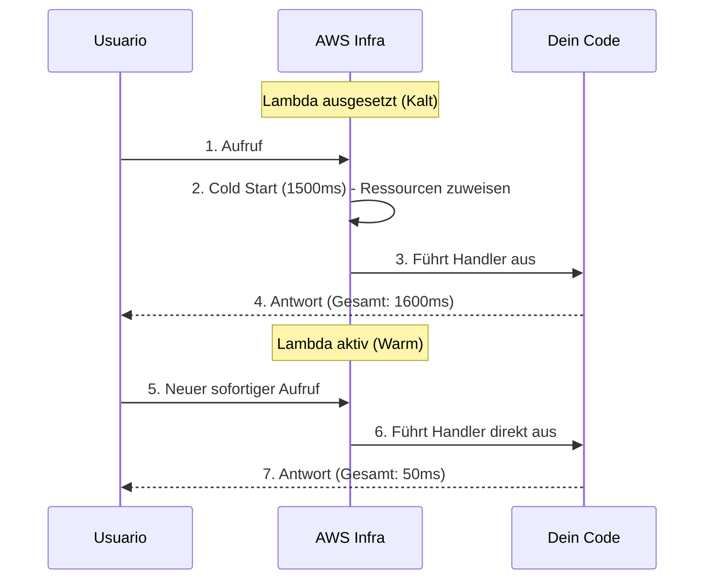

# AWS Lambda und den Cold Start meistern

AWS Lambda ist der absolute Kern der Serverless-Architektur. Es ist eine flüchtige Computerumgebung. Buchstäblich lädt AWS deinen Code in einen Mikro-Container, führt ihn aus, berechnet dir die genutzten Millisekunden und zerstört ihn wieder.

## 1. Die Anatomie einer Lambda

Eine Lambda-Funktion besteht immer aus drei wesentlichen Elementen in ihrer Signatur (Signature).

```javascript
// index.mjs
export const handler = async (event, context) => {
  try {
    // 1. EVENTO (Ereignis): Enthält die Daten des Auslösers (S3, API Gateway, SQS)
    const body = JSON.parse(event.body);
    
    // 2. CONTEXTO (Kontext): Metadaten der Umgebung (Verbleibende Zeit, Request ID)
    const tiempoRestante = context.getRemainingTimeInMillis();

    if (body.action === 'procesar') {
       return { statusCode: 200, body: "Verarbeitet!" };
    }

  } catch (error) {
    console.error("Kritischer Fehler:", error);
    return { statusCode: 500, body: "Interner Fehler" };
  }
};
```

### Eiserne Beschränkungen (Harte Limits)
Du musst deine Architektur unter Berücksichtigung dieser Lambda-Limits entwerfen:
* **Maximale Ausführungszeit:** 15 Minuten. (Wenn du Stunden brauchst, verwende AWS Batch oder Fargate).
* **Maximaler Speicher:** 10 GB.
* **Flüchtige Schicht (`/tmp`):** Maximal 10 GB temporärer Speicher, der verschwinden wird.

## 2. Feind #1: Cold Start (Kaltstart)

Wenn deine Lambda in den letzten Minuten nicht aufgerufen wurde, unterbricht AWS sie, um Ressourcen zu sparen. Wenn eine neue Anfrage eintrifft, muss AWS:
1. Einen physischen Server mit freiem Speicherplatz finden.
2. Deinen Code aus einem internen Bucket herunterladen.
3. Die Umgebung starten (Node.js, Python).
4. Die Funktion ausführen.

Dieser Prozess wird **Cold Start** genannt. Er kann zwischen 300 Millisekunden und 3 Sekunden dauern, was für die Benutzererfahrung schrecklich ist.



### Grundlegende Strategien zur Minderung
* **Paketgewicht minimieren:** Lade keinen 200-MB-`node_modules`-Ordner hoch. Verwende `esbuild` oder `webpack`, um deinen Code in einer einzigen minimierten 2-MB-Datei zu bündeln.
* **Globale Initialisierung:** Datenbankverbindungen müssen AUSSERHALB des `handler` hergestellt werden.

```javascript
import { Client } from 'pg';

// ✅ GUT: Wird während des Cold Starts ausgeführt und bei warmen Aufrufen wiederverwendet.
const db = new Client({ connectionString: process.env.DB_URL });
await db.connect();

export const handler = async (event) => {
  // Das wird superschnell sein.
  const res = await db.query('SELECT * FROM users');
  return { statusCode: 200, body: JSON.stringify(res.rows) };
};
```

Auf der **mittleren Stufe (Nivel Medio)** werden wir sehen, wie wir unsere Lambdas mit dem API Gateway mit der Außenwelt verbinden und wie wir Serverless-Datenbanken mit DynamoDB handhaben.
