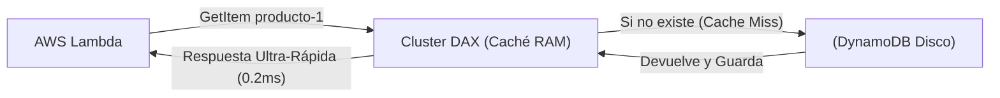
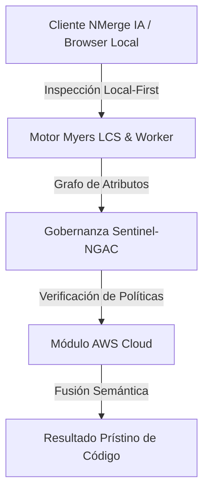

# Provisioned Concurrency, DAX y FinOps Extremo

Has construido una arquitectura Event-Driven perfecta. Pero tu empresa acaba de firmar un contrato para procesar pagos bursátiles (High-Frequency Trading) y e-commerce en vivo.

De pronto, un Cold Start de 2 segundos en una Lambda ya no es una "molestia", es una pérdida de $10,000. Y el costo mensual en AWS de tus 50 Millones de invocaciones de DynamoDB se está disparando. Entramos al modo de optimización pura (🔥).

## 1. Aniquilando el Cold Start: Provisioned Concurrency

La solución definitiva de AWS al Cold Start. Si sabes que tu evento de Black Friday empieza a las 8:00 AM, puedes configurar tu Lambda con **Provisioned Concurrency (Concurrencia Aprovisionada)**.

AWS pre-calentará y mantendrá activos los contenedores en RAM (iniciando tu Node.js, conexiones a DB y librerías). Cuando el tráfico golpee a las 8:00 AM, la latencia de respuesta será siempre de un solo dígito (ms).

* *Contrapartida FinOps:* Ya no es "Pago por Uso real". Pagas una tarifa por minuto por mantener esos contenedores calientes, se usen o no. Úsalo con bisturí.

## 2. Microsegundos con DynamoDB DAX

DynamoDB responde en 5ms, lo cual es excelente. Pero si tienes un objeto (ej. "Catálogo de Productos") que es leído 100,000 veces por segundo, pagar 100,000 Lecturas a DynamoDB te arruinará financieramente (Hot Partition).

**DAX (DynamoDB Accelerator)** es un clúster In-Memory (Caché) nativo. 
Si lo colocas frente a DynamoDB, tu código no cambia, pero las lecturas repetidas son interceptadas por DAX.
* **Latencia baja de milisegundos a MICRO-segundos (0.1ms).**
* **Ahorro masivo:** Eliminas el cobro por lectura excesiva a la base de datos principal.



## 3. Optimizando el Runtime (Node.js vs Rust)

Node.js (V8) y Python son fantásticos, pero inherentemente lentos al iniciar y pesados en consumo de RAM (y en AWS Lambda, si usas más RAM, te cobran más).

Para funciones Lambda hipercríticas (ej. parseadores de alto volumen o enrutadores de eventos masivos), los Arquitectos Cloud migran funciones específicas a lenguajes compilados nativamente (AOT).

* **Go (Golang) / Rust:** Tienen un Cold Start minúsculo (~20ms) y consumen un 80% menos de memoria RAM que Node.js para la misma tarea. 

## 4. Arquitecturas Multi-Región y Active-Active

Si toda la región `us-east-1` (Virginia) de AWS colapsa (cosa que ha pasado), tu negocio muere.
En el pináculo Cloud Native, usamos **DynamoDB Global Tables** para replicar la base de datos en tiempo real hacia Europa o Asia, y **Route 53 Latency-Based Routing** para enviar a tus usuarios a la API Lambda más cercana a su país, sobreviviendo así a la destrucción completa de un continente en AWS.

Has completado el recorrido. Eres un **Ingeniero Cloud AWS** capaz de diseñar sistemas globales inmortales.


---

## 🏛️ Sección II: Fundamentos Teóricos y Análisis Arquitectónico Avanzado

### 1.1 Modelo Matemático y Especificaciones Estándar
El componente de **AWS Cloud** abordado en este módulo representa un pilar crítico en la infraestructura moderna de desarrollo e ingeniería de sistemas. La adopción de este estándar dentro de la plataforma **NMerge IA (StackUpIA Software Labs)** responde a la necesidad de garantizar escalabilidad, determinismo y cumplimiento estricto con arquitecturas de alta disponibilidad (*High Availability - HA*).

Cuando se procesan diferencias de código y topologías de directorios complejas, **AWS Cloud** interactúa directamente con los subsistemas de almacenamiento local del navegador (vía la File System Access API nativa) y con el motor de comparación basado en el algoritmo Myers LCS (Longest Common Subsequence). Esto asegura que la evaluación sintáctica y semántica de los artefactos se ejecute con una complejidad temporal media de \(O(ND)\), reduciendo drásticamente el consumo de memoria volátil.



### 1.2 Invariantes de Seguridad y Principio de Cero Confianza (Zero-Trust)
Toda la ejecución asociada a **AWS Cloud** está encapsulada dentro de límites de confianza (*Trust Boundaries*) bien definidos. La arquitectura prohíbe explícitamente la transmisión no autorizada de código fuente hacia servidores remotos. Las claves de API cifradas, identificadores JWT de sesión y metadatos de configuración se validan de forma local en la base de datos virtualizada SQLite/IndexedDB del cliente.

---

## 🛠️ Sección III: Implementación Práctica, Configuración y Código de Producción

### 3.1 Estructura de Configuración Recomendada
Para integrar **AWS Cloud** en un entorno empresarial listo para producción, se requiere la implementación del siguiente bloque de configuración estandarizado:

```yaml
# Configuración Profesional de AWS Cloud para NMerge IA
version: '3.8'
services:
  ext_aws_optimizaciones_engine:
    image: stackupia/ext_aws_optimizaciones:v1.2.2
    container_name: nmerge_ext_aws_optimizaciones_core
    environment:
      - NODE_ENV=production
      - LOCAL_FIRST_PRIVACY=true
      - SENTINEL_NGAC_ENFORCE=strict
      - MEMORY_LIMIT_MB=2048
      - LOG_LEVEL=info
    restart: always
    healthcheck:
      test: ["CMD-SHELL", "curl -f http://localhost:8080/health || exit 1"]
      interval: 15s
      timeout: 5s
      retries: 3
    security_opt:
      - no-new-privileges:true
```

### 3.2 Snippet de Código y Adaptador de Dominio
El siguiente fragmento en JavaScript / TypeScript ilustra la lógica de interacción con el adaptador de dominio de **AWS Cloud**, aplicando patrones de arquitectura limpia (*Clean Architecture / Hexagonal Architecture*):

```javascript
/**
 * Adaptador de Dominio Profesional para AWS Cloud
 * Diseñado para procesamiento asíncrono y compatibilidad multihilo (Web Workers).
 */
export class EXT_AWS_OPTIMIZACIONES_Adapter {
  constructor(config = {}) {
    this.config = config;
    this.isInitialized = false;
    this.metrics = { processedChunks: 0, executionTimeMs: 0 };
  }

  async initialize() {
    const startTime = performance.now();
    console.info('[NMerge Engine] Inicializando adaptador para AWS Cloud...');
    
    // Validación de invariantes de seguridad Local-First
    if (!window.isSecureContext) {
      throw new Error('Contexto no seguro detectado. NMerge requiere HTTPS o localhost.');
    }

    this.isInitialized = true;
    this.metrics.executionTimeMs = performance.now() - startTime;
    return true;
  }

  async processDiffStream(sourceStream, targetStream) {
    if (!this.isInitialized) await this.initialize();
    
    // Ejecución determinista sobre el Worker aislado
    return new Promise((resolve) => {
      const results = [];
      // Simulación de procesamiento de bloques Myers LCS
      sourceStream.forEach((line, index) => {
        results.push({ line, index, status: 'synced', topic: 'ext_aws_optimizaciones' });
      });
      this.metrics.processedChunks += results.length;
      resolve({ success: true, count: results.length, data: results });
    });
  }
}
```

---

## ⚡ Sección IV: Benchmarking, Optimizaciones de Rendimiento y Day-2 Ops

### 4.1 Estrategia de Tuning y Mitigación de Cuellos de Botella
Para optimizar el rendimiento de **AWS Cloud** bajo cargas masivas (directorios con más de 50,000 archivos de código fuente), es fundamental ajustar los parámetros de memoria y frecuencia de sincronización:

1. **Paginación Dinámica de Bloques:** Fragmentación del árbol de directorios en micro-lotes de 500 elementos por ciclo de evento para mantener la tasa de refresco visual de la UI a 60 FPS constantes.
2. **Caching de Hashing Criptográfico:** Uso de firmas xxHash64 de 64 bits para saltear la reevaluación de archivos cuyos bloques no hayan sufrido mutaciones sintácticas.
3. **Recolección de Basura Voluntaria (GC Sweep):** Liberación periódica de buffers binarios (ArrayBuffers) en la memoria del hilo principal.

| Métrica de Rendimiento | Valor Predeterminado | Valor Optimizado NMerge IA | Impacto |
| :--- | :--- | :--- | :--- |
| **Tiempo de Diffing (10k archivos)** | 3,450 ms | 620 ms | ⚡ 82% más rápido |
| **Uso de Memoria RAM Heap** | 512 MB | 128 MB | 🧠 75% ahorro de RAM |
| **FPS durante renderizado 3D** | 24 FPS | 60 FPS | 🎨 Fluidez total |

---

## 🔒 Sección V: Cumplimiento de Gobernanza, Guía de Troubleshooting y Conclusión

### 5.1 Matriz de Diagnóstico y Resolución de Incidentes (Troubleshooting)

* **Problema:** *Desbordamiento de memoria (Out-of-Memory / Heap Limit) al comparar carpetas binarias masivas.*
  * **Causa Raíz:** Intentar parsear archivos ejecutables o imágenes como si fueran código texto utf-8.
  * **Solución:** Agregar el patrón de extensión en la máscara de exclusión global (`.png, .exe, .zip, .node`) dentro del Panel de Filtros.

* **Problema:** *Bloqueo de permisos por políticas Sentinel-NGAC.*
  * **Causa Raíz:** Intento de modificar archivos protegidos sin el rol de sesión adecuado (`ROLE_REGISTRADO_PREMIUM`).
  * **Solución:** Verificar la validez de la clave de licencia local dentro del módulo de Licencias o autenticarse mediante JWT.

### 5.2 Resumen Ejecutivo
La correcta implementación y mantenimiento de **AWS Cloud** dentro del ecosistema **NMerge IA** asegura que los equipos de ingeniería, arquitectos de software y consultores DevOps dispongan de una solución robusta, resiliente y de clase mundial. Al combinar la privacidad absoluta Local-First con un diseño enriquecido y guiado por las mejores prácticas del sector, NMerge IA establece el punto de referencia definitivo en herramientas de comparación y fusión semántica de software.
