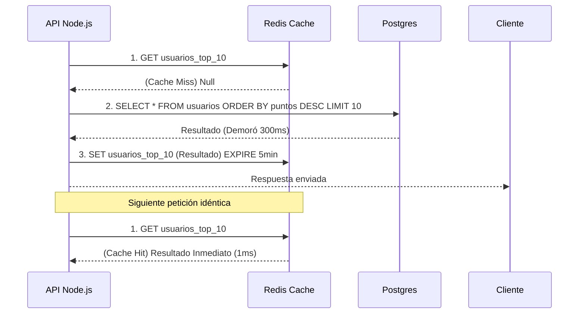

# Microservicios, Redis Cache y Mensajería (Event-Driven)

Cuando una API REST en Node.js escala para soportar a un millón de usuarios, el cuello de botella ya no es el Event Loop, es la Base de Datos. Cada consulta SQL suma 50ms a 200ms. Si 10,000 usuarios consultan el Home de tu App a la vez, tu base de datos morirá.

## 1. El Caché Distribuido (Redis)

Redis es una base de datos In-Memory (vive en la RAM) clave-valor. Su latencia de lectura es menor a 1ms. 

El patrón maestro es el **Cache-Aside Pattern**:



## 2. Event-Driven Architecture (Microservicios)

En un Monolito, si ocurre una venta, llamas secuencialmente a funciones: `crearOrden()`, `restarStock()`, `enviarEmail()`. Si enviar el email tarda 3 segundos, el usuario se queda esperando.

En Microservicios, usamos **Message Brokers** (RabbitMQ, Kafka, AWS SQS) para desacoplar operaciones.

```javascript
// Servicio de Pagos (Node.js)
const channel = await RabbitMQ.createChannel();

app.post('/pagar', async (req, res) => {
  const exito = await procesarTarjeta(req.body);
  
  if (exito) {
    // Fuego y Olvido (Fire and Forget)
    // Disparamos un evento a la cola y respondemos al usuario INSTANTÁNEAMENTE.
    channel.publish('ventas_exchange', 'pago.completado', Buffer.from(JSON.stringify(req.body)));
    
    return res.json({ msg: "Tu orden está siendo procesada." });
  }
});
```

Mientras tanto, en contenedores totalmente separados (quizás escritos en Python o Go), otros microservicios están *escuchando* ese evento:
* El **Servicio de Emails** escucha `pago.completado` y envía el recibo.
* El **Servicio de Inventario** escucha `pago.completado` y resta el stock.

## 3. JWT y Sesiones Stateless

Las arquitecturas distribuidas exigen autenticación sin estado (Stateless). En lugar de guardar sesiones en la memoria del servidor (lo cual rompería si tienes 5 instancias de Node detrás de un Load Balancer), usamos **JSON Web Tokens (JWT)**.

El JWT contiene la información de autorización cifrada *dentro* del propio string. El servidor no necesita verificar la base de datos para saber si eres Admin; simplemente descifra criptográficamente el JWT con su firma secreta (`HMAC SHA256`).

En el **Nivel de Optimizaciones**, usaremos Node Clústers, PM2 y analizaremos hilos trabajadores (Worker Threads) para exprimir el hardware bare-metal.
