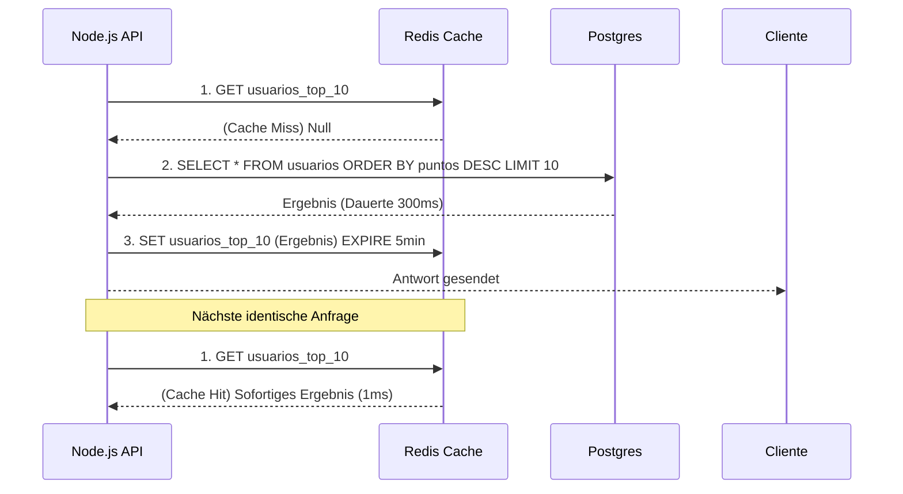

# Microservices, Redis Cache und Messaging (Event-Driven)

Wenn eine REST-API in Node.js skaliert, um eine Million Benutzer zu unterstützen, ist der Engpass nicht mehr der Event Loop, sondern die Datenbank. Jede SQL-Abfrage fügt 50ms bis 200ms hinzu. Wenn 10.000 Benutzer gleichzeitig die Startseite deiner App abfragen, wird deine Datenbank sterben.

## 1. Verteilter Cache (Redis)

Redis ist eine In-Memory-Datenbank (lebt im RAM) für Schlüssel-Wert-Paare (Key-Value). Die Leselatenz beträgt weniger als 1ms. 

Das Master-Muster ist das **Cache-Aside Pattern**:



## 2. Event-Driven Architecture (Microservices)

In einem Monolithen rufst du, wenn ein Verkauf stattfindet, sequenziell Funktionen auf: `crearOrden()`, `restarStock()`, `enviarEmail()`. Wenn das Senden der E-Mail 3 Sekunden dauert, bleibt der Benutzer in der Warteschleife.

In Microservices verwenden wir **Message Broker** (RabbitMQ, Kafka, AWS SQS), um Operationen zu entkoppeln.

```javascript
// Zahlungs-Service (Node.js)
const channel = await RabbitMQ.createChannel();

app.post('/pagar', async (req, res) => {
  const exito = await procesarTarjeta(req.body);
  
  if (exito) {
    // Fire and Forget
    // Wir feuern ein Ereignis in die Warteschlange und antworten dem Benutzer SOFORT.
    channel.publish('ventas_exchange', 'pago.completado', Buffer.from(JSON.stringify(req.body)));
    
    return res.json({ msg: "Deine Bestellung wird bearbeitet." });
  }
});
```

Währenddessen *lauschen* andere Microservices in völlig separaten Containern (vielleicht in Python oder Go geschrieben) auf dieses Ereignis:
* Der **E-Mail-Service** lauscht auf `pago.completado` und sendet die Quittung.
* Der **Inventar-Service** lauscht auf `pago.completado` und reduziert den Bestand.

## 3. JWT und zustandslose Sitzungen (Stateless)

Verteilte Architekturen erfordern eine zustandslose Authentifizierung (Stateless). Anstatt Sitzungen im Speicher des Servers zu speichern (was fehlschlagen würde, wenn du 5 Node-Instanzen hinter einem Load Balancer hast), verwenden wir **JSON Web Tokens (JWT)**.

Das JWT enthält die verschlüsselten Autorisierungsinformationen *innerhalb* des Strings selbst. Der Server muss die Datenbank nicht überprüfen, um zu wissen, ob du ein Admin bist; er entschlüsselt das JWT einfach kryptografisch mit seiner geheimen Signatur (`HMAC SHA256`).

Auf der **Optimierungsstufe (Nivel de Optimizaciones)** werden wir Node Cluster und PM2 verwenden und Worker Threads analysieren, um die Bare-Metal-Hardware maximal auszunutzen.
