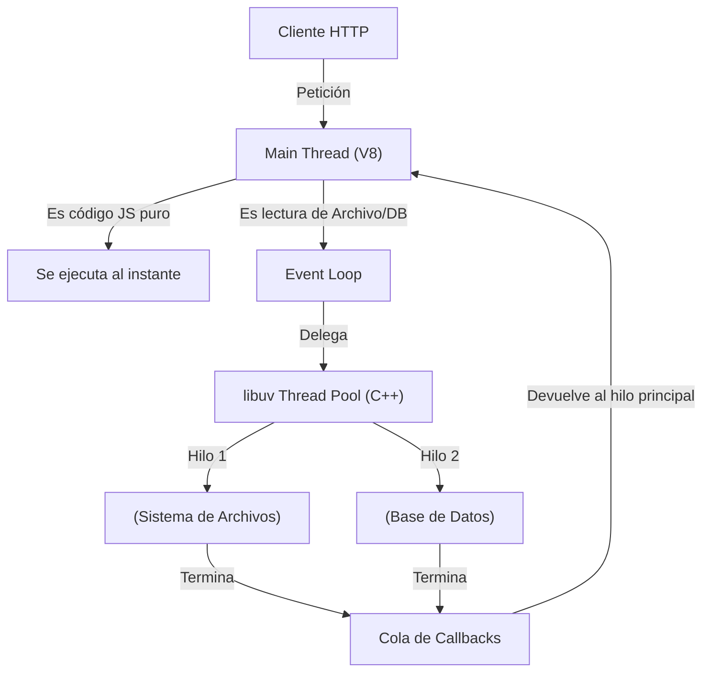

# Arquitectura Event-Driven y el V8 Engine

Bienvenido al lado del servidor con JavaScript. Node.js revolucionó el desarrollo web no por ser un nuevo lenguaje, sino por llevar el motor V8 de Google Chrome al backend, acoplado con un bucle de eventos (Event Loop) asíncrono y no bloqueante.

## 1. El Mito del "Single Thread"

Se dice comúnmente que Node.js es "Single Threaded" (de un solo hilo). Esto es una verdad a medias.

* **El Hilo Principal (Main Thread):** Ejecuta tu código JavaScript.
* **El Thread Pool (libuv):** Node delega las tareas pesadas (I/O, compresión, criptografía, red) a un pool de hilos oculto manejado por la librería `libuv` escrita en C++.



## 2. Bloqueando el Event Loop (El Pecado Capital)

Dado que solo hay un Main Thread para tu código, si ejecutas una operación matemática gigante o un bucle `while` infinito, **todo el servidor se congela**. Ningún otro usuario podrá hacer login o cargar datos.

```javascript
// ❌ PELIGRO: Código Bloqueante (Sincrónico)
app.get('/hash', (req, res) => {
  // Mientras se lee este archivo de 2GB, Node.js no puede responder a nadie más.
  const data = fs.readFileSync('/archivo-gigante.mp4'); 
  res.send('Completado');
});

// ✅ CORRECTO: Código No Bloqueante (Asincrónico)
app.get('/hash', async (req, res) => {
  // Node envía la tarea a libuv y sigue atendiendo otras peticiones HTTP
  const data = await fs.promises.readFile('/archivo-gigante.mp4');
  res.send('Completado');
});
```

## 3. Node no es para CPU-Intensive

Si necesitas procesar video, entrenar modelos de Inteligencia Artificial, o renderizar 3D, Node.js es la herramienta equivocada. Para tareas intensivas de CPU, Python (con librerías en C), Rust o Go son superiores.
Node.js es el REY absoluto en aplicaciones **I/O Intensive** (Input/Output): Chats en tiempo real, APIs REST, streaming de datos y microservicios.

## Próximos Pasos
Hemos entendido cómo respira Node.js. En el **Nivel Básico**, dejaremos la teoría y crearemos nuestro primer servidor HTTP utilizando el framework que gobierna el 90% del mercado: Express.js.
