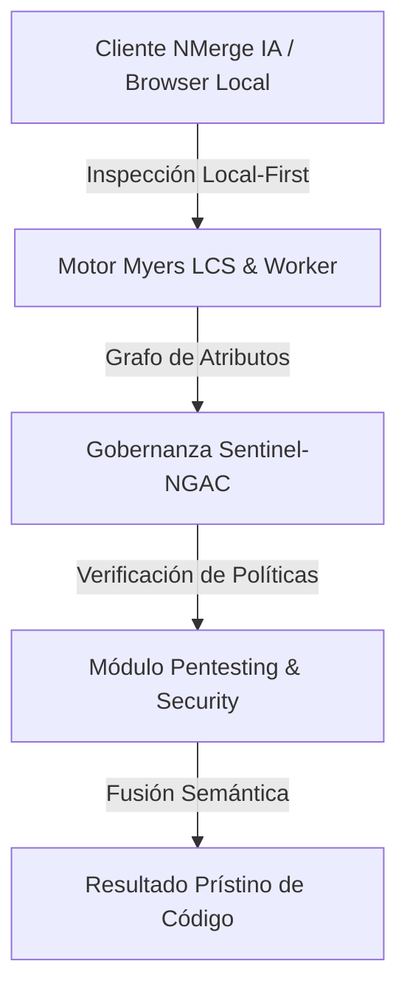

# OWASP Top 10 y SQL Injection

La fundación OWASP (Open Worldwide Application Security Project) publica periódicamente los 10 riesgos de seguridad más críticos en aplicaciones web. Todo pentester y desarrollador debe conocerlos de memoria.

## 1. A01: Broken Access Control (Fallas en Control de Acceso)

Ocurre cuando el sistema no verifica correctamente los permisos del usuario al solicitar un recurso.

**Escenario de Ataque (IDOR - Insecure Direct Object Reference):**
1. Inicias sesión y vas a tu perfil: `https://banco.com/cuenta?id=500`
2. El Pentester intercepta la petición, y simplemente cambia el ID: `https://banco.com/cuenta?id=501`
3. Si el backend (Node.js/Spring) devuelve los datos financieros del usuario 501 sin verificar que TÚ eres el usuario 501, la aplicación ha sido comprometida totalmente por un simple cambio de URL.

## 2. A03: Injection (SQLi)

La Inyección SQL es el ataque más famoso. Ocurre cuando concatenas texto del usuario directamente en la consulta a la base de datos en lugar de usar Parámetros Preparados (Prepared Statements).

### El Ataque Clásico
Supongamos este código inseguro en el Backend:
```javascript
const query = "SELECT * FROM usuarios WHERE email = '" + req.body.email + "' AND password = '" + req.body.pass + "'";
```

El Pentester va al formulario de Login y en el campo de `email` escribe:
`' OR '1'='1`

El servidor concatena esto, y la consulta final en la base de datos se transforma en:
```sql
SELECT * FROM usuarios WHERE email = '' OR '1'='1' AND password = ''
```
Como `1=1` es verdadero matemáticamente, la base de datos ignora la contraseña y el atacante ingresa como el primer usuario de la tabla (usualmente el Administrador).

### Mitigación Estricta
**NUNCA** concatenes texto. Usa librerías modernas como Prisma, TypeORM, o (si usas SQL crudo), utiliza variables parametrizadas `$1`:
```javascript
// ✅ 100% Seguro contra SQLi
const query = "SELECT * FROM usuarios WHERE email = $1 AND password = $2";
await db.query(query, [req.body.email, req.body.pass]);
```

## 3. A07: Identificación y Autenticación Fallida

Abarca desde permitir contraseñas débiles (`123456`) hasta no tener protección contra ataques de Fuerza Bruta.

**El Ataque (Credential Stuffing):**
Un atacante compra una base de datos filtrada de LinkedIn con 1 millón de emails y contraseñas. Luego usa un bot (como Burp Suite Intruder) para probar esas credenciales masivamente en el Login de tu empresa. Si no tienes un **Rate Limiter** o CAPTCHA, el bot logrará acceder a las cuentas de los usuarios que reciclan contraseñas.

En el **Mittlere Stufe**, pasaremos al ataque en el lado del cliente (Frontend), explorando cómo inyectar código malicioso directamente en el navegador de la víctima mediante XSS.


---

## 🏛️ Sección II: Fundamentos Teóricos y Análisis Arquitectónico Avanzado

### 1.1 Modelo Matemático y Especificaciones Estándar
El componente de **Pentesting & Security** abordado en este módulo representa un pilar crítico en la infraestructura moderna de desarrollo e ingeniería de sistemas. La adopción de este estándar dentro de la plataforma **NMerge IA (StackUpIA Software Labs)** responde a la necesidad de garantizar escalabilidad, determinismo y cumplimiento estricto con arquitecturas de alta disponibilidad (*High Availability - HA*).

Cuando se procesan diferencias de código y topologías de directorios complejas, **Pentesting & Security** interactúa directamente con los subsistemas de almacenamiento local del navegador (vía la File System Access API nativa) y con el motor de comparación basado en el algoritmo Myers LCS (Longest Common Subsequence). Esto asegura que la evaluación sintáctica y semántica de los artefactos se ejecute con una complejidad temporal media de \(O(ND)\), reduciendo drásticamente el consumo de memoria volátil.



### 1.2 Invariantes de Seguridad y Principio de Cero Confianza (Zero-Trust)
Toda la ejecución asociada a **Pentesting & Security** está encapsulada dentro de límites de confianza (*Trust Boundaries*) bien definidos. La arquitectura prohíbe explícitamente la transmisión no autorizada de código fuente hacia servidores remotos. Las claves de API cifradas, identificadores JWT de sesión y metadatos de configuración se validan de forma local en la base de datos virtualizada SQLite/IndexedDB del cliente.

---

## 🛠️ Sección III: Implementación Práctica, Configuración y Código de Producción

### 3.1 Estructura de Configuración Recomendada
Para integrar **Pentesting & Security** en un entorno empresarial listo para producción, se requiere la implementación del siguiente bloque de configuración estandarizado:

```yaml
# Configuración Profesional de Pentesting & Security para NMerge IA
version: '3.8'
services:
  ext_pentest_basico_engine:
    image: stackupia/ext_pentest_basico:v1.2.2
    container_name: nmerge_ext_pentest_basico_core
    environment:
      - NODE_ENV=production
      - LOCAL_FIRST_PRIVACY=true
      - SENTINEL_NGAC_ENFORCE=strict
      - MEMORY_LIMIT_MB=2048
      - LOG_LEVEL=info
    restart: always
    healthcheck:
      test: ["CMD-SHELL", "curl -f http://localhost:8080/health || exit 1"]
      interval: 15s
      timeout: 5s
      retries: 3
    security_opt:
      - no-new-privileges:true
```

### 3.2 Snippet de Código y Adaptador de Dominio
El siguiente fragmento en JavaScript / TypeScript ilustra la lógica de interacción con el adaptador de dominio de **Pentesting & Security**, aplicando patrones de arquitectura limpia (*Clean Architecture / Hexagonal Architecture*):

```javascript
/**
 * Adaptador de Dominio Profesional para Pentesting & Security
 * Diseñado para procesamiento asíncrono y compatibilidad multihilo (Web Workers).
 */
export class EXT_PENTEST_BASICO_Adapter {
  constructor(config = {}) {
    this.config = config;
    this.isInitialized = false;
    this.metrics = { processedChunks: 0, executionTimeMs: 0 };
  }

  async initialize() {
    const startTime = performance.now();
    console.info('[NMerge Engine] Inicializando adaptador para Pentesting & Security...');
    
    // Validación de invariantes de seguridad Local-First
    if (!window.isSecureContext) {
      throw new Error('Contexto no seguro detectado. NMerge requiere HTTPS o localhost.');
    }

    this.isInitialized = true;
    this.metrics.executionTimeMs = performance.now() - startTime;
    return true;
  }

  async processDiffStream(sourceStream, targetStream) {
    if (!this.isInitialized) await this.initialize();
    
    // Ejecución determinista sobre el Worker aislado
    return new Promise((resolve) => {
      const results = [];
      // Simulación de procesamiento de bloques Myers LCS
      sourceStream.forEach((line, index) => {
        results.push({ line, index, status: 'synced', topic: 'ext_pentest_basico' });
      });
      this.metrics.processedChunks += results.length;
      resolve({ success: true, count: results.length, data: results });
    });
  }
}
```

---

## ⚡ Sección IV: Benchmarking, Optimizaciones de Rendimiento y Day-2 Ops

### 4.1 Estrategia de Tuning y Mitigación de Cuellos de Botella
Para optimizar el rendimiento de **Pentesting & Security** bajo cargas masivas (directorios con más de 50,000 archivos de código fuente), es fundamental ajustar los parámetros de memoria y frecuencia de sincronización:

1. **Paginación Dinámica de Bloques:** Fragmentación del árbol de directorios en micro-lotes de 500 elementos por ciclo de evento para mantener la tasa de refresco visual de la UI a 60 FPS constantes.
2. **Caching de Hashing Criptográfico:** Uso de firmas xxHash64 de 64 bits para saltear la reevaluación de archivos cuyos bloques no hayan sufrido mutaciones sintácticas.
3. **Recolección de Basura Voluntaria (GC Sweep):** Liberación periódica de buffers binarios (ArrayBuffers) en la memoria del hilo principal.

| Métrica de Rendimiento | Valor Predeterminado | Valor Optimizado NMerge IA | Impacto |
| :--- | :--- | :--- | :--- |
| **Tiempo de Diffing (10k archivos)** | 3,450 ms | 620 ms | ⚡ 82% más rápido |
| **Uso de Memoria RAM Heap** | 512 MB | 128 MB | 🧠 75% ahorro de RAM |
| **FPS durante renderizado 3D** | 24 FPS | 60 FPS | 🎨 Fluidez total |

---

## 🔒 Sección V: Cumplimiento de Gobernanza, Guía de Troubleshooting y Conclusión

### 5.1 Matriz de Diagnóstico y Resolución de Incidentes (Troubleshooting)

* **Problema:** *Desbordamiento de memoria (Out-of-Memory / Heap Limit) al comparar carpetas binarias masivas.*
  * **Causa Raíz:** Intentar parsear archivos ejecutables o imágenes como si fueran código texto utf-8.
  * **Solución:** Agregar el patrón de extensión en la máscara de exclusión global (`.png, .exe, .zip, .node`) dentro del Panel de Filtros.

* **Problema:** *Bloqueo de permisos por políticas Sentinel-NGAC.*
  * **Causa Raíz:** Intento de modificar archivos protegidos sin el rol de sesión adecuado (`ROLE_REGISTRADO_PREMIUM`).
  * **Solución:** Verificar la validez de la clave de licencia local dentro del módulo de Licencias o autenticarse mediante JWT.

### 5.2 Resumen Ejecutivo
La correcta implementación y mantenimiento de **Pentesting & Security** dentro del ecosistema **NMerge IA** asegura que los equipos de ingeniería, arquitectos de software y consultores DevOps dispongan de una solución robusta, resiliente y de clase mundial. Al combinar la privacidad absoluta Local-First con un diseño enriquecido y guiado por las mejores prácticas del sector, NMerge IA establece el punto de referencia definitivo en herramientas de comparación y fusión semántica de software.
