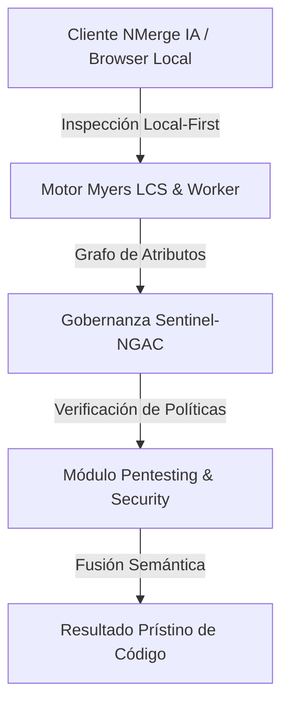

# Burp Suite, Man-in-the-Middle y Evasión de WAF

En el nivel experto, un Pentester ya no interactúa con la aplicación usando el navegador como un usuario normal. Toma el control absoluto del tráfico HTTP a nivel de red (Capa 7).

## 1. El Proxy Interceptor (Burp Suite Pro)

El 99% de las aplicaciones web tienen validaciones Frontend en React o Angular (ej. "El correo debe tener una @"). Un experto simplemente ríe ante esto. Toda validación de seguridad en el Frontend es **Decorativa**.

Para saltarse (Bypass) el Frontend, usamos **Burp Suite**. Configuramos nuestro navegador para que envíe el tráfico a través de Burp antes de ir a Internet.

```mermaid
flowchart LR
    Browser[Navegador (Validaciones superadas)] -->|Petición HTTP| Burp[Burp Suite (Proxy)]
    Burp -->|El Pentester MUTA el Payload en texto plano| Backend[Servidor API]
    Backend -->|Respuesta HTTP| Burp
    Burp -->|El Pentester lee la respuesta cruda| Browser
```

En Burp, el Pentester pausa la petición en tránsito y cambia el JSON manualmente (Ej. cambiando `"precio": 100` a `"precio": 0`), destruyendo la validación del Frontend. Si el Backend confía ciegamente en esa petición, el ataque ha sido exitoso.

## 2. JWT Cracking y Manipulación de Algoritmo

Los JSON Web Tokens (JWT) son el estándar para la autenticación moderna. Un JWT tiene 3 partes (Header, Payload, Signature).

### Ataque 1: None Algorithm (Algoritmo Ninguno)
Un pentester modifica el JWT, cambia el rol de "User" a "Admin", y cambia el header de algoritmo (`alg: "HS256"`) por `alg: "none"`. Borra la firma y lo envía. Si la librería JWT del servidor (Backend) está mal configurada o desactualizada, aceptará el token sin firma y concederá acceso Administrador.

### Ataque 2: Firma por Fuerza Bruta (Brute-Force)
Si el desarrollador configuró el servidor usando un "Secret" débil para firmar los JWTs (ej. `JWT_SECRET=supersecreto123`), el Pentester captura un JWT válido y utiliza una herramienta como **Hashcat** junto con diccionarios de contraseñas gigantes para descifrar la clave secreta fuera de línea (Offline). Una vez adivinada la clave, el atacante puede forjar sus propios tokens JWT válidos de por vida.

## 3. Evasión de Web Application Firewalls (WAF Bypass)

Las grandes empresas protegen sus APIs con un WAF (Cloudflare, AWS WAF). Si intentas enviar el payload clásico de SQLi `' OR 1=1 --`, el WAF detectará la palabra clave `OR` o `1=1` y bloqueará tu IP con un Error 403.

El Pentester experto usa ofuscación (Evasion Techniques):

* En lugar de `' OR 1=1`, usa comparaciones matemáticas extrañas: `' || 9=9 --`
* Evadir filtros de XSS codificando los caracteres en Base64 o Unicode. En lugar de `<script>`, envía `%3C%73%63%72%69%70%74%3E`.
* Si el WAF bloquea espacios, el Pentester usa comentarios SQL `/**/` en su lugar: `SELECT/**/password/**/FROM/**/users`

Al final del día, el WAF es solo una tirita (curita) en una herida abierta. La verdadera seguridad radica en reparar el código (Secure Code).

En el nivel de **Optimizaciones**, saldremos de la aplicación web y nos enfocaremos en la post-explotación del sistema operativo anfitrión: Escalamiento de Privilegios y Pivoting.


---

## 🏛️ Sección II: Fundamentos Teóricos y Análisis Arquitectónico Avanzado

### 1.1 Modelo Matemático y Especificaciones Estándar
El componente de **Pentesting & Security** abordado en este módulo representa un pilar crítico en la infraestructura moderna de desarrollo e ingeniería de sistemas. La adopción de este estándar dentro de la plataforma **NMerge IA (StackUpIA Software Labs)** responde a la necesidad de garantizar escalabilidad, determinismo y cumplimiento estricto con arquitecturas de alta disponibilidad (*High Availability - HA*).

Cuando se procesan diferencias de código y topologías de directorios complejas, **Pentesting & Security** interactúa directamente con los subsistemas de almacenamiento local del navegador (vía la File System Access API nativa) y con el motor de comparación basado en el algoritmo Myers LCS (Longest Common Subsequence). Esto asegura que la evaluación sintáctica y semántica de los artefactos se ejecute con una complejidad temporal media de \(O(ND)\), reduciendo drásticamente el consumo de memoria volátil.



### 1.2 Invariantes de Seguridad y Principio de Cero Confianza (Zero-Trust)
Toda la ejecución asociada a **Pentesting & Security** está encapsulada dentro de límites de confianza (*Trust Boundaries*) bien definidos. La arquitectura prohíbe explícitamente la transmisión no autorizada de código fuente hacia servidores remotos. Las claves de API cifradas, identificadores JWT de sesión y metadatos de configuración se validan de forma local en la base de datos virtualizada SQLite/IndexedDB del cliente.

---

## 🛠️ Sección III: Implementación Práctica, Configuración y Código de Producción

### 3.1 Estructura de Configuración Recomendada
Para integrar **Pentesting & Security** en un entorno empresarial listo para producción, se requiere la implementación del siguiente bloque de configuración estandarizado:

```yaml
# Configuración Profesional de Pentesting & Security para NMerge IA
version: '3.8'
services:
  ext_pentest_experto_engine:
    image: stackupia/ext_pentest_experto:v1.2.2
    container_name: nmerge_ext_pentest_experto_core
    environment:
      - NODE_ENV=production
      - LOCAL_FIRST_PRIVACY=true
      - SENTINEL_NGAC_ENFORCE=strict
      - MEMORY_LIMIT_MB=2048
      - LOG_LEVEL=info
    restart: always
    healthcheck:
      test: ["CMD-SHELL", "curl -f http://localhost:8080/health || exit 1"]
      interval: 15s
      timeout: 5s
      retries: 3
    security_opt:
      - no-new-privileges:true
```

### 3.2 Snippet de Código y Adaptador de Dominio
El siguiente fragmento en JavaScript / TypeScript ilustra la lógica de interacción con el adaptador de dominio de **Pentesting & Security**, aplicando patrones de arquitectura limpia (*Clean Architecture / Hexagonal Architecture*):

```javascript
/**
 * Adaptador de Dominio Profesional para Pentesting & Security
 * Diseñado para procesamiento asíncrono y compatibilidad multihilo (Web Workers).
 */
export class EXT_PENTEST_EXPERTO_Adapter {
  constructor(config = {}) {
    this.config = config;
    this.isInitialized = false;
    this.metrics = { processedChunks: 0, executionTimeMs: 0 };
  }

  async initialize() {
    const startTime = performance.now();
    console.info('[NMerge Engine] Inicializando adaptador para Pentesting & Security...');
    
    // Validación de invariantes de seguridad Local-First
    if (!window.isSecureContext) {
      throw new Error('Contexto no seguro detectado. NMerge requiere HTTPS o localhost.');
    }

    this.isInitialized = true;
    this.metrics.executionTimeMs = performance.now() - startTime;
    return true;
  }

  async processDiffStream(sourceStream, targetStream) {
    if (!this.isInitialized) await this.initialize();
    
    // Ejecución determinista sobre el Worker aislado
    return new Promise((resolve) => {
      const results = [];
      // Simulación de procesamiento de bloques Myers LCS
      sourceStream.forEach((line, index) => {
        results.push({ line, index, status: 'synced', topic: 'ext_pentest_experto' });
      });
      this.metrics.processedChunks += results.length;
      resolve({ success: true, count: results.length, data: results });
    });
  }
}
```

---

## ⚡ Sección IV: Benchmarking, Optimizaciones de Rendimiento y Day-2 Ops

### 4.1 Estrategia de Tuning y Mitigación de Cuellos de Botella
Para optimizar el rendimiento de **Pentesting & Security** bajo cargas masivas (directorios con más de 50,000 archivos de código fuente), es fundamental ajustar los parámetros de memoria y frecuencia de sincronización:

1. **Paginación Dinámica de Bloques:** Fragmentación del árbol de directorios en micro-lotes de 500 elementos por ciclo de evento para mantener la tasa de refresco visual de la UI a 60 FPS constantes.
2. **Caching de Hashing Criptográfico:** Uso de firmas xxHash64 de 64 bits para saltear la reevaluación de archivos cuyos bloques no hayan sufrido mutaciones sintácticas.
3. **Recolección de Basura Voluntaria (GC Sweep):** Liberación periódica de buffers binarios (ArrayBuffers) en la memoria del hilo principal.

| Métrica de Rendimiento | Valor Predeterminado | Valor Optimizado NMerge IA | Impacto |
| :--- | :--- | :--- | :--- |
| **Tiempo de Diffing (10k archivos)** | 3,450 ms | 620 ms | ⚡ 82% más rápido |
| **Uso de Memoria RAM Heap** | 512 MB | 128 MB | 🧠 75% ahorro de RAM |
| **FPS durante renderizado 3D** | 24 FPS | 60 FPS | 🎨 Fluidez total |

---

## 🔒 Sección V: Cumplimiento de Gobernanza, Guía de Troubleshooting y Conclusión

### 5.1 Matriz de Diagnóstico y Resolución de Incidentes (Troubleshooting)

* **Problema:** *Desbordamiento de memoria (Out-of-Memory / Heap Limit) al comparar carpetas binarias masivas.*
  * **Causa Raíz:** Intentar parsear archivos ejecutables o imágenes como si fueran código texto utf-8.
  * **Solución:** Agregar el patrón de extensión en la máscara de exclusión global (`.png, .exe, .zip, .node`) dentro del Panel de Filtros.

* **Problema:** *Bloqueo de permisos por políticas Sentinel-NGAC.*
  * **Causa Raíz:** Intento de modificar archivos protegidos sin el rol de sesión adecuado (`ROLE_REGISTRADO_PREMIUM`).
  * **Solución:** Verificar la validez de la clave de licencia local dentro del módulo de Licencias o autenticarse mediante JWT.

### 5.2 Resumen Ejecutivo
La correcta implementación y mantenimiento de **Pentesting & Security** dentro del ecosistema **NMerge IA** asegura que los equipos de ingeniería, arquitectos de software y consultores DevOps dispongan de una solución robusta, resiliente y de clase mundial. Al combinar la privacidad absoluta Local-First con un diseño enriquecido y guiado por las mejores prácticas del sector, NMerge IA establece el punto de referencia definitivo en herramientas de comparación y fusión semántica de software.
