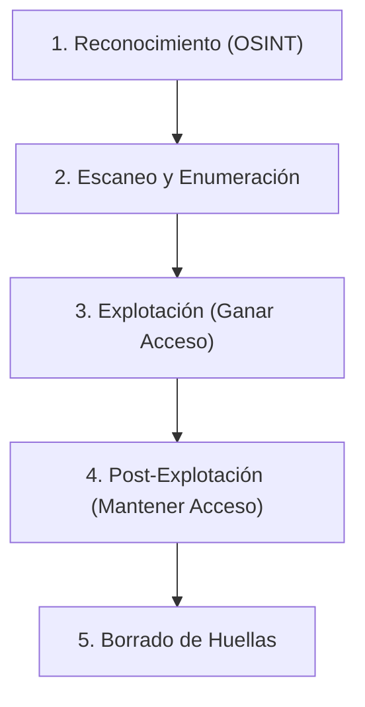

# Fundamentos de Seguridad Ofensiva

Bienvenido al lado oscuro. El Pentesting (Prueba de Penetración) no se trata de destruir, sino de pensar como un atacante para descubrir las brechas antes de que lo haga un cibercriminal real.

## 1. El Mindset del Atacante

Un desarrollador construye pensando en el "Happy Path" (El Camino Feliz). El usuario ingresa su email, su contraseña, y entra al sistema.
El Pentester (o el Atacante) piensa exclusivamente en romper ese camino:
* ¿Qué pasa si en lugar del email pongo un millón de caracteres `A`?
* ¿Qué pasa si en lugar de un String envío un Objeto JSON anidado?
* ¿Qué pasa si intercepto la petición y cambio el ID de mi usuario por el ID del Administrador?

## 2. Herramientas Base (La Navaja Suiza)

No necesitas ser un mago de la consola para empezar, pero hay herramientas estándar en la industria (generalmente incluidas en distribuciones como Kali Linux o Parrot OS):

| Herramienta | Propósito Principal |
| :--- | :--- |
| **Nmap** | Escáner de Puertos. Descubre qué servicios (SSH, HTTP, FTP) están vivos en un servidor. |
| **Burp Suite** | Proxy de Interceptación. El Santo Grial del Hacking Web. |
| **Metasploit** | Framework de explotación automatizada para vulnerabilidades conocidas (CVEs). |
| **Gobuster / DirBuster** | Descubrimiento de rutas ocultas (Fuzzing). Encuentra `/admin`, `/respaldos.zip`, etc. |

## 3. El Concepto de Superficie de Ataque

Tu aplicación web no es solo tu código en React. La "Superficie de Ataque" es la suma de todas las puertas de entrada posibles:
* Tu servidor web (Nginx/Apache).
* El motor de Base de Datos (PostgreSQL/MySQL).
* Las librerías de terceros (Paquetes NPM obsoletos).
* Los puertos abiertos en el servidor físico.
* Los propios empleados (Ingeniería Social).

Una cadena es tan fuerte como su eslabón más débil. De nada sirve encriptar contraseñas con el algoritmo militar Argon2 si el desarrollador deja la base de datos abierta a internet en el puerto 5432 sin contraseña.

## Próximos Pasos
Hemos entendido la filosofía ofensiva. En el **Grundstufe**, exploraremos el OWASP Top 10, la biblia de la seguridad web, comenzando con el ataque más infame y letal de la historia: La Inyección SQL.
