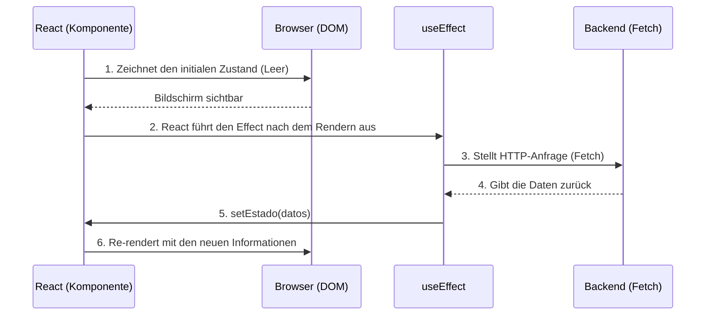

# Core Hooks und lokales Zustandsmanagement (State)

Funktionale Komponenten allein sind rein und ohne Gedächtnis ("Stateless"). Wenn du eine Funktion zweimal aufrufst, beginnt sie bei Null. Damit sich eine Komponente zwischen Renderzyklen an Informationen "erinnert" (wie ein Einkaufswagen oder ob ein Modal geöffnet ist), hat React **Hooks** eingeführt.

## 1. Der lokale Zustand: useState

`useState` ist der wichtigste Hook. Er gibt deiner Komponente einen privaten Speichertresor, der Renderzyklen überlebt.

```jsx
import React, { useState } from 'react';

export const Contador = () => {
  // 1. Deklaration: 'contador' ist der Wert, 'setContador' ist die Mutatorfunktion
  // 2. Initialisierung: Startet bei 0
  const [contador, setContador] = useState(0);

  return (
    <div>
      <p>Du hast {contador} Mal geklickt</p>
      {/* Niemals direkt mutieren (z. B.: contador = contador + 1). Immer den Setter verwenden */}
      <button onClick={() => setContador(contador + 1)}>
        Inkrementieren
      </button>
    </div>
  );
};
```

### Goldene Regel des Zustands: Unveränderlichkeit (Immutability)
React entscheidet, den Bildschirm neu zu rendern, indem es vergleicht, ob sich der neue Zustand vom vorherigen unterscheidet, wobei die referenzielle Gleichheit (`===`) verwendet wird. Wenn du ein Array oder ein Objekt hast, darfst du NIEMALS `.push()` darauf anwenden oder seine Eigenschaften direkt ändern, da sich seine Speicherreferenz nicht ändert und React den Bildschirm nicht aktualisiert.
**Du musst immer ein neues Array oder Objekt erstellen, indem du das vorherige kopierst (Spread Operator `...`).**

## 2. Nebeneffekte: useEffect

Reine Funktionen sollten die "Außenwelt" nicht berühren (HTTP-Anfragen stellen, WebSockets abonnieren, LocalStorage berühren). Wenn du das tun musst, musst du `useEffect` verwenden.



## Das Abhängigkeits-Array (Matrix de Dependencias)

Das zweite Argument von `useEffect` steuert, **wann** der Effekt ausgeführt wird. Es ist die Quelle von 90% der Fehler in React, wenn man es nicht beherrscht.

```jsx
// Szenario 1: Ohne Abhängigkeits-Array (Gefahr)
// Wird NACH JEDEM RENDER ausgeführt. Kann Endlosschleifen verursachen.
useEffect(() => { fetchDatos() }); 

// Szenario 2: Leeres Array [] (Das moderne "componentDidMount")
// Wird NUR EINMAL ausgeführt, wenn die Komponente geboren wird.
useEffect(() => { fetchDatos() }, []); 

// Szenario 3: Array mit Variablen [userId]
// Wird bei der Geburt ausgeführt und JEDES MAL, wenn sich 'userId' ändert.
useEffect(() => { fetchDatosUsuario(userId) }, [userId]); 
```

Wenn du `useState` und `useEffect` beherrschst, kannst du 80% jeder Anwendung erstellen. Auf der **mittleren Stufe (Nivel Medio)** werden wir das berüchtigte Problem des "Prop Drilling" lösen und unsere App mit der Context API mit einem globalen Zustand verbinden.
