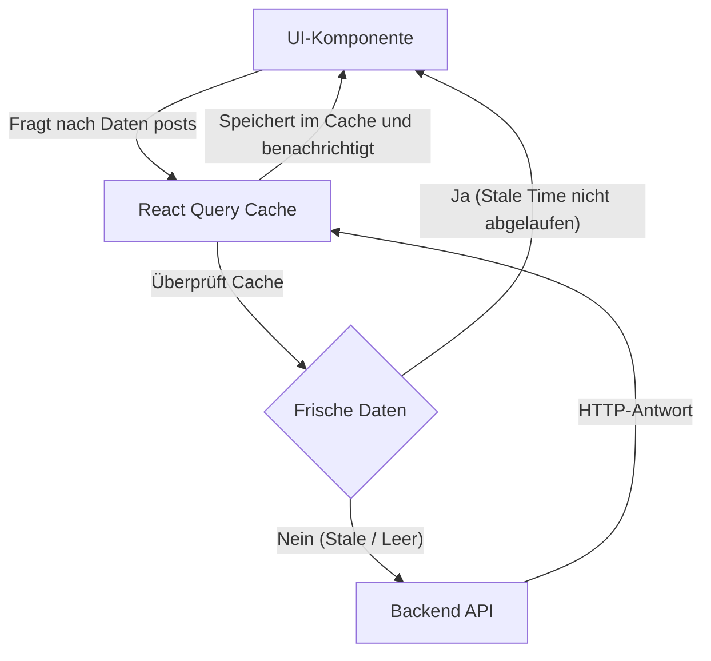

# Server State, Mutationen und React Query

Wenn du jemals ein `useEffect`-System gebaut hast, um Daten von einer API abzurufen, musstest du drei Zustände manuell erstellen: `data`, `isLoading` und `error`. Du musstest dich mit Race Conditions auseinandersetzen, Anfragen abbrechen, wenn der Benutzer schnell die Seite wechselt, und herausfinden, wie man die Informationen zwischenspeichert (cacht), um das Backend nicht zu bombardieren.

Auf dieser Expertenstufe akzeptieren wir eine grundlegende Wahrheit: **Daten, die vom Backend kommen, sind KEIN Anwendungsstatus (Client State), sie sind Serverstatus (Server State).**

## 1. Der Paradigmenwechsel: TanStack Query (React Query)

Zustand und Redux sind perfekt für UI (Ob ein Panel geöffnet ist, das aktuelle Thema, ein In-Memory-Warenkorb). Aber für die Handhabung von APIs und Datenbanken ist der absolute Industriestandard **TanStack Query**.



## 2. Den useEffect für immer eliminieren

Sehen wir uns an, wie ein Experte Daten von einer API ohne ein einziges `useEffect`, `useState` oder Nebenläufigkeitsblockaden erhält.

```jsx
import { useQuery } from '@tanstack/react-query';
import axios from 'axios';

// 1. Wir trennen die reine Fetch-Funktion (Agnostisch zu React)
const fetchUsuarios = async () => {
  const { data } = await axios.get('https://api.empresa.com/v1/usuarios');
  return data;
};

export const ListaUsuarios = () => {
  // 2. Die Magie von React Query
  const { data: usuarios, isLoading, isError, error } = useQuery({
    queryKey: ['usuarios', 'lista'], // Die eindeutige ID für diesen Cache
    queryFn: fetchUsuarios,
    staleTime: 1000 * 60 * 5, // Vertraue dem Cache für 5 Minuten vor einem Refetch
  });

  if (isLoading) return <Spinner />;
  if (isError) return <Alert msg={error.message} />;

  return (
    <ul>
      {usuarios.map(u => <li key={u.id}>{u.nombre}</li>)}
    </ul>
  );
};
```

### Die Macht des globalen Caches
Wenn eine andere Komponente in einer anderen Ansicht der App ein `useQuery` mit demselben Key `['usuarios', 'lista']` ausführt, wird React Query **die HTTP-Anfrage nicht ausführen**. Es liefert die Daten sofort aus dem Arbeitsspeicher (Cache Hit), was die Latenz auf 0 ms reduziert.

## 3. Mutationen: Den Server modifizieren

Daten zu lesen ist einfach; sie zu ändern und den Cache zu invalidieren (damit die Benutzeroberfläche aktualisiert wird), ist die wahre Herausforderung. `useMutation` handhabt Aktualisierungen, Erstellung und Löschung.

```jsx
import { useMutation, useQueryClient } from '@tanstack/react-query';

export const FormularioCrear = () => {
  const queryClient = useQueryClient();

  const mutation = useMutation({
    mutationFn: (nuevoUsuario) => axios.post('/api/usuarios', nuevoUsuario),
    // Lifecycle hook: Wenn der Server mit OK (200) antwortet
    onSuccess: () => {
      // Invaldiert den Cache der Benutzerliste.
      // Dies zwingt React Query, einen automatischen Refetch im Hintergrund durchzuführen!
      queryClient.invalidateQueries({ queryKey: ['usuarios', 'lista'] });
    },
  });

  const onSubmit = (datos) => {
    mutation.mutate(datos);
  };

  return (
    <button 
      onClick={() => onSubmit({ nombre: 'Bob' })}
      disabled={mutation.isPending} // Automatische Steuerung des Buttons
    >
      {mutation.isPending ? 'Speichert...' : 'Benutzer erstellen'}
    </button>
  );
};
```

Mit React Query reduziert sich dein Code um 50%, dein Backend atmet auf dank des Caches, und der Benutzer nimmt eine ultraschnelle App wahr. Auf der Stufe der **Optimierungen (Optimizaciones)** konzentrieren wir uns auf die lokalen Rendering-Engpässe des Browsers: Memoization, Profiling und massives Code Splitting.
