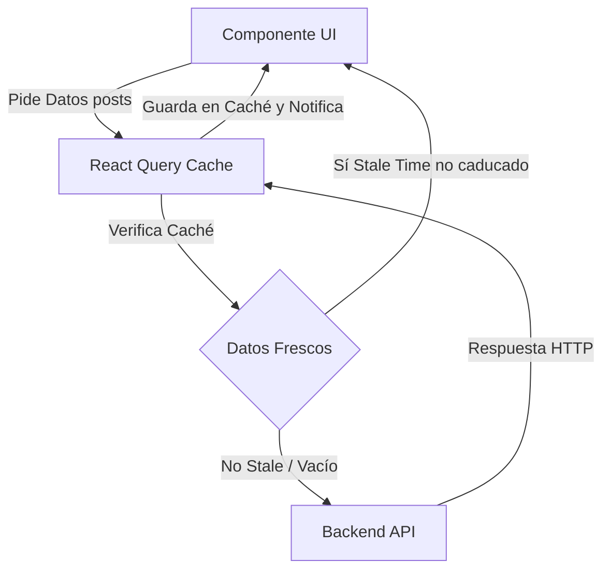

# Server State, Mutaciones y React Query

Si alguna vez has construido un sistema `useEffect` para hacer fetch a una API, has tenido que crear manualmente tres estados: `data`, `isLoading` y `error`. Has tenido que lidiar con condiciones de carrera (Race Conditions), abortar peticiones cuando el usuario cambia de página rápido, y averiguar cómo cachear la información para no bombardear a tu backend.

En este nivel experto, aceptamos una verdad fundamental: **Los datos que vienen del backend NO son estado de la aplicación (Client State), son Estado del Servidor (Server State).**

## 1. El Cambio de Paradigma: TanStack Query (React Query)

Zustand y Redux son perfectos para UI (Si un panel está abierto, el tema actual, un carrito en memoria). Pero para manejar APIs y base de datos, el estándar industrial absoluto es **TanStack Query**.



## 2. Eliminando el useEffect para siempre

Miremos cómo un experto obtiene datos de una API sin un solo `useEffect`, `useState` ni bloqueos de concurrencia.

```jsx
import { useQuery } from '@tanstack/react-query';
import axios from 'axios';

// 1. Separamos la función pura de fetch (Agnóstica de React)
const fetchUsuarios = async () => {
  const { data } = await axios.get('https://api.empresa.com/v1/usuarios');
  return data;
};

export const ListaUsuarios = () => {
  // 2. La Magia de React Query
  const { data: usuarios, isLoading, isError, error } = useQuery({
    queryKey: ['usuarios', 'lista'], // El ID único para este caché
    queryFn: fetchUsuarios,
    staleTime: 1000 * 60 * 5, // Confía en la caché por 5 minutos antes de refetch
  });

  if (isLoading) return <Spinner />;
  if (isError) return <Alert msg={error.message} />;

  return (
    <ul>
      {usuarios.map(u => <li key={u.id}>{u.nombre}</li>)}
    </ul>
  );
};
```

### El Poder del Caché Global
Si otro componente en otra vista de la app hace un `useQuery` con la misma key `['usuarios', 'lista']`, React Query **no hará la petición HTTP**. Le entregará instantáneamente los datos de la memoria ram (Caché Hit), reduciendo la latencia a 0 ms.

## 3. Mutaciones: Modificando el Servidor

Leer datos es fácil; modificarlos e invalidar la caché (para que la interfaz se refresque) es el verdadero desafío. `useMutation` maneja actualizaciones, creación y eliminación.

```jsx
import { useMutation, useQueryClient } from '@tanstack/react-query';

export const FormularioCrear = () => {
  const queryClient = useQueryClient();

  const mutation = useMutation({
    mutationFn: (nuevoUsuario) => axios.post('/api/usuarios', nuevoUsuario),
    // Lifecycle hook: Cuando el servidor responda OK (200)
    onSuccess: () => {
      // Invalida la caché de la lista de usuarios.
      // ¡Esto obliga a React Query a hacer un refetch automático en el fondo!
      queryClient.invalidateQueries({ queryKey: ['usuarios', 'lista'] });
    },
  });

  const onSubmit = (datos) => {
    mutation.mutate(datos);
  };

  return (
    <button 
      onClick={() => onSubmit({ nombre: 'Bob' })}
      disabled={mutation.isPending} // Control automático del botón
    >
      {mutation.isPending ? 'Guardando...' : 'Crear Usuario'}
    </button>
  );
};
```

Con React Query, tu código se reduce un 50%, tu backend respira gracias al caché, y el usuario percibe una app ultra rápida. En el nivel de **Optimizaciones**, nos concentraremos en los cuellos de botella de renderizado local del navegador: Memoización, Profiling y Code Splitting masivo.
