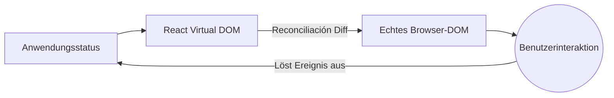

# Erste Konzepte und moderner Lebenszyklus

Willkommen im modernen React-Ökosystem. Vorbei sind die Zeiten der Klassen und monströsen Lebenszyklen (`componentDidMount`, `componentWillReceiveProps`). Heute ist React funktional, deklarativ und extrem schnell, wenn es richtig eingesetzt wird.

## 1. Das deklarative Paradigma

Im Gegensatz zum Vanilla JavaScript (Imperativ), bei dem du dem Browser mitteilst, *wie* jeder Schritt ausgeführt werden soll (Element erstellen, Klasse hinzufügen, an das DOM anhängen), teilst du in React mit, *was* gezeichnet werden soll, und React kümmert sich um das *Wie*.



## 2. Funktionale Komponenten (Der Standard)

Eine Komponente in React ist einfach eine reine JavaScript-Funktion, die Daten (Props) empfängt und JSX zurückgibt (eine hybride Syntax zwischen JS und HTML).

```jsx
// Eine perfekte und reine Komponente
export const TarjetaUsuario = ({ nombre, rol }) => {
  return (
    <div className="tarjeta">
      <h2>{nombre}</h2>
      <p>Rol: {rol}</p>
    </div>
  );
};
```

### Warum JSX?
JSX ist kein echtes HTML. Es ist syntaktischer Zucker für `React.createElement()`. Unter der Haube wandelt React diese Tags in JavaScript-Objekte um, sodass das *Virtual DOM* mathematische Vergleiche (Diffing) in einer Geschwindigkeit durchführen kann, die das echte DOM niemals erreichen könnte.

## 3. Der Motor der Veränderung: Das Virtual DOM

Wenn du den Zustand deiner Anwendung änderst, zerstört React nicht die gesamte Webseite und baut sie neu auf (wie es alte Frameworks taten).

1. **Snapshot:** React macht ein "Foto" des neuen Virtual DOM.
2. **Diffing:** Es vergleicht das neue Foto mit dem vorherigen Virtual DOM unter Verwendung eines heuristischen O(n)-Algorithmus.
3. **Reconciliación (Patching):** Es wendet nur die mathematisch exakten Änderungen auf das echte DOM an.

Wenn sich nur die Anzahl der "Likes" auf einem Button geändert hat, reist React direkt zu diesem DOM-Knoten und aktualisiert den Text, während der Rest des Baums (Bilder, Formulare) intakt bleibt.

## Nächste Schritte
Wir haben verstanden, wie React den Bildschirm zeichnet. Auf der **Basisstufe (Nivel Básico)** werden wir untersuchen, wie wir unseren Komponenten "Gedächtnis" verleihen, indem wir Hooks (`useState` und `useEffect`) verwenden, das Herzstück des modernen React.
