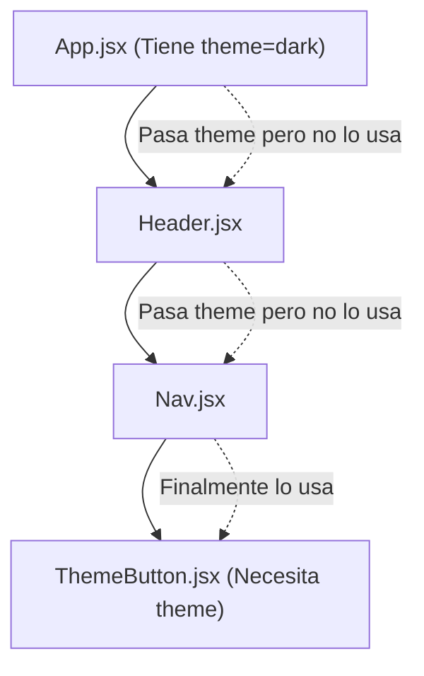

# Context API, Prop Drilling y Renderizado Condicional

A medida que tu árbol de componentes crece, pasar un estado desde un componente Padre hasta un componente Bisnieto usando `props` (Parámetros) se vuelve una pesadilla arquitectónica. A este anti-patrón se le conoce como **Prop Drilling**.

## 1. El Problema: Prop Drilling


El `Header` y el `Nav` se ensucian con propiedades que no les importan, violando el principio de encapsulamiento.

## 2. La Solución Nativa: Context API

Context API es una bóveda global que permite a cualquier componente (sin importar su profundidad) conectarse y leer datos directamente.

### Paso 1: Crear y Proveer el Contexto

```jsx
// ThemeContext.jsx
import React, { createContext, useState } from 'react';

// 1. Creamos el portal dimensional
export const ThemeContext = createContext();

// 2. Creamos el Proveedor (El Enrutador del estado)
export const ThemeProvider = ({ children }) => {
  const [theme, setTheme] = useState('dark');

  return (
    <ThemeContext.Provider value={{ theme, setTheme }}>
      {children}
    </ThemeContext.Provider>
  );
};
```

En tu `App.jsx` superior, envuelves tu aplicación:
```jsx
<ThemeProvider>
  <Header />
</ThemeProvider>
```

### Paso 2: Consumir el Contexto (El useContext)

Ahora, el botón puede teletransportarse a la bóveda y obtener los datos ignorando por completo al `Header` y `Nav`.

```jsx
import React, { useContext } from 'react';
import { ThemeContext } from './ThemeContext';

export const ThemeButton = () => {
  // Destructuramos directamente desde el éter global
  const { theme, setTheme } = useContext(ThemeContext);

  return (
    <button onClick={() => setTheme(theme === 'dark' ? 'light' : 'dark')}>
      Tema Actual: {theme}
    </button>
  );
};
```

## 3. Renderizado Condicional Avanzado

En aplicaciones medianas, constantemente necesitamos ocultar o mostrar componentes. Evita usar CSS (`display: none`) para esto; en su lugar, no dibujes el componente en el Virtual DOM.

### El Operador Lógico Cortocircuito (&&)
El estándar de facto cuando solo hay dos estados (Mostrar o Nada).
```jsx
const LoadingSpinner = ({ isLoading }) => {
  return (
    <div>
      {/* Si isLoading es true, React dibuja el Spinner. Si es false, ignora el componente */}
      {isLoading && <Spinner />}
    </div>
  );
};
```

Con Context API en tu arsenal, puedes manejar estados de Autenticación, Carritos de Compra y Temas globales. Pero cuando las reglas de negocio globales se vuelven matemáticas puras y complejas, Context empieza a sufrir cuellos de botella de renderizado. En el **Nivel Avanzado**, pasaremos a arquitecturas globales inmutables como Redux Toolkit o Zustand.
