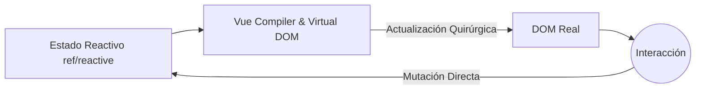

# Conceptos Iniciales y Reactividad

Bienvenido a Vue.js, el framework progresivo. A diferencia de React, Vue utiliza un sistema de reactividad basado en Proxies (en Vue 3) que hace que la gestión del estado sea mucho más intuitiva y menos propensa a renderizados innecesarios.

## 1. El Paradigma Progresivo
Vue se llama 'progresivo' porque puedes usarlo para renderizar un solo componente en una página estática (como jQuery) o construir una SPA (Single Page Application) completa usando Vue Router y Pinia.



## 2. Options API vs Composition API
En Vue 3, el estándar es la **Composition API** con `<script setup>`. Esto permite agrupar la lógica por funcionalidad en lugar de por ciclo de vida.

```html
<script setup>
import { ref } from 'vue'

const contador = ref(0)
const incrementar = () => contador.value++
</script>

<template>
  <div class="tarjeta">
    <h2>Contador: {{ contador }}</h2>
    <button @click="incrementar">Incrementar</button>
  </div>
</template>
```
