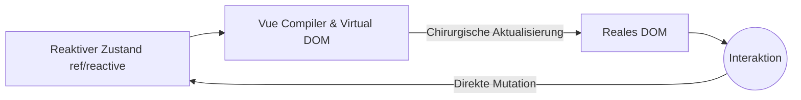

# Erste Konzepte und Reaktivität

Willkommen bei Vue.js, dem progressiven Framework. Im Gegensatz zu React verwendet Vue ein Proxy-basiertes Reaktivitätssystem (in Vue 3), das die Zustandsverwaltung viel intuitiver und weniger anfällig für unnötiges Rendering macht.

## 1. Das progressive Paradigma
Vue wird "progressiv" genannt, weil Sie es verwenden können, um eine einzelne Komponente auf einer statischen Seite (wie jQuery) zu rendern oder eine vollständige SPA (Single Page Application) mit Vue Router und Pinia zu erstellen.



## 2. Options API vs Composition API
In Vue 3 ist die **Composition API** mit `<script setup>` der Standard. Dies ermöglicht es, die Logik nach Funktionalität statt nach Lebenszyklus zu gruppieren.

```html
<script setup>
import { ref } from 'vue'

const contador = ref(0)
const incrementar = () => contador.value++
</script>

<template>
  <div class="tarjeta">
    <h2>Zähler: {{ contador }}</h2>
    <button @click="incrementar">Inkrementieren</button>
  </div>
</template>
```
