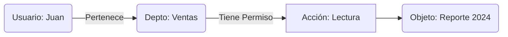
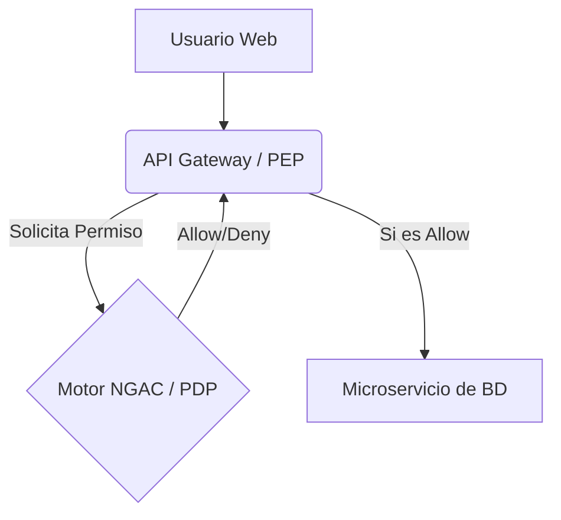

# El Fin del RBAC Tradicional

> [!IMPORTANT]
> **Rol:** Arquitecto de Seguridad  

El RBAC (Role-Based Access Control) tradicional colapsa cuando tienes miles de usuarios con necesidades granulares ("Solo lectura los martes en documentos del departamento X").

## 1. ¿Qué es NGAC?
NGAC (Next Generation Access Control) fue creado por el NIST. Sustituye las "Listas de Permisos" por un **Grafo de Atributos**.



---

# Modelado de Políticas

A diferencia del RBAC, el NGAC usa "User Attributes" (UA) y "Object Attributes" (OA).

## 1. El Paradigma Lineal

```text
User(Alice) -> UA(Managers) -> Association(Read/Write) -> OA(Confidential_Docs) <- Object(Doc_1)
```
Si queremos revocar el acceso a un solo documento temporalmente, no necesitamos crear un nuevo rol. Simplemente movemos el Objeto `Doc_1` a otro `OA`. Esto es matemáticamente elegante e infinitamente escalable.

---

# Motores de Decisión (PDP/PEP)

En una arquitectura Zero-Trust, separamos la ejecución de la decisión.



* **PEP (Policy Enforcement Point):** El proxy que detiene el tráfico.
* **PDP (Policy Decision Point):** El cerebro que evalúa el Grafo NGAC.

---

# Obligaciones y Condiciones Temporales

NGAC permite inyectar **Prohibiciones** o restricciones geográficas/temporales sin ensuciar los permisos estáticos.

```json
{
  "policy": "Horario Laboral",
  "condition": {
    "time": ["09:00", "18:00"],
    "ip_range": "10.0.0.0/8"
  },
  "action": "DENY"
}
```
El PDP evaluará esta regla dinámicamente en microsegundos, previniendo exfiltración de datos nocturna.

---

# Gobernanza Global (Zanzibar)

> [!IMPORTANT]
> **Ref:** Google Zanzibar Paper  

Los gigantes como Google Docs no evalúan SQL para saber si puedes ver un archivo. Usan relaciones masivas globales (Relationship-Based Access Control / NGAC avanzado).

**Las Tuplas de Relación (Zanzibar Style):**
```text
documento:reporte2024#viewer@usuario:juan
documento:reporte2024#editor@grupo:managers#member
```
A escala global (miles de millones de reglas), la evaluación NGAC requiere bases de datos distribuidas como Spanner o equivalentes open-source (SpiceDB, Keto).

---

# 🌟 Sentinel-NGAC - Nivel Maestro (Master Class)

## 📌 Enfoque de Nivel Maestro
Control de acceso basado en atributos y gráficos de politicas (NGAC - Next Generation Access Control, ANSI/INCITS 494) con motor de decisión en tiempo real, evaluadores de grafos de alta concurrencia, integración con modelos Zero-Trust de grado militar y orquestación agéntica.

---

## 🛠️ 1. Dynamic Attribute Context Graphs (ANSI/INCITS 494)
Creación de relaciones de contexto dinámicas donde las asignaciones se evalúan en tiempo real según métricas del dispositivo, ubicación IP y puntuación de riesgo probabilística:

```json
{
  "policy_class": "POLICY_MAESTRO_ZERO_TRUST",
  "subject_attributes": {
    "user_id": "invitado@nmergeia.com",
    "risk_score": 0.02,
    "device_health": "PASSED_TPM_2_0"
  },
  "object_attributes": {
    "resource": "RES_CORE_DATABASE",
    "sensitivity_level": "RESTRICTED"
  },
  "environment_conditions": {
    "mfa_verified": true,
    "ip_reputation_score": 99.8
  },
  "decision_algorithm": "EVALUATE_GRAPH_PATH_CONVERGENCE"
}
```

---

## ⚡ 2. High-Performance DAG Authorization Engine (Rust / C++)
Implementación del motor de evaluación de políticas NGAC sobre Grafos Acíclicos Dirigidos (DAG) con soporte para 100,000 decisiones de autorización por segundo:

```rust
// Engine NGAC Nivel Maestro en Rust
pub struct NgacGraphEngine {
    nodes: HashMap<u64, Node>,
    edges: Vec<Edge>,
}

impl NgacGraphEngine {
    pub fn check_access(&self, user_id: u64, resource_id: u64, mode: &str) -> bool {
        // Recorrido de grafo optimizado con memoización de caminos activos
        let has_path = self.find_dag_path(user_id, resource_id);
        has_path && self.verify_attributes(user_id, mode)
    }
}
```