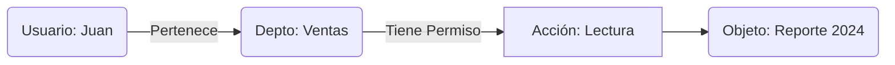

# El Fin del RBAC Tradicional

> [!IMPORTANT]
> **Rol:** Arquitecto de Seguridad  

El RBAC (Role-Based Access Control) tradicional colapsa cuando tienes miles de usuarios con necesidades granulares ("Solo lectura los martes en documentos del departamento X").

## 1. ¿Qué es NGAC?
NGAC (Next Generation Access Control) fue creado por el NIST. Sustituye las "Listas de Permisos" por un **Grafo de Atributos**.

