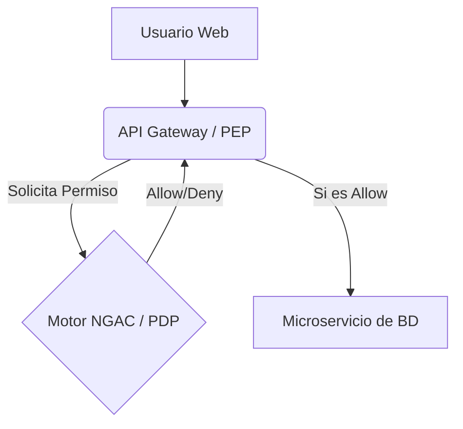

# Motores de Decisión (PDP/PEP)

En una arquitectura Zero-Trust, separamos la ejecución de la decisión.

* **PEP (Policy Enforcement Point):** El proxy que detiene el tráfico.
* **PDP (Policy Decision Point):** El cerebro que evalúa el Grafo NGAC.
