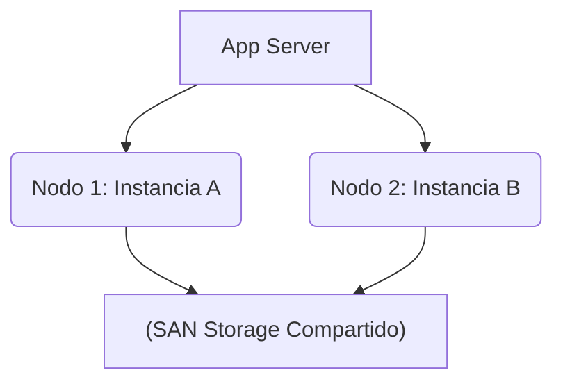

# RAC (Real Application Clusters)

> [!IMPORTANT]
> **Costo Estimado:** Cientos de miles de dólares.  

RAC permite que MÚLTIPLES instancias en distintos servidores físicos accedan concurrentemente a los MISMOS archivos de base de datos en un almacenamiento SAN compartido.

Si el Nodo 1 se incendia, las conexiones fallan instantáneamente al Nodo 2 (Transparent Application Failover).
