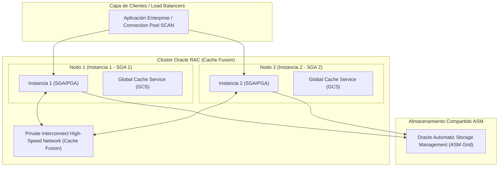

## 🎯 1. Alta Disponibilidad: Oracle RAC, Data Guard & Flashback

Para arquitecturas de Misión Crítica (Tier-0), **Oracle Database Enterprise** ofrece disponibilidad del 99.999% mediante **Real Application Clusters (RAC)**, continuidad del negocio con **Active Data Guard** y recuperación ante desastres con tecnología **Flashback**.

### 💡 Tecnologías de Misión Crítica:
- **Oracle RAC (Real Application Clusters):** Múltiples instancias compartiendo una única base de datos física mediante **Cache Fusion** e interconexión privada de alta velocidad.
- **Cache Fusion & GCS/GES:** Intercambio directo de bloques de memoria entre nodos vía InfiniBand/RoCE sin necesidad de escribir a disco.
- **Oracle Active Data Guard:** Replicación física en tiempo real a sitios remotos de contingencia con soporte de apertura en modo `READ ONLY` para descarga de consultas de reporte.
- **Oracle Flashback Database:** Rebobinado de la base de datos completa o tablas específicas a un punto exacto del tiempo (`AS OF TIMESTAMP`) sin restaurar copias de seguridad de cinta.

---

## 🏗️ 2. Arquitectura Oracle RAC (Cache Fusion & Shared Storage)



---

## 💻 3. Implementación Empresarial: Consultas Flashback y Diagnóstico Data Guard

```sql
-- =====================================================================
-- NMerge IA - Oracle Enterprise: Flashback Query y Monitoreo de Data Guard
-- =====================================================================

-- 📌 1. Consulta Flashback (Recuperar datos como existían hace 30 minutos)
SELECT * 
FROM ledger_transactions 
AS OF TIMESTAMP (SYSTIMESTAMP - INTERVAL '30' MINUTE)
WHERE account_id = 884920;

-- 📌 2. Restauración de Tabla Borrada accidentalmente mediante Flashback Drop
FLASHBACK TABLE ledger_transactions TO BEFORE DROP RENAME TO ledger_transactions_restored;

-- 📌 3. Rebobinado Atómico de Tabla a un SCN (System Change Number) Específico
ALTER TABLE ledger_transactions ENABLE ROW MOVEMENT;
FLASHBACK TABLE ledger_transactions TO SCN 104928501;

-- 📌 4. Script DBA: Monitoreo de Lag de Replicación en Active Data Guard
SELECT 
    name, 
    value, 
    unit, 
    time_computed 
FROM v$dataguard_stats 
WHERE name IN ('transport lag', 'apply lag');

-- 📌 5. Estado de los Nodos del Clúster Oracle RAC
SELECT 
    inst_id, 
    instance_name, 
    host_name, 
    status, 
    database_status 
FROM gv$instance;
```

---

© 2026 NMerge IA. StackUpIA Software Labs. Alle Rechte vorbehalten.