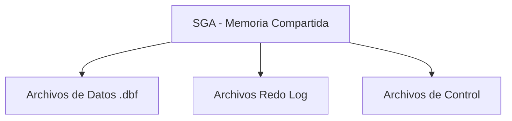

# Arquitectura Empresarial

> [!IMPORTANT]
> **Nivel:** Inicial  
> **Rol:** DBA Junior  

Oracle es el motor relacional de mayor adopción en el entorno bancario.

## 1. Instancias vs Bases de Datos
En Oracle, una "Instancia" (Procesos de Memoria + Hilos) es independiente de la "Base de Datos" (Archivos físicos).

