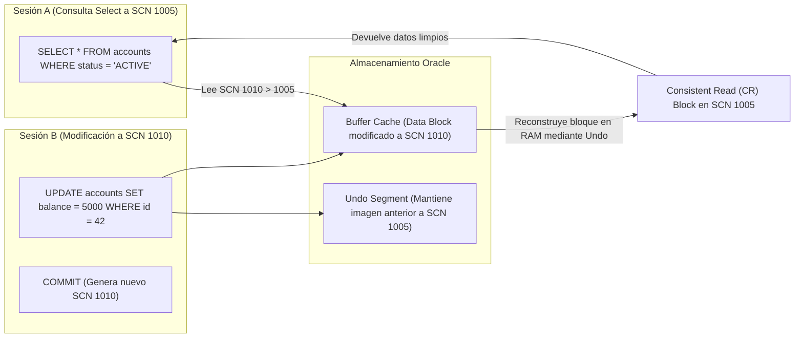

## 🎯 1. Paquetes PL/SQL Avanzados, Colecciones & Bulk Operations

En entornos empresariales con millones de transacciones por minuto, la manipulación registro a registro (`ROW-BY-ROW`) genera una penalización severa por el cambio de contexto entre el motor SQL y el motor PL/SQL. **Oracle Database** soluciona esto mediante **Colecciones (PL/SQL Collections)** y operaciones en bloque **`BULK COLLECT`** y **`FORALL`**.

### 💡 Conceptos Clave de Alto Rendimiento:
- **Paquetes PL/SQL (Packages):** Encapsulación modular de código en dos partes: **Specification** (interfaz pública) y **Body** (implementación privada y gestión de estado de sesión).
- **Undo Tablespace & Read Consistency:** Mecanismo multiversión (MVCC) que reconstruye vistas consistentes de datos en el pasado usando *Undo Segments* y previene bloqueos de lectura sobre escrituras.
- **Bulk Binding (`FORALL`):** Envía múltiples sentencias de modificación (INSERT/UPDATE/DELETE) al motor SQL en un único cambio de contexto.
- **Bulk Collect (`BULK COLLECT INTO`):** Recupera miles de filas desde el motor SQL a colecciones en memoria PGA en una sola instrucción.

---

## 🏗️ 2. Mecanismo de Lectura Consistente (Undo Segments & SCN)



---

## 💻 3. Implementación Empresarial: Package PL/SQL con Bulk Collect & FORALL

```sql
-- =====================================================================
-- NMerge IA - Oracle Enterprise: Paquete de Procesamiento Masivo PL/SQL
-- Colecciones PL/SQL, Ref Cursors, BULK COLLECT y FORALL con SAVE EXCEPTIONS
-- =====================================================================

CREATE OR REPLACE PACKAGE pkg_batch_processor AS
    -- Definición de tipos de colecciones
    TYPE t_account_rec IS RECORD (
        account_id   NUMBER,
        balance      NUMBER,
        status       VARCHAR2(20)
    );
    TYPE t_account_tbl IS TABLE OF t_account_rec INDEX BY PLS_INTEGER;
    TYPE ref_cursor_type IS REF CURSOR;

    -- Procedimiento principal de procesamiento en lote
    PROCEDURE execute_mass_interest_credit (
        p_batch_size  IN  NUMBER DEFAULT 5000,
        p_processed   OUT NUMBER,
        p_errors      OUT NUMBER
    );
END pkg_batch_processor;
/

CREATE OR REPLACE PACKAGE BODY pkg_batch_processor AS

    PROCEDURE execute_mass_interest_credit (
        p_batch_size  IN  NUMBER DEFAULT 5000,
        p_processed   OUT NUMBER,
        p_errors      OUT NUMBER
    ) IS
        CURSOR c_accounts IS
            SELECT account_id, balance, status 
            FROM accounts 
            WHERE status = 'ACTIVE';

        v_accounts_tbl   t_account_tbl;
        v_bulk_exceptions EXCEPTION;
        PRAGMA EXCEPTION_INIT(v_bulk_exceptions, -24381); -- ORA-24381: errors in FORALL
    BEGIN
        p_processed := 0;
        p_errors := 0;

        OPEN c_accounts;
        LOOP
            -- 📌 1. Carga masiva en lote desde SQL a memoria PGA
            FETCH c_accounts BULK COLLECT INTO v_accounts_tbl LIMIT p_batch_size;
            EXIT WHEN v_accounts_tbl.COUNT = 0;

            -- 📌 2. Modificación masiva con FORALL y SAVE EXCEPTIONS
            BEGIN
                FORALL i IN 1..v_accounts_tbl.COUNT SAVE EXCEPTIONS
                    UPDATE accounts
                    SET balance = balance + (v_accounts_tbl(i).balance * 0.05),
                        updated_at = SYSDATE
                    WHERE account_id = v_accounts_tbl(i).account_id;
            EXCEPTION
                WHEN v_bulk_exceptions THEN
                    -- Manejo de errores individuales sin abortar el lote completo
                    p_errors := p_errors + SQL%BULK_EXCEPTIONS.COUNT;
                    FOR j IN 1..SQL%BULK_EXCEPTIONS.COUNT LOOP
                        DBMS_OUTPUT.PUT_LINE(' Error en fila ' || SQL%BULK_EXCEPTIONS(j).ERROR_INDEX || 
                                           ': ' || SQLERRM(-SQL%BULK_EXCEPTIONS(j).ERROR_CODE));
                    END LOOP;
            END;

            p_processed := p_processed + v_accounts_tbl.COUNT;
            COMMIT; -- Commit por lote para evitar Undo Overflow
        END LOOP;
        CLOSE c_accounts;
        
        DBMS_OUTPUT.PUT_LINE('🚀 Proceso en Lote Completado. Procesados: ' || p_processed || ' | Errores: ' || p_errors);
    END execute_mass_interest_credit;

END pkg_batch_processor;
/
```

---

© 2026 NMerge IA. StackUpIA Software Labs. Alle Rechte vorbehalten.