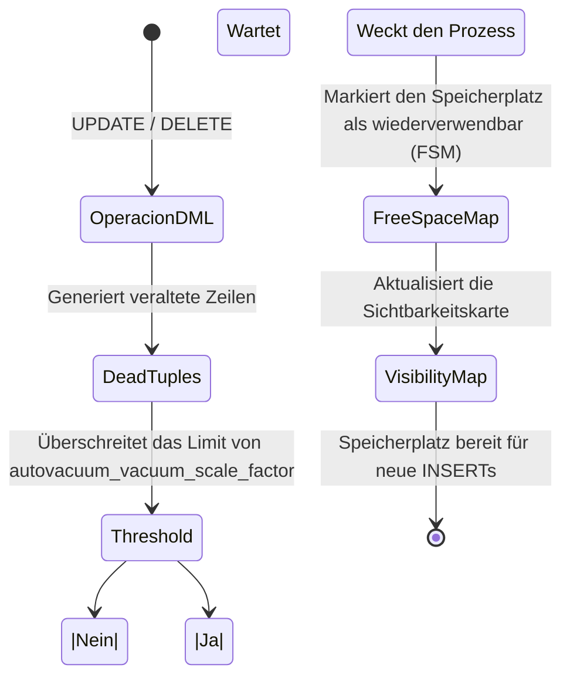

# Ausführungs-Engine, Vacuum und Zusammengesetzte Indizes

Auf der fortgeschrittenen Stufe hören wir auf, blind Code zu schreiben, und fangen an zu verstehen, **wie PostgreSQL unseren Code liest**. Der Unterschied zwischen einer Abfrage, die 5 Minuten dauert, und einer, die 50 Millisekunden dauert, liegt im Verständnis des *Query Planners*.

## 1. Die Kunst von EXPLAIN ANALYZE

Gehe niemals davon aus, dass ein Index verwendet wird. PostgreSQL verfügt über einen kostenbasierten Optimierer (Cost-Based Optimizer). Wenn die Engine berechnet, dass ein *Sequential Scan* (das Lesen der gesamten Tabelle) billiger ist als die Verwendung des Index, weil du 80% der Daten anforderst, wird sie deinen Index ignorieren.

### Wie man einen Ausführungsplan liest

```sql
EXPLAIN ANALYZE 
SELECT * FROM sales.orders 
WHERE status = 'pending' AND total > 1000;
```

**Kritische Metriken, auf die man achten sollte:**
- `Execution Time`: Die tatsächliche Zeit, die benötigt wurde.
- `Buffers: shared hit=... read=...`: Wenn du viele `read` siehst, greift Postgres auf die Festplatte zu. Wenn du viele `hit` siehst, werden die Daten aus dem RAM bedient (Hervorragend!).
- `Seq Scan`: Roter Alarm, wenn die Tabelle Millionen von Zeilen hat. Versuche, ihn durch einen `Index Scan` oder `Bitmap Heap Scan` zu ersetzen.

## 2. Zusammengesetzte Indizes und die Reihenfolge der Spalten

Wenn du nach mehreren Spalten filterst, reicht ein einfacher Index nicht aus.

```sql
-- Zusammengesetzter Index
CREATE INDEX idx_orders_status_total ON sales.orders(status, total);
```
**Goldene Regel:** Die Reihenfolge ist wichtig. Setze immer die Spalte mit der höchsten **Kardinalität** (diejenige, die am schnellsten die meisten Daten verwirft) oder die Spalte, die du mit Gleichheitsoperatoren (`=`) verwendest, an die erste Stelle. Spalten, die für Bereiche (`>`, `<`) verwendet werden, sollten am Ende des Index stehen.

## 3. Autovacuum: Der Garbage Collector von MVCC

In der mittleren Stufe haben wir etwas über MVCC und *dead tuples* (veraltete Zeilen, die durch UPDATEs und DELETEs generiert werden) gelernt. Wenn diese Zeilen nicht bereinigt werden, leidet deine Datenbank unter **Bloat** (Aufblähung), was Festplattenspeicher verbraucht und die Leistung zerstört.

Der `Autovacuum`-Prozess ist dafür verantwortlich, dies zu bereinigen.

### Diagramm des Autovacuum-Prozesses



**Kritisches Tuning für große Tabellen:**
Der Standardwert von Postgres (`autovacuum_vacuum_scale_factor = 0.2`) bedeutet, dass das Autovacuum nur ausgelöst wird, wenn sich 20% der Tabelle ändern. Wenn du eine Tabelle mit 100 Millionen Zeilen hast, müssten sich 20 Millionen Zeilen ändern, um sie zu bereinigen! 
Passe dies pro Tabelle an:

```sql
ALTER TABLE sales.orders SET (autovacuum_vacuum_scale_factor = 0.01);
```

Das Verständnis von EXPLAIN und die Beherrschung des Autovacuum trennen einen Senior-Entwickler von einem wahren Datenbankexperten. Auf der **Expertenstufe (Experto)** werden wir dies auf Replikation und massive Partitionierung skalieren.
