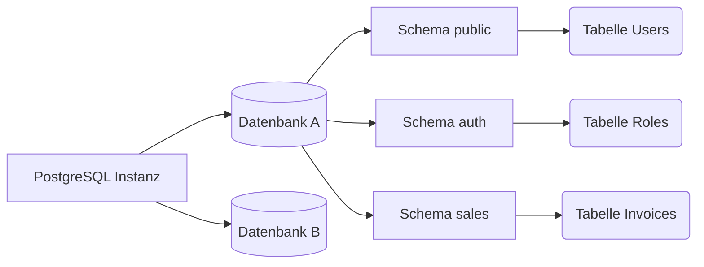

# Grundlagen, Datentypen und Core-Abfragen

Wir haben die Infrastruktur-Phase bereits hinter uns gelassen. Jetzt betreten wir das "Spielfeld" der Entwickler. PostgreSQL ist nicht nur ein Datenspeicher für Zeilen und Spalten; es ist ein objektrelationales Datenbankmanagementsystem (ORDBMS). Das bedeutet, dass es Vererbung, komplexe Datentypen und Erweiterungen unterstützt.

## 1. Das Schema-Paradigma (Schemas)

Ein sehr häufiger Fehler bei Entwicklern, die von MySQL migrieren, ist die Verwendung der Datenbank als einzigen logischen Container für Tabellen. In PostgreSQL haben wir eine Zwischenschicht: das **Schema**.



Standardmäßig werden alle Tabellen im Schema `public` erstellt. **Best Practice:** Wenn du eine monolithische oder Microservices-Architektur mit einer einzigen DB aufbaust, unterteile deine Geschäftsdomänen mithilfe von Schemas.

```sql
CREATE SCHEMA IF NOT EXISTS billing;
CREATE SCHEMA IF NOT EXISTS inventory;
```

## 2. Datentypen: Die Macht von JSONB und Arrays

PostgreSQL zerstört den Mythos, dass "SQL-Datenbanken starr sind". Postgres unterstützt NoSQL-Datentypen nativ mit einer außergewöhnlichen Leistung.

### Der JSONB-Typ (Binäres JSON)
Während `JSON` Klartext speichert, verarbeitet `JSONB` das JSON in einem benutzerdefinierten binären Format vor. Dies macht das Einfügen etwas langsamer, aber die Lesezugriffe und **indexierten Suchen** sind erstaunlich schnell.

```sql
CREATE TABLE billing.invoices (
    id UUID PRIMARY KEY DEFAULT gen_random_uuid(),
    customer_name VARCHAR(150) NOT NULL,
    total_amount NUMERIC(10, 2),
    metadata JSONB,
    created_at TIMESTAMP WITH TIME ZONE DEFAULT NOW()
);

-- Einfügen von NoSQL-Daten in eine relationale Tabelle
INSERT INTO billing.invoices (customer_name, total_amount, metadata)
VALUES ('Acme Corp', 500.50, '{"tags": ["b2b", "premium"], "payment_gateway": "stripe", "tax_exempt": false}');
```

### Das Innere von JSONB abfragen
PostgreSQL bietet spezielle Operatoren (wie `->>` und `@>`), um im Dokument zu suchen:

```sql
-- Alle von Stripe verarbeiteten Rechnungen suchen
SELECT customer_name, total_amount 
FROM billing.invoices 
WHERE metadata @> '{"payment_gateway": "stripe"}';

-- Den ersten Tag aus der Liste extrahieren
SELECT metadata->'tags'->>0 AS primary_tag 
FROM billing.invoices;
```

## 3. Strenge referenzielle Integrität (Constraints)

Ein gut entworfenes Schema verlässt sich nicht darauf, dass der Frontend- oder Backend-Code Fehler herausfiltert; die Datenbank ist die **letzte Verteidigungslinie**.

```sql
CREATE TABLE inventory.products (
    id SERIAL PRIMARY KEY,
    sku VARCHAR(20) UNIQUE NOT NULL,
    price NUMERIC(8,2) CHECK (price > 0),
    discount_percentage INT DEFAULT 0 CHECK (discount_percentage BETWEEN 0 AND 100),
    status VARCHAR(20) DEFAULT 'draft' CHECK (status IN ('draft', 'active', 'archived'))
);
```
Die wahllose Verwendung von `CHECK`-Constraints stellt sicher, dass *niemals* ein Produkt mit negativem Preis eingegeben wird, egal wie viele Bugs deine API in Node.js oder Python hat.

## 4. Einführung in B-Tree-Indizes

Der B-Tree-Index (Balancierter Baum) ist das Arbeitstier von Postgres. Es ist der Standardindex und für Gleichheits- und Bereichsoperatoren (`<`, `<=`, `=`, `>=`, `>`) optimiert.

```sql
-- Erstellen eines klassischen B-Tree-Index zur Beschleunigung von Suchen
CREATE INDEX idx_products_sku ON inventory.products(sku);

-- Partieller Index: Indiziert nur die Zeilen, die die Bedingung erfüllen.
-- Spart enorm viel Festplattenspeicher und RAM.
CREATE INDEX idx_active_products ON inventory.products(status) WHERE status = 'active';
```

### Wann sollten partielle Indizes verwendet werden?
Wenn du eine "Users"-Tabelle mit 10 Millionen Datensätzen hast, aber nur 50.000 als `is_deleted = false` markiert sind, ist ein partieller Index auf die aktiven Benutzer mikroskopisch klein und ultraschnell im Vergleich zur Indizierung der gesamten Tabelle.

## Abschließende Überlegung
Das Beherrschen der `JSONB`-Typen, die Verwendung logischer Schemas und der Schutz deiner Daten mit `CHECK`-Constraints verwandeln deine Datenbanken von einfachen verherrlichten Tabellenkalkulationen in robuste Datentresore. Auf der **mittleren Stufe (Nivel Medio)** werden wir die dunkle Kunst komplexer Abfragen erkunden: *Common Table Expressions (CTEs)* und *Window Functions*.
